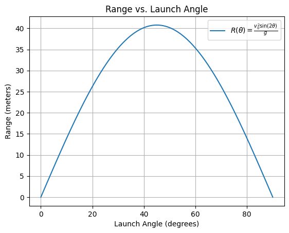
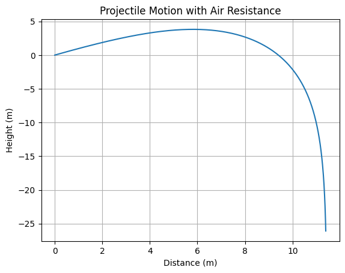
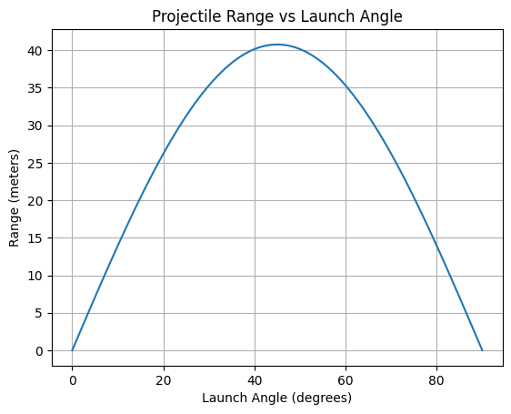

# Problem 1

# Investigating the Range as a Function of the Angle of Projection

## 1. Theoretical Foundation

### 1.1 Governing Equations of Motion

To analyze projectile motion, we start by applying the fundamental laws of motion under constant acceleration, particularly the law of gravity.

The two-dimensional motion of a projectile is governed by the following equations:

### Horizontal Motion

The acceleration in the horizontal direction is zero (assuming no air resistance), so the horizontal velocity remains constant.

$$
x(t) = v_0 \cdot \cos(\theta) \cdot t
$$

where:
- $x(t)$ is the horizontal position of the projectile at time $t$,
- $v_0$ is the initial velocity,
- $\theta$ is the launch angle.

---

### Vertical Motion

The vertical motion is influenced by gravity. The velocity in the vertical direction is affected by gravitational acceleration (\(g\)).

$$
y(t) = v_0 \cdot \sin(\theta) \cdot t - \frac{1}{2} g t^2
$$

where:
- \(y(t)\) is the vertical position of the projectile at time \(t\),
- \(g\) is the acceleration due to gravity (approximately 9.81 m/s²).

### 1.2 Solving the Basic Differential Equation

To find the time of flight, we focus on the vertical motion. The projectile hits the ground when $y(t) = 0$. Therefore, we set the vertical displacement equation equal to zero:

$$
v_0 \cdot \sin(\theta) \cdot t - \frac{1}{2} g t^2 = 0
$$

Factorizing the equation:

$$
t \left( v_0 \cdot \sin(\theta) - \frac{1}{2} g t \right) = 0
$$

The solutions to this equation are:
1. $t = 0$ (at the moment of launch),
2. $t = \frac{2 v_0 \cdot \sin(\theta)}{g}$ (the time at which the projectile hits the ground).

Thus, the total time of flight $T$ is:

$$
T = \frac{2 v_0 \cdot \sin(\theta)}{g}
$$

### 1.3 Horizontal Range of the Projectile

Now that we have the time of flight, we can use the horizontal motion equation to find the range of the projectile.

The horizontal distance traveled is given by:

$$
R = x(T) = v_0 \cdot \cos(\theta) \cdot T
$$

Substitute $T$ from the earlier equation:

$$
R = v_0 \cdot \cos(\theta) \cdot \frac{2 v_0 \cdot \sin(\theta)}{g}
$$

Simplify the expression:

$$
R = \frac{v_0^2 \cdot \sin(2\theta)}{g}
$$

Thus, the **range of the projectile** as a function of the launch angle is:

$$
R(\theta) = \frac{v_0^2 \cdot \sin(2\theta)}{g}
$$

### 1.4 Family of Solutions

The general form of the range equation shows that the range depends on several parameters:
- **Initial velocity $v_0$**: The range increases with the square of the initial velocity.
- **Launch angle $\theta$**: The range is maximized when $\theta = 45^\circ$, as $\sin(2\theta)$ reaches its maximum value of 1 at this angle.
- **Gravitational acceleration $g$**: The range decreases with an increase in gravitational acceleration.

Thus, the relationship between the angle and the range can be explored by varying these parameters.

---

### Key Points:
- The projectile follows a parabolic trajectory.
- The launch angle $\theta$ has a significant impact on the horizontal range.
- For a given initial velocity, the optimal launch angle for maximum range is $\theta = 45^\circ$.

---

# Analysis of the Range

## 1. Investigating the Horizontal Range as a Function of the Angle of Projection

### 1.1 Range Equation Recap

The horizontal range $R$ of a projectile is given by the equation:

$$
R(\theta) = \frac{v_0^2 \cdot \sin(2\theta)}{g}
$$

Where:
- $v_0$ is the initial velocity,
- $\theta$ is the launch angle,
- $g$ is the gravitational acceleration.

### 1.2 Range as a Function of Angle

To investigate how the range depends on the angle of projection, we need to analyze the behavior of the function $R(\theta)$ for various values of $\theta$.

- The range increases with the sine of $2\theta$. This means that the range is maximized when $2\theta = 90^\circ$, which occurs at $\theta = 45^\circ$.
  
- At $\theta = 0^\circ$ and $\theta = 90^\circ$, the range is zero because $\sin(0^\circ) = \sin(180^\circ) = 0$.

- The general behavior of the range as a function of angle is symmetric, meaning that the range for an angle $\theta$ is the same as for the angle $90^\circ - \theta$.

### 1.3 Graphical Representation

We can plot $R(\theta)$ for a given initial velocity $v_0$ and gravitational acceleration $g$ to visualize how the range changes with the launch angle.

---

## 2. Analyzing the Influence of Initial Velocity and Gravitational Acceleration

### 2.1 Effect of Initial Velocity $v_0$

From the range equation:

$$
R(\theta) = \frac{v_0^2 \cdot \sin(2\theta)}{g}
$$

- The range increases with the square of the initial velocity $v_0$. This means that for a higher initial velocity, the projectile will travel further for the same angle.
- The influence of $v_0$ is more significant than the angle, meaning that for the same angle, doubling the initial velocity will quadruple the range.

### 2.2 Effect of Gravitational Acceleration $g$

Again, from the range equation:

$$
R(\theta) = \frac{v_0^2 \cdot \sin(2\theta)}{g}
$$

- The range decreases as the gravitational acceleration $g$ increases. This means that in stronger gravitational fields (e.g., on planets with higher gravity), the range will be shorter for the same initial velocity and launch angle.
- The effect of $g$ is inversely proportional, meaning that for a given initial velocity, increasing the gravitational acceleration reduces the range.

---

## 3. Summary of Effects on Range

### 3.1 Dependence on Launch Angle
- **Range increases** as the launch angle increases from $0^\circ$ to $45^\circ$.
- The **maximum range** occurs at $\theta = 45^\circ$.
- The relationship is symmetric around $45^\circ$.

### 3.2 Dependence on Initial Velocity
- The range **increases quadratically** with the initial velocity $v_0$.
- Doubling the initial velocity results in a **fourfold increase** in range.

### 3.3 Dependence on Gravitational Acceleration
- The range **decreases** as the gravitational acceleration $g$ increases.
- The effect is **inversely proportional** to $g$.

---

## 4. Python Code for Visualizing the Range



---
```python
import numpy as np
import matplotlib.pyplot as plt

# Constants
v_0 = 20  # Initial velocity in m/s
g = 9.81  # Gravitational acceleration in m/s^2

# Function to calculate range as a function of angle
def calculate_range(v_0, g, theta):
    return (v_0**2 * np.sin(2 * np.radians(theta))) / g

# Angles from 0 to 90 degrees
angles = np.linspace(0, 90, 500)
ranges = calculate_range(v_0, g, angles)

# Plotting the range as a function of launch angle
plt.plot(angles, ranges, label=r'$R(\theta) = \frac{v_0^2 \sin(2\theta)}{g}$')
plt.title('Range vs. Launch Angle')
plt.xlabel('Launch Angle (degrees)')
plt.ylabel('Range (meters)')
plt.grid(True)
plt.legend()
plt.show()
```
---
# Practical Applications of Projectile Motion

## 1. Reflection on Real-World Situations

While the basic projectile motion model provides valuable insights into how an object moves through the air, real-world situations often introduce additional complexities that the idealized model does not account for. Below, we explore some real-world scenarios and the adjustments needed for a more accurate description.

### 1.1 Uneven Terrain

- **Effect of Uneven Terrain**:
  - In the ideal model, the projectile is launched from and lands on flat ground. However, in real-world scenarios, the launch or landing height might vary due to uneven terrain.
  - If the launch and landing points are at different heights, the range equation must be modified to account for the difference in elevation.
  
  The new range equation with an initial height $h_0$ becomes:

  $$
  R(\theta) = \frac{v_0 \cos(\theta)}{g} \left( v_0 \sin(\theta) + \sqrt{(v_0 \sin(\theta))^2 + 2gh_0} \right)
  $$

  Where:
  - $h_0$ is the initial height from which the projectile is launched.

- **Effect of Sloped Terrain**:
  - When the terrain is sloped, the trajectory and landing location change based on the angle of the slope.
  - The equation for the range becomes more complex and involves solving for the intersection of the projectile's path with the slope of the ground.

### 1.2 Air Resistance

- **Impact of Air Resistance**:
  - Air resistance (drag) significantly alters the trajectory of a projectile. The ideal model assumes no air resistance, but in real life, air resistance slows down the projectile as it travels.
  
  The general form of the motion with drag can be described by the following second-order differential equations:

  $$
  \frac{d^2x}{dt^2} = -\frac{C_d \rho A}{2m} v \frac{dx}{dt}
  $$

  $$
  \frac{d^2y}{dt^2} = -g - \frac{C_d \rho A}{2m} v \frac{dy}{dt}
  $$

  Where:
  - $C_d$ is the drag coefficient,
  - $\rho$ is the air density,
  - $A$ is the cross-sectional area of the projectile,
  - $m$ is the mass of the projectile,
  - $v$ is the velocity of the projectile.

- **Numerical Methods**:
  - Solving these differential equations requires numerical methods such as Euler's method, Runge-Kutta, or other integration techniques.
  - These methods can provide an accurate simulation of the trajectory that accounts for the effects of drag.

### 1.3 Wind and Environmental Factors

- **Wind Effects**:
  - Wind can alter the trajectory of a projectile, either increasing or decreasing its range depending on the wind direction.
  - The wind’s influence on the trajectory can be modeled by adding a velocity term to the equations that represent the wind speed and direction.
  
  If the wind velocity is represented by $v_w$, the horizontal velocity of the projectile becomes:

  $$
  v_x' = v_x + v_w
  $$

  Where:
  - $v_x$ is the horizontal velocity of the projectile,
  - $v_w$ is the wind velocity.

- **Temperature and Air Density**:
  - The air density $\rho$ depends on environmental factors such as temperature and pressure.
  - In warmer conditions, the air density decreases, which reduces air resistance and can increase the range of the projectile.

### 1.4 Real-World Examples

- **Sports**:
  - In sports like basketball or soccer, air resistance and launch height are crucial. A basketball shot will differ depending on the angle and initial velocity, but also on the height of the player and the presence of wind.
  
- **Military and Engineering Applications**:
  - In military applications, such as missile trajectories, engineers must account for air resistance, wind, and terrain elevation. High-precision models that include drag and varying gravitational fields are used for accurate targeting.

- **Space Exploration**:
  - For objects launched into space, air resistance is negligible at high altitudes, but gravitational variation (due to Earth's curvature) and velocity are still factors that affect trajectory calculations.
---

## 2. Python Code to Simulate Air Resistance and Uneven Terrain

Below is a Python code to simulate projectile motion considering air resistance and varying terrain height.
---



---
```python
import numpy as np
import matplotlib.pyplot as plt
from scipy.integrate import odeint

# Constants
v_0 = 20  # Initial velocity in m/s
theta = 45  # Launch angle in degrees
g = 9.81  # Gravitational acceleration in m/s^2
C_d = 0.47  # Drag coefficient (for a sphere)
rho = 1.225  # Air density in kg/m^3
A = 0.05  # Cross-sectional area in m^2 (for a small ball)
m = 0.1  # Mass of the projectile in kg

# Function to compute the drag force
def drag_force(v):
    return 0.5 * C_d * rho * A * v**2

# Equations of motion with air resistance
def projectile_motion(y, t, g, C_d, rho, A, m):
    x, y_pos, vx, vy = y
    v = np.sqrt(vx**2 + vy**2)
    ax = -drag_force(v) * vx / (m * v)
    ay = -g - (drag_force(v) * vy / (m * v))
    return [vx, vy, ax, ay]

# Initial conditions
angle_rad = np.radians(theta)
vx0 = v_0 * np.cos(angle_rad)
vy0 = v_0 * np.sin(angle_rad)
y0 = [0, 0, vx0, vy0]  # Initial position (x=0, y=0) and velocity components

# Time array
t_max = 5  # Total time of flight in seconds
t = np.linspace(0, t_max, 500)

# Solving the system of equations using odeint
solution = odeint(projectile_motion, y0, t, args=(g, C_d, rho, A, m))

# Extract the results
x = solution[:, 0]
y = solution[:, 1]

# Plotting the trajectory
plt.plot(x, y)
plt.title('Projectile Motion with Air Resistance')
plt.xlabel('Distance (m)')
plt.ylabel('Height (m)')
plt.grid(True)
plt.show()
```
---
# Implementation of Projectile Motion Simulation

## 1. Developing a Computational Tool

To simulate projectile motion and visualize the range as a function of the angle of projection, we need to use a computational approach that considers the basic equations of motion. The key to building this simulation involves solving the projectile's motion under the influence of gravity and accounting for various parameters such as **initial velocity**, **launch angle**, and **gravitational acceleration**.

### 1.1 Governing Equations

The equations of motion for projectile motion without air resistance are:

- Horizontal motion: 
  $$
  x(t) = v_0 \cos(\theta) t
  $$

- Vertical motion:
  $$
  y(t) = v_0 \sin(\theta) t - \frac{1}{2} g t^2
  $$

Where:
- $v_0$ is the initial velocity of the projectile,
- $\theta$ is the launch angle,
- $g$ is the gravitational acceleration,
- $x(t)$ and $y(t)$ are the horizontal and vertical displacements, respectively.

The range $R$ of the projectile (the distance it travels before hitting the ground) can be obtained when the projectile reaches $y = 0$. This condition gives the time of flight as:

$$
t_f = \frac{2 v_0 \sin(\theta)}{g}
$$

Substituting this into the equation for horizontal motion, we get the range $R$:

$$
R = \frac{v_0^2 \sin(2\theta)}{g}
$$

### 1.2 Algorithm Design

- **Input Parameters**:
  - Initial velocity $v_0$
  - Launch angle $\theta$
  - Gravitational acceleration $g$
  
- **Steps**:
  1. Define the initial conditions (velocity, angle).
  2. Use the equations of motion to calculate the horizontal and vertical displacements at each time step.
  3. Compute the time of flight and the range $R$.
  4. Visualize the range $R$ for different launch angles by plotting it as a function of the angle of projection.

---

## 2. Visualizing the Range as a Function of the Launch Angle

To explore how the range changes with different angles of projection, we will create a plot of the range $R$ for a range of angles, keeping the initial velocity and gravitational acceleration constant.

- **Range Equation**:
  $$ 
  R(\theta) = \frac{v_0^2 \sin(2\theta)}{g}
  $$

  This equation will be used to calculate the range for various values of $\theta$ (from 0° to 90°).

### 2.1 Python Code Implementation

Below is the Python code that simulates the projectile motion and visualizes the range as a function of the launch angle for a given initial velocity.
---


---
```python
import numpy as np
import matplotlib.pyplot as plt

# Constants
v_0 = 20  # Initial velocity in m/s
g = 9.81  # Gravitational acceleration in m/s^2

# Function to calculate the range for different launch angles
def calculate_range(v_0, g, theta):
    # Convert angle to radians
    theta_rad = np.radians(theta)
    
    # Range equation
    R = (v_0**2 * np.sin(2*theta_rad)) / g
    return R

# Launch angles from 0 to 90 degrees
angles = np.linspace(0, 90, 100)

# Calculate the range for each angle
ranges = [calculate_range(v_0, g, angle) for angle in angles]

# Plotting the range as a function of the launch angle
plt.plot(angles, ranges)
plt.title('Projectile Range vs Launch Angle')
plt.xlabel('Launch Angle (degrees)')
plt.ylabel('Range (meters)')
plt.grid(True)
plt.show()
```
---


