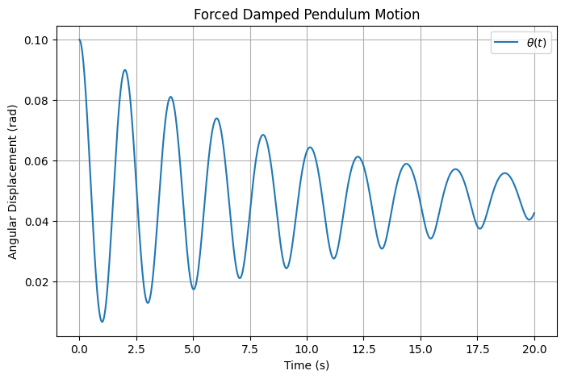
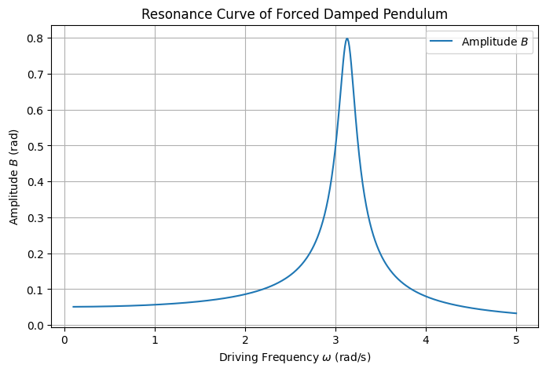
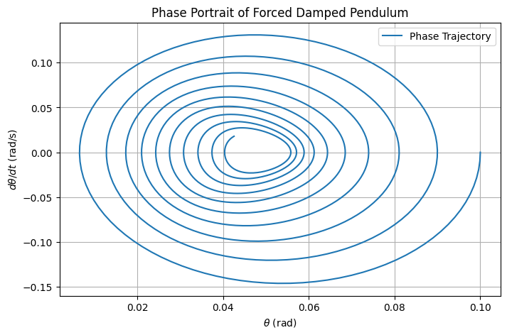

# Problem 2

## Forced Damped Pendulum: Dynamics and Analysis

## 1. Theoretical Framework

The forced damped pendulum is modeled by a second-order nonlinear ordinary differential equation (ODE) describing angular displacement under damping and periodic external forcing.

### 1.1 Governing Equation

The equation of motion is:

$$d^2\theta/dt^2+b\,d\theta/dt+(g/L)\sin\theta=A\cos(\omega t)$$

- **Variables**:
  - $\theta(t)$: Angular displacement (radians)
  - $b$: Damping coefficient (s$^{-1}$)
  - $g$: Gravitational acceleration (m/s$^2$)
  - $L$: Pendulum length (m)
  - $A$: Driving amplitude (s$^{-2}$)
  - $\omega$: Driving frequency (rad/s)

### 1.2 Small-Angle Approximation

For small angles ($\theta\ll 1$), the nonlinear term simplifies:

$$\sin\theta\approx\theta$$

This yields a linear ODE:

$$d^2\theta/dt^2+b\,d\theta/dt+(g/L)\theta=A\cos(\omega t)$$

### 1.3 Solution to Linearized Equation

The solution combines homogeneous and particular components:

- **Homogeneous Solution**:
  The characteristic equation is:

  $$r^2+br+(g/L)=0$$

  Roots are:

  $$r_{1,2}=(-b\pm\sqrt{b^2-4(g/L)})/2$$

  The homogeneous solution is:

  $$\theta_h(t)=C_1e^{r_1t}+C_2e^{r_2t}$$

  - For underdamped systems ($b^2<4(g/L)$):

    $$\theta_h(t)=e^{-(b/2)t}(C_1\cos(\omega_dt)+C_2\sin(\omega_dt))$$

    Where damped frequency is:

    $$\omega_d=\sqrt{(g/L)-(b^2/4)}$$

- **Particular Solution**:
  Assume a steady-state form:

  $$\theta_p(t)=B\cos(\omega t-\delta)$$

  The amplitude $B$ is:

  $$B=A/\sqrt{((g/L)-\omega^2)^2+(b\omega)^2}$$

  The phase shift $\delta$ is:

  $$\tan\delta=(b\omega)/((g/L)-\omega^2)$$

  #### 1.3.1 Pendulum Motion Visualization

The time evolution of $\theta(t)$ illustrates the combined effects of damping and external forcing, as described by the nonlinear ODE:

$$d^2\theta/dt^2+b\,d\theta/dt+(g/L)\sin\theta=A\cos(\omega t)$$

The following Python code solves this ODE numerically using parameters $g=9.81$ m/s$^2$, $L=1$ m, $b=0.2$ s$^{-1}$, $A=0.5$ s$^{-2}$, and $\omega=0.8\sqrt{g/L}$, plotting $\theta(t)$ over time.


---

```python
import numpy as np
import matplotlib.pyplot as plt
from scipy.integrate import odeint


# Parameters
g = 9.81  # m/s^2
L = 1.0   # m
b = 0.2   # s^-1
A = 0.5   # s^-2
omega = 0.8 * np.sqrt(g/L)

# ODE system: dtheta/dt = omega, domega/dt = -b*omega - (g/L)*sin(theta) + A*cos(omega*t)
def pendulum(state, t, b, g, L, A, omega):
    theta, omega = state
    dtheta_dt = omega
    domega_dt = -b*omega - (g/L)*np.sin(theta) + A*np.cos(omega*t)
    return [dtheta_dt, domega_dt]

# Time array
t = np.linspace(0, 20, 1000)

# Initial conditions: theta(0) = 0.1 rad, dtheta/dt(0) = 0
state0 = [0.1, 0.0]

# Solve ODE
solution = odeint(pendulum, state0, t, args=(b, g, L, A, omega))
theta = solution[:, 0]

# Plot
plt.figure(figsize=(8, 5))
plt.plot(t, theta, label=r'$\theta(t)$')
plt.xlabel('Time (s)')
plt.ylabel('Angular Displacement (rad)')
plt.title('Forced Damped Pendulum Motion')
plt.grid(True)
plt.legend()
plt.show()

### 1.4 Resonance

Resonance occurs when $\omega$ approaches the natural frequency:

$$\omega_0=\sqrt{g/L}$$

- **Undamped Case** ($b=0$):

  $$B\to\infty\text{ as }\omega\to\omega_0$$

- **Damped Case**:
  Maximum amplitude occurs at:

  $$\omega_{\text{res}}=\sqrt{\omega_0^2-(b^2/2)}$$

  With maximum amplitude:

  $$B_{\text{max}}=A/(b\sqrt{\omega_0^2-(b^2/4)})$$

  #### 1.4.1 Resonance Curve Visualization

The resonance curve plots the steady-state amplitude $B$ against driving frequency $\omega$, as given by:

$$B=A/\sqrt{((g/L)-\omega^2)^2+(b\omega)^2}$$

The following Python code computes $B$ for $\omega$ from 0.1 to 5 rad/s, with $g=9.81$ m/s$^2$, $L=1$ m, $b=0.2$ s$^{-1}$, and $A=0.5$ s$^{-2}$.


---

```python
import numpy as np
import matplotlib.pyplot as plt

# Parameters
g = 9.81
L = 1.0
b = 0.2
A = 0.5

# Frequency range
omega = np.linspace(0.1, 5, 500)

# Amplitude B
B = A / np.sqrt(((g/L) - omega**2)**2 + (b*omega)**2)

# Plot
plt.figure(figsize=(8, 5))
plt.plot(omega, B, label=r'Amplitude $B$')
plt.xlabel(r'Driving Frequency $\omega$ (rad/s)')
plt.ylabel(r'Amplitude $B$ (rad)')
plt.title('Resonance Curve of Forced Damped Pendulum')
plt.grid(True)
plt.legend()
plt.show()

### 1.5 Energy Dynamics

Total mechanical energy is:

$$E(t)=(1/2)mL^2(d\theta/dt)^2+mgL(1-\cos\theta)$$

- At resonance:
  - Undamped: Energy grows without bound.
  - Damped: Energy balances input and dissipation, yielding:

    $$E_{\text{steady}}\approx(1/2)mL^2B^2\omega^2$$

### 1.6 Summary

- The nonlinear ODE governs pendulum motion.
- Small-angle approximation linearizes the system.
- Solutions include damped and forced components.
- Resonance amplifies oscillations, moderated by damping.

## 2. Parametric Effects

This section analyzes how parameters affect dynamics, focusing on damping, driving amplitude, and frequency.

### 2.1 Damping Coefficient ($b$)

Damping influences oscillation decay:

- **Low $b$**:
  - Sustained oscillations.
  - Solution approximates undamped case:

    $$\theta(t)\approx B\cos(\omega t-\delta)$$

- **High $b$**:
  - Rapid decay to equilibrium.
  - Overdamped solution ($b^2>4(g/L)$):

    $$\theta(t)=C_1e^{r_1t}+C_2e^{r_2t}$$

### 2.2 Driving Amplitude ($A$)

The amplitude $A$ scales the external force:

- **Small $A$**:
  - Oscillations decay unless near resonance.
  - Amplitude scales linearly:

    $$B\propto A$$

- **Large $A$**:
  - Increases steady-state amplitude:

    $$B=A/\sqrt{((g/L)-\omega^2)^2+(b\omega)^2}$$

### 2.3 Driving Frequency ($\omega$)

Frequency determines forcing efficiency:

- **Near $\omega_0$**:
  - Large oscillations due to resonance.
  - Amplitude peaks at $\omega_{\text{res}}$.

- **Far from $\omega_0$**:
  - Reduced amplitude:

    $$B\approx A/|(g/L)-\omega^2|$$

### 2.4 Chaos and Nonlinearity

For large $A$ or specific $\omega$, the nonlinear $\sin\theta$ term induces chaos:

- **Periodic Motion**:
  - Stable at low $A$, described by:

    $$\theta(t)\approx B\cos(\omega t-\delta)$$

- **Chaotic Motion**:
  - Sensitive to initial conditions.
  - Characterized by positive Lyapunov exponent:

    $$\lambda>0$$

### 2.5 Visualization Tools

- **Phase Portrait**:
  - Plots $\theta$ vs. $d\theta/dt$.
  - Periodic motion: Closed loops.
  - Chaotic motion: Irregular patterns.
 
  The following Python code generates a phase portrait for the pendulum with $g=9.81$ m/s$^2$, $L=1$ m, $b=0.2$ s$^{-1}$, $A=0.5$ s$^{-2}$, and $\omega=0.8\sqrt{g/L}$, showing a closed loop indicative of periodic motion.
   ---
  
```python
import numpy as np
import matplotlib.pyplot as plt
from scipy.integrate import odeint

# Parameters
g = 9.81
L = 1.0
b = 0.2
A = 0.5
omega = 0.8 * np.sqrt(g/L)

# ODE system
def pendulum(state, t, b, g, L, A, omega):
    theta, omega = state
    dtheta_dt = omega
    domega_dt = -b*omega - (g/L)*np.sin(theta) + A*np.cos(omega*t)
    return [dtheta_dt, domega_dt]

# Time array
t = np.linspace(0, 20, 1000)

# Initial conditions
state0 = [0.1, 0.0]

# Solve ODE
solution = odeint(pendulum, state0, t, args=(b, g, L, A, omega))
theta = solution[:, 0]
dtheta_dt = solution[:, 1]

# Plot
plt.figure(figsize=(8, 5))
plt.plot(theta, dtheta_dt, label='Phase Trajectory')
plt.xlabel(r'$\theta$ (rad)')
plt.ylabel(r'$d\theta/dt$ (rad/s)')
plt.title('Phase Portrait of Forced Damped Pendulum')
plt.grid(True)
plt.legend()
plt.show()

- **Poincaré Section**:
  - Samples at $t=2\pi n/\omega$.
  - Periodic: Discrete points.
  - Chaotic: Scattered points.

### 2.6 Summary

- Damping controls oscillation decay.
- Amplitude scales forcing strength.
- Frequency drives resonance or chaos.
- Nonlinear effects lead to complex dynamics.

## 3. Applications

The model applies to systems with oscillatory dynamics.

### 3.1 Energy Harvesting

Vibrational harvesters convert motion to energy:

- **Model**:
  - Driving force: Ambient vibrations.
  - Power output:

    $$P=(1/2)mL^2(d\theta/dt)^2$$

- **Optimization**:
  - Maximize at resonance:

    $$\omega=\omega_0$$

### 3.2 Structural Engineering

Bridges oscillate under external loads:

- **Equation**:
  - Similar to pendulum:

    $$d^2\theta/dt^2+b\,d\theta/dt+(g/L)\sin\theta=F_{\text{ext}}(t)$$

- **Design**:
  - Increase $b$ to avoid resonance.

### 3.3 Electrical Circuits

RLC circuits mirror pendulum dynamics:

- **Equation**:
  - Charge dynamics:

    $$Ld^2q/dt^2+R\,dq/dt+(1/C)q=V_{\text{ext}}(t)$$

- **Resonance**:
  - Maximizes current at:

    $$\omega=1/\sqrt{LC}$$

### 3.4 Summary

- Energy harvesting optimizes power at resonance.
- Structures require damping to prevent failure.
- Circuits control resonance for stability.
