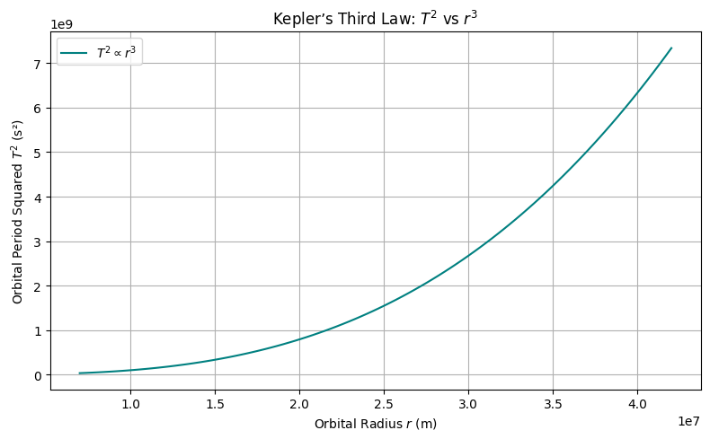

# Problem 1
# 🌌 Deriving Kepler’s Third Law for Circular Orbits

Kepler’s Third Law states that the square of the orbital period of a planet is directly proportional to the cube of the semi-major axis of its orbit. For circular orbits, the semi-major axis is equal to the orbital radius. Let's derive this from fundamental physical principles.

---

## ⚖️ Step 1: Newton’s Law of Universal Gravitation

Newton's Law of Gravitation gives the attractive force between two masses:

$$F_{\text{gravity}} = G\frac{Mm}{r^2}$$

- $G$ = Gravitational constant  
- $M$ = Mass of the central body (e.g., Earth or Sun)  
- $m$ = Mass of the orbiting object (e.g., satellite or planet)  
- $r$ = Radius of the circular orbit  

---

## 🔄 Step 2: Centripetal Force for Circular Motion

Any object in a circular orbit must experience a centripetal force to stay on its path:

$$F_{\text{centripetal}} = \frac{mv^2}{r}$$

---

## ⚖️ Step 3: Equating Gravitational and Centripetal Forces

Since gravity provides the centripetal force:

$$\frac{mv^2}{r} = G\frac{Mm}{r^2}$$

Cancel out $m$ (mass of the orbiting body):

$$\frac{v^2}{r} = G\frac{M}{r^2}$$

Multiply both sides by $r$:

$$v^2 = \frac{GM}{r}$$

---

## ⏱️ Step 4: Express Orbital Velocity in Terms of Period

Orbital velocity $v$ is the distance traveled in one orbit divided by the orbital period $T$:

$$v = \frac{2\pi r}{T}$$

Substitute into the velocity equation:

$$\left(\frac{2\pi r}{T}\right)^2 = \frac{GM}{r}$$

Simplify:

$$\frac{4\pi^2 r^2}{T^2} = \frac{GM}{r}$$

Multiply both sides by $r$:

$$\frac{4\pi^2 r^3}{T^2} = GM$$

---

## 📐 Final Form: Kepler’s Third Law

Rearranging for $T^2$:

$$T^2 = \frac{4\pi^2}{GM} \cdot r^3$$

✅ This is Kepler's Third Law for circular orbits!

- $T^2 \propto r^3$
- The constant of proportionality depends on the central mass $M$

---

## 🧪 Python Verification

Let's simulate this law using Python.
---


```python
import numpy as np
import matplotlib.pyplot as plt

# Constants
G = 6.67430e-11  # Gravitational constant (m^3 kg^-1 s^-2)
M = 5.972e24     # Mass of the Earth (kg)

# Generate orbital radii (in meters)
radii = np.linspace(7e6, 4.2e7, 100)  # from ~7000 km to ~42000 km
# Calculate orbital periods
T_squared = (4 * np.pi**2 * radii**3) / (G * M)

# Plotting
plt.figure(figsize=(8, 5))
plt.plot(radii, T_squared, label=r'$T^2 \propto r^3$', color='teal')
plt.title("Kepler’s Third Law: $T^2$ vs $r^3$")
plt.xlabel("Orbital Radius $r$ (m)")
plt.ylabel("Orbital Period Squared $T^2$ (s²)")
plt.grid(True)
plt.legend()
plt.tight_layout()
plt.show()

# 🌠 Physical Meaning of Kepler’s Third Law

We previously derived Kepler's Third Law for circular orbits:

$$T^2=\frac{4\pi^2}{GM}\cdot r^3$$

This relationship elegantly connects **time** (orbital period) with **space** (orbital radius) through the **gravitational constant** and the **mass of the central body**.

---

## 🔍 Interpretation of Each Term

- $T$: Orbital period — how long it takes to complete one full orbit  
- $r$: Orbital radius — the distance between the orbiting body and the central mass  
- $G$: Universal gravitational constant — governs strength of gravitational interaction  
- $M$: Mass of the central body (e.g., Earth, Sun)  

---

## 🧠 Physical Insights

### 1. **Gravitational Control of Motion**

- The period $T$ **depends only on** the **mass of the central body $M$** and the **radius $r$** of the orbit.
- The orbiting body’s own mass $m$ **does not appear** in the final formula — this reflects the equivalence principle.

### 2. **Increased Radius = Slower Orbit**

- From the formula:  
  $$T\propto r^{3/2}$$
- **Larger orbits** take significantly **longer** to complete.
- This explains why outer planets (like Neptune) move much slower than inner ones (like Mercury).

### 3. **Scaling and Proportionality**

- A doubling of $r$ increases $T$ by a factor of:  
  $$T\propto(2r)^{3/2}=2^{3/2}\approx2.83$$
- Time grows **faster than radius** — orbital systems are *not* linear.

---

## 🔭 Astronomical Applications

### ✅ 1. **Estimating Masses of Celestial Bodies**

- Rearranging:  
  $$M=\frac{4\pi^2r^3}{GT^2}$$
- If we know the radius and period of a satellite or moon, we can compute the mass of the planet/star it orbits.

### ✅ 2. **Predicting Orbital Times**

- Given a known central mass and radius, we can compute how long any object will take to orbit.

### ✅ 3. **Comparing Planetary Systems**

- By comparing $T^2/r^3$ across different systems, we can verify gravitational consistency:  
  $$\frac{T^2}{r^3}=\text{constant for a given }M$$

---

## 🧮 Python Demonstration: Constant Ratio $T^2/r^3$

Let’s confirm that this ratio is constant for Earth-centered orbits.

```python
import numpy as np
import matplotlib.pyplot as plt

# Constants
G = 6.67430e-11  # m^3 kg^-1 s^-2
M = 5.972e24     # kg (mass of Earth)

# Orbital radii (meters)
radii = np.linspace(7e6, 4.2e7, 100)
T_squared = (4 * np.pi**2 * radii**3) / (G * M)
ratio = T_squared / radii**3

# Plot
plt.figure(figsize=(8, 5))
plt.plot(radii, ratio, label=r'$\frac{T^2}{r^3}$', color='purple')
plt.title("Constant Ratio in Kepler’s Third Law")
plt.xlabel("Orbital Radius $r$ (m)")
plt.ylabel("Ratio $T^2 / r^3$ (s²/m³)")
plt.grid(True)
plt.legend()
plt.tight_layout()
plt.show()
