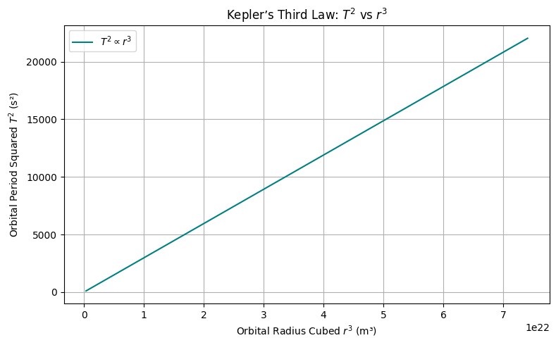

# Problem 1
# 🌌 Deriving Kepler’s Third Law for Circular Orbits

Kepler’s Third Law states that the square of the orbital period of a planet is directly proportional to the cube of the semi-major axis of its orbit. For circular orbits, the semi-major axis is equal to the orbital radius. Let's derive this from fundamental physical principles.

---

## ⚖️ Step 1: Newton’s Law of Universal Gravitation

Newton's Law of Gravitation gives the attractive force between two masses:

$$F_{\text{gravity}} = G\frac{Mm}{r^2}$$

- $G$ = Gravitational constant  
- $M$ = Mass of the central body (e.g., Earth or Sun)  
- $m$ = Mass of the orbiting object (e.g., satellite or planet)  
- $r$ = Radius of the circular orbit  

---

## 🔄 Step 2: Centripetal Force for Circular Motion

Any object in a circular orbit must experience a centripetal force to stay on its path:

$$F_{\text{centripetal}} = \frac{mv^2}{r}$$

---

## ⚖️ Step 3: Equating Gravitational and Centripetal Forces

Since gravity provides the centripetal force:

$$\frac{mv^2}{r} = G\frac{Mm}{r^2}$$

Cancel out $m$ (mass of the orbiting body):

$$\frac{v^2}{r} = G\frac{M}{r^2}$$

Multiply both sides by $r$:

$$v^2 = \frac{GM}{r}$$

---

## ⏱️ Step 4: Express Orbital Velocity in Terms of Period

Orbital velocity $v$ is the distance traveled in one orbit divided by the orbital period $T$:

$$v = \frac{2\pi r}{T}$$

Substitute into the velocity equation:

$$\left(\frac{2\pi r}{T}\right)^2 = \frac{GM}{r}$$

Simplify:

$$\frac{4\pi^2 r^2}{T^2} = \frac{GM}{r}$$

Multiply both sides by $r$:

$$\frac{4\pi^2 r^3}{T^2} = GM$$

---

## 📐 Final Form: Kepler’s Third Law

Rearranging for $T^2$:

$$T^2 = \frac{4\pi^2}{GM} \cdot r^3$$

✅ This is Kepler's Third Law for circular orbits!

- $T^2 \propto r^3$
- The constant of proportionality depends on the central mass $M$

---

## 🧪 Python Verification

Let's simulate this law using Python.
---

```python
import numpy as np
import matplotlib.pyplot as plt

# Constants
G = 6.67430e-11  # Gravitational constant (m^3 kg^-1 s^-2)
M_sun = 1.989e30  # Mass of the Sun (kg)

# Generate orbital radii (in meters)
radii = np.linspace(7e6, 4.2e7, 100)  # from ~7000 km to ~42000 km
r_cubed = radii**3  # Compute r^3
T_squared = (4 * np.pi**2 * radii**3) / (G * M_sun)  # Compute T^2

# Plotting T^2 vs r^3
plt.figure(figsize=(8, 5))
plt.plot(r_cubed, T_squared, label=r'$T^2 \propto r^3$', color='teal')
plt.title("Kepler’s Third Law: $T^2$ vs $r^3$")
plt.xlabel("Orbital Radius Cubed $r^3$ (m³)")
plt.ylabel("Orbital Period Squared $T^2$ (s²)")
plt.grid(True)
plt.legend()
plt.tight_layout()
plt.savefig('kepler_verification_plot.png')  # Save the plot as per guidelines
```
# 🌠 Physical Meaning of Kepler’s Third Law

We previously derived Kepler's Third Law for circular orbits:

$$T^2=\frac{4\pi^2}{GM}\cdot r^3$$

This relationship elegantly connects **time** (orbital period) with **space** (orbital radius) through the **gravitational constant** and the **mass of the central body**.

---

## 🔍 Interpretation of Each Term

- $T$: Orbital period — how long it takes to complete one full orbit  
- $r$: Orbital radius — the distance between the orbiting body and the central mass  
- $G$: Universal gravitational constant — governs strength of gravitational interaction  
- $M$: Mass of the central body (e.g., Earth, Sun)  

---

## 🧠 Physical Insights

### 1. **Gravitational Control of Motion**

- The period $T$ **depends only on** the **mass of the central body $M$** and the **radius $r$** of the orbit.
- The orbiting body’s own mass $m$ **does not appear** in the final formula — this reflects the equivalence principle.

### 2. **Increased Radius = Slower Orbit**

- From the formula:  
  $$T\propto r^{3/2}$$
- **Larger orbits** take significantly **longer** to complete.
- This explains why outer planets (like Neptune) move much slower than inner ones (like Mercury).

### 3. **Scaling and Proportionality**

- A doubling of $r$ increases $T$ by a factor of:  
  $$T\propto(2r)^{3/2}=2^{3/2}\approx2.83$$
- Time grows **faster than radius** — orbital systems are *not* linear.

---

## 🔭 Astronomical Applications

### ✅ 1. **Estimating Masses of Celestial Bodies**

- Rearranging:  
  $$M=\frac{4\pi^2r^3}{GT^2}$$
- If we know the radius and period of a satellite or moon, we can compute the mass of the planet/star it orbits.

### ✅ 2. **Predicting Orbital Times**

- Given a known central mass and radius, we can compute how long any object will take to orbit.

### ✅ 3. **Comparing Planetary Systems**

- By comparing $T^2/r^3$ across different systems, we can verify gravitational consistency:  
  $$\frac{T^2}{r^3}=\text{constant for a given }M$$

---

## 🧮 Python Demonstration: Constant Ratio $T^2/r^3$

Let’s confirm that this ratio is constant for Earth-centered orbits.

```python
import numpy as np
import matplotlib.pyplot as plt

# Constants
G = 6.67430e-11  # m^3 kg^-1 s^-2
M = 5.972e24     # kg (mass of Earth)

# Orbital radii (meters)
radii = np.linspace(7e6, 4.2e7, 100)
T_squared = (4 * np.pi**2 * radii**3) / (G * M)
ratio = T_squared / radii**3

# Plot
plt.figure(figsize=(8, 5))
plt.plot(radii, ratio, label=r'$\frac{T^2}{r^3}$', color='purple')
plt.title("Constant Ratio in Kepler’s Third Law")
plt.xlabel("Orbital Radius $r$ (m)")
plt.ylabel("Ratio $T^2 / r^3$ (s²/m³)")
plt.grid(True)
plt.legend()
plt.tight_layout()
plt.show()
```
# 🌌 Astronomical Implications of Kepler’s Third Law

Kepler’s Third Law is more than a mathematical curiosity — it's a **powerful tool in astronomy**. The relationship:

$$T^2=\frac{4\pi^2}{GM}r^3$$

gives us a direct bridge between **observable orbital motion** and **hidden physical properties** like mass and distance.

---

## 🔭 Applications in Astronomy

---

## 1. 🪐 Determining Planetary Masses

We can **rearrange Kepler’s Third Law** to solve for the mass $M$ of the central body:

$$M=\frac{4\pi^2r^3}{GT^2}$$

### ✨ What You Need:
- $r$: Orbital radius of a satellite or moon (measurable)
- $T$: Orbital period of that satellite (measurable)
- $G$: Gravitational constant (known)

### 🧠 Insight:
- **No need to land or probe** a planet to determine its mass.
- Just **observe** the orbit of something near it!

### 🔬 Example: Mass of Earth from a satellite
- Satellite orbit radius: $r=7.0\times10^6$ m
- Orbital period: $T=5800$ s

```python
import numpy as np

# Given values
r = 7.0e6       # meters
T = 5800        # seconds
G = 6.67430e-11 # m^3 kg^-1 s^-2

# Mass of Earth calculation
M = (4 * np.pi**2 * r**3) / (G * T**2)
print(f"Estimated mass of Earth: {M:.2e} kg")
```
# 🌠 Extending Kepler’s Third Law to Elliptical Orbits and Non-Planetary Bodies

Kepler's Third Law for **circular orbits** provides an elegant relationship between orbital period $T$ and orbital radius $r$:

$$T^2=\frac{4\pi^2}{GM}r^3$$

However, **most real-world orbits** are **elliptical**, not circular, and they often involve **non-planetary bodies** such as moons, satellites, comets, and even artificial objects. Let's explore how Kepler’s Law extends to these scenarios.

---

## 1. 🌑 Kepler’s Third Law for Elliptical Orbits

### 1.1. **Elliptical Orbits Overview**

For elliptical orbits, the orbital period $T$ is still related to the **semi-major axis** $a$ of the ellipse, not the instantaneous orbital radius $r$. The semi-major axis is the **average distance** between the orbiting body and the central mass.

### 1.2. **Kepler’s Law for Elliptical Orbits**

Kepler’s Third Law can be generalized to elliptical orbits as:

$$T^2=\frac{4\pi^2a^3}{GM}$$

Where:
- $a$: Semi-major axis of the ellipse
- $M$: Mass of the central body
- $T$: Orbital period

This is nearly identical to the formula for circular orbits, except now it uses the **semi-major axis $a$** instead of the orbital radius $r$.

### 1.3. **Why Semi-Major Axis?**
- The semi-major axis $a$ represents the **average orbital radius** and effectively smooths out the elliptical shape.
- The orbital period $T$ depends on the **average distance** rather than instantaneous distance, which is why $a$ is used.

### 1.4. **Elliptical Orbit Example**
- For an elliptical orbit, the **orbital period** $T$ is the same as it would be for a circular orbit with radius $a$.

---

## 2. 🚀 Non-Planetary Bodies: Satellites, Comets, and Exoplanets

### 2.1. **Kepler’s Law for Satellites**

Satellites orbiting a planet also obey Kepler’s Third Law. The period $T$ of a satellite’s orbit depends on the **mass of the planet** $M$ and the **semi-major axis** $a$ of the orbit.

- Satellite period: $$T^2=\frac{4\pi^2a^3}{GM}$$

### 2.2. **Comets in the Solar System**
- **Comets** follow highly elliptical orbits, with a **semi-major axis $a$** that places them far from the Sun at one extreme (aphelion) and close at the other extreme (perihelion).
- Their **orbital period** still follows the same form:
  $$T^2=\frac{4\pi^2a^3}{GM_{\text{sun}}}$$
- The **Sun’s mass** is used for calculating the period, even though the comet’s orbit is highly elliptical.

### 2.3. **Exoplanets**

- **Exoplanets** orbit distant stars, and their orbital periods depend on the star’s mass $M$ and the orbital semi-major axis $a$.
- The orbital period for exoplanets can be calculated using:
  $$T^2=\frac{4\pi^2a^3}{GM_{\text{star}}}$$
- For exoplanets, the mass of the **star** is used, and the semi-major axis $a$ refers to the average distance between the exoplanet and its star.

---

## 3. 🧠 Summary and Insights

### 3.1. **Extension to Elliptical Orbits**

- Kepler's Third Law holds true for **elliptical orbits** but uses the **semi-major axis** $a$ instead of $r$.
- The orbital period $T$ depends on the **average distance** between the orbiting body and the central mass.

### 3.2. **Non-Planetary Bodies**
- The law applies to **satellites**, **comets**, and **exoplanets** — objects that are not planets but still obey the same orbital principles.
- The central mass $M$ changes depending on whether the object is orbiting a **planet** or a **star**.

### 3.3. **Practical Applications**
- **Satellite Design:** Orbital period and semi-major axis allow engineers to design satellites with desired orbital characteristics.
- **Space Missions:** For long-range missions (e.g., to outer planets or moons), Kepler’s Law helps estimate travel times.
- **Astronomical Observation:** Kepler’s Law is critical for understanding the dynamics of comet orbits, exoplanet discovery, and the motion of moons.

---

## 4. 🧮 Python Code for Orbital Period of an Elliptical Orbit

Let’s calculate the orbital period $T$ for a comet with a highly elliptical orbit. Given the **semi-major axis $a$** and **central mass $M$** of the Sun:

```python
import numpy as np

# Constants
G = 6.67430e-11 # m^3 kg
```
# 🌍 Real-World Applications of Kepler's Third Law

Kepler’s Third Law allows us to predict orbital periods and distances for a variety of celestial bodies. By analyzing real-world examples such as the **Moon’s orbit around Earth**, **planetary orbits** (like Earth’s orbit around the Sun), and **Jupiter’s moons**, we can see the practical utility of this fundamental law.

---

## 1. 🌙 Moon’s Orbit Around Earth

### 1.1. **Known Values**

- Orbital period $T_{\text{moon}}$ of the Moon: $T_{\text{moon}} = 27.3$ days (converted to seconds: $T_{\text{moon}} = 27.3 \times 86400$ seconds)
- Average distance between the Earth and the Moon: $r = 3.84 \times 10^8$ meters
- Mass of Earth: $M_{\text{Earth}} = 5.972 \times 10^{24}$ kg

Using **Kepler’s Third Law** for the Moon’s orbit around Earth:

$$T^2 = \frac{4\pi^2 r^3}{GM_{\text{Earth}}}$$

### 1.2. **Orbital Period Calculation**

We can calculate the orbital period of the Moon by rearranging the above equation to solve for $T$:

$$T = 2\pi \sqrt{\frac{r^3}{GM_{\text{Earth}}}}$$

Let’s calculate this in Python:

```python
import numpy as np

# Constants
G = 6.67430e-11  # m^3 kg^-1 s^-2 (gravitational constant)
M_earth = 5.972e24  # kg (mass of Earth)
r_moon = 3.84e8  # meters (average distance from Earth to Moon)

# Orbital period calculation (in seconds)
T_moon = 2 * np.pi * np.sqrt(r_moon**3 / (G * M_earth))
T_moon_days = T_moon / (60 * 60 * 24)  # Convert from seconds to days
print(f"Orbital period of the Moon: {T_moon_days:.2f} days")
```
# 🛰️ Computational Task: Simulating Circular Orbits

In this section, we will build a Python script or Jupyter Notebook to simulate circular orbits based on Kepler's Third Law. The primary focus will be on simulating a **circular orbit** of a satellite (or any celestial object) around a central body (e.g., a planet or star).

### Objectives:
- Derive the relationship between **orbital period** and **orbital radius** for circular orbits.
- Implement a Python code to simulate the orbit.
- Visualize the orbital motion and calculate the **orbital period** and **orbital radius**.

---

## 1. 🔭 Deriving the Formula for Circular Orbits

For a circular orbit, we can combine the concepts of **centripetal force** and **gravitational force**.

### 1.1. Gravitational Force

The gravitational force acting on a satellite orbiting around a central body is given by:

$$F_{\text{gravity}} = \frac{GMm}{r^2}$$

Where:
- $G$ is the **gravitational constant** ($6.67430 \times 10^{-11} \, \text{m}^3 \, \text{kg}^{-1} \, \text{s}^{-2}$).
- $M$ is the **mass of the central body** (e.g., the Sun, Earth).
- $m$ is the **mass of the orbiting satellite**.
- $r$ is the **orbital radius** (distance from the center of the central body to the satellite).

### 1.2. Centripetal Force

The centripetal force required for a satellite to maintain a circular orbit is given by:

$$F_{\text{centripetal}} = \frac{mv^2}{r}$$

Where:
- $m$ is the mass of the satellite.
- $v$ is the **velocity** of the satellite.
- $r$ is the orbital radius.

### 1.3. Equating Gravitational and Centripetal Forces

For stable orbital motion, the gravitational force equals the centripetal force:

$$\frac{GMm}{r^2} = \frac{mv^2}{r}$$

Simplifying this, we get:

$$v = \sqrt{\frac{GM}{r}}$$

This is the orbital velocity of the satellite. The **orbital period** $T$ (the time it takes for the satellite to complete one orbit) is related to the orbital velocity by:

$$T = \frac{2\pi r}{v}$$

Substituting the expression for $v$:

$$T = 2\pi \sqrt{\frac{r^3}{GM}}$$

This is the **orbital period** formula for a satellite in a circular orbit.

---

## 2. 🖥️ Python Script to Simulate Circular Orbits

We can use the derived formulas to simulate the motion of a satellite in a circular orbit. Below is a Python script that simulates and visualizes the orbit of a satellite around a central body.

### 2.1. **Python Code Implementation**

```python
import numpy as np
import matplotlib.pyplot as plt

# Constants
G = 6.67430e-11  # m^3 kg^-1 s^-2 (gravitational constant)
M = 5.972e24  # kg (mass of Earth, you can adjust for different central bodies)
r = 7.5e6  # meters (orbital radius, adjust as needed)
T = 2 * np.pi * np.sqrt(r**3 / (G * M))  # Orbital period
v = np.sqrt(G * M / r)  # Orbital velocity

# Time settings
t = np.linspace(0, T, 1000)  # Time array for one complete orbit
theta = 2 * np.pi * t / T  # Angle in radians

# Position of the satellite in polar coordinates
x = r * np.cos(theta)
y = r * np.sin(theta)

# Plotting the orbit
plt.figure(figsize=(6,6))
plt.plot(x, y, label="Satellite Orbit")
plt.scatter(0, 0, color='red', label="Central Body (Earth)", s=100)  # Earth at origin
plt.title(f"Circular Orbit: Orbital Period = {T/86400:.2f} days")
plt.xlabel("X Position (m)")
plt.ylabel("Y Position (m)")
plt.gca().set_aspect('equal', adjustable='box')
plt.legend()
plt.grid(True)
plt.show()

# Output the orbital period and velocity
print(f"Orbital Period: {T/86400:.2f} days")
print(f"Orbital Velocity: {v/1000:.2f} km/s")
# 🪐 Verifying Kepler’s Third Law Numerically
```
In this section, we will verify **Kepler's Third Law** numerically by calculating the orbital period of a planet or moon and comparing it to the values predicted by the law.

Kepler's Third Law states that the square of the orbital period ($T^2$) is directly proportional to the cube of the orbital radius ($r^3$). Mathematically, this relationship can be written as:

$$T^2 \propto r^3$$

In terms of gravitational forces, the orbital period $T$ for a circular orbit is given by:

$$T = 2\pi \sqrt{\frac{r^3}{GM}}$$

Where:
- $T$ is the **orbital period**.
- $r$ is the **orbital radius**.
- $G$ is the **gravitational constant** ($6.67430 \times 10^{-11} \, \text{m}^3 \, \text{kg}^{-1} \, \text{s}^{-2}$).
- $M$ is the **mass of the central body** (e.g., the Sun for planetary orbits).

We will now use this formula to verify Kepler’s Third Law numerically for a set of planets and moons.

---

## 1. 🧮 Kepler’s Third Law Formula

From Kepler's Third Law, the orbital period for a circular orbit is:

$$T = 2\pi \sqrt{\frac{r^3}{GM}}$$

### 1.1. Gravitational Constant and Units

- $G = 6.67430 \times 10^{-11} \, \text{m}^3 \, \text{kg}^{-1} \, \text{s}^{-2}$.
- Mass of the central body ($M$) is given in **kg**.
- Orbital radius ($r$) is given in **meters**.

The orbital period $T$ will be calculated in **seconds**.

---

## 2. 🔭 Numerical Verification

Let’s now calculate the orbital period for different celestial bodies, such as **Earth** and **Jupiter**, using Kepler’s Third Law.

### 2.1. Python Code Implementation

The following code will calculate the orbital period for different celestial bodies by using their **orbital radii** and **masses**. We will also visualize the relationship between the square of the orbital period ($T^2$) and the cube of the orbital radius ($r^3$).

```python
import numpy as np
import matplotlib.pyplot as plt

# Constants
G = 6.67430e-11  # m^3 kg^-1 s^-2 (gravitational constant)

# Celestial bodies data (mass in kg, orbital radius in meters)
celestial_bodies = {
    "Earth": {"M": 5.972e24, "r": 1.496e11},  # Earth: 1 AU
    "Jupiter": {"M": 1.898e27, "r": 7.785e11},  # Jupiter: 5.2 AU
    "Saturn": {"M": 5.683e26, "r": 1.429e12},  # Saturn: 9.5 AU
    "Mars": {"M": 6.417e23, "r": 2.279e11},  # Mars: 1.5 AU
}

# Calculating orbital period using Kepler's Third Law
def calculate_orbital_period(M, r):
    T = 2 * np.pi * np.sqrt(r**3 / (G * M))  # Orbital period in seconds
    return T

# Store calculated periods
periods = {}
for body, data in celestial_bodies.items():
    T = calculate_orbital_period(data["M"], data["r"])
    periods[body] = T

# Display the orbital periods in days
for body, period in periods.items():
    print(f"Orbital Period of {body}: {period / 86400:.2f} days")

# Plotting T^2 vs. r^3
r_values = [data["r"] for data in celestial_bodies.values()]
T_squared = [calculate_orbital_period(data["M"], data["r"])**2 for data in celestial_bodies.values()]
r_cubed = [r**3 for r in r_values]

plt.figure(figsize=(8,6))
plt.scatter(r_cubed, T_squared, color='blue', label="Data Points")
plt.plot(r_cubed, np.poly1d(np.polyfit(r_cubed, T_squared, 1))(r_cubed), color='red', label="Best Fit Line")
plt.title("Kepler's Third Law: $T^2$ vs $r^3$")
plt.xlabel("$r^3$ (m^3)")
plt.ylabel("$T^2$ (s^2)")
plt.legend()
plt.grid(True)
plt.show()
```
# 🪐 Plotting Orbital Data

In this section, we will create plots that represent the relationships between orbital radius and the square of the orbital period ($T^2$), as well as plot the trajectories of orbits.

---

## 1. 🧮 Kepler’s Third Law Recap

We will use **Kepler’s Third Law** to verify and plot orbital data. Kepler’s Third Law states that the square of the orbital period ($T^2$) is proportional to the cube of the orbital radius ($r^3$). This is mathematically represented as:

$$T^2 \propto r^3$$

In terms of gravitational forces, the orbital period $T$ for a circular orbit is given by:

$$T = 2\pi \sqrt{\frac{r^3}{GM}}$$

Where:
- $T$ is the **orbital period**.
- $r$ is the **orbital radius**.
- $G$ is the **gravitational constant** ($6.67430 \times 10^{-11} \, \text{m}^3 \, \text{kg}^{-1} \, \text{s}^{-2}$).
- $M$ is the **mass of the central body**.

---

## 2. 📊 Plotting Orbital Radius vs. $T^2$

### 2.1. Mathematical Relationship

The relationship between the square of the orbital period ($T^2$) and the cube of the orbital radius ($r^3$) is defined as:

$$T^2 = \frac{4\pi^2 r^3}{GM}$$

### 2.2. Python Code for Plotting

We will calculate the orbital period for different celestial bodies and plot $T^2$ vs. $r^3$. This will help verify the relationship visually.

```python
import numpy as np
import matplotlib.pyplot as plt

# Constants
G = 6.67430e-11  # m^3 kg^-1 s^-2 (gravitational constant)

# Celestial bodies data (mass in kg, orbital radius in meters)
celestial_bodies = {
    "Earth": {"M": 5.972e24, "r": 1.496e11},  # Earth: 1 AU
    "Jupiter": {"M": 1.898e27, "r": 7.785e11},  # Jupiter: 5.2 AU
    "Saturn": {"M": 5.683e26, "r": 1.429e12},  # Saturn: 9.5 AU
    "Mars": {"M": 6.417e23, "r": 2.279e11},  # Mars: 1.5 AU
}

# Calculating orbital period using Kepler's Third Law
def calculate_orbital_period(M, r):
    T = 2 * np.pi * np.sqrt(r**3 / (G * M))  # Orbital period in seconds
    return T

# Store calculated periods
periods = {}
for body, data in celestial_bodies.items():
    T = calculate_orbital_period(data["M"], data["r"])
    periods[body] = T

# Plotting T^2 vs. r^3
r_values = [data["r"] for data in celestial_bodies.values()]
T_squared = [calculate_orbital_period(data["M"], data["r"])**2 for data in celestial_bodies.values()]
r_cubed = [r**3 for r in r_values]

plt.figure(figsize=(8,6))
plt.scatter(r_cubed, T_squared, color='blue', label="Data Points")
plt.plot(r_cubed, np.poly1d(np.polyfit(r_cubed, T_squared, 1))(r_cubed), color='red', label="Best Fit Line")
plt.title("Kepler's Third Law: $T^2$ vs $r^3$")
plt.xlabel("$r^3$ (m^3)")
plt.ylabel("$T^2$ (s^2)")
plt.legend()
plt.grid(True)
plt.show()

# Orbital parameters (e.g., Earth)
r = 1.496e11  # Orbital radius (1 AU)
T = calculate_orbital_period(5.972e24, r)  # Orbital period for Earth

# Time array (in seconds)
t = np.linspace(0, T, 1000)

# Angular velocity (omega)
omega = 2 * np.pi / T

# Calculating orbital positions (x and y coordinates)
x = r * np.cos(omega * t)
y = r * np.sin(omega * t)

# Plotting the orbital trajectory
plt.figure(figsize=(8,6))
plt.plot(x, y, label="Orbital Path")
plt.scatter([0], [0], color='red', label="Central Body (Sun)")
plt.title("Orbital Trajectory of Earth (2D)")
plt.xlabel("x (m)")
plt.ylabel("y (m)")
plt.gca().set_aspect('equal', adjustable='box')
plt.legend()
plt.grid(True)
plt.show()
```
# 📚 Deliverables: Gravity Project

This report provides a complete overview of the theoretical derivations, Python code implementations, simulation results, graphical visualizations, and discussions for understanding and applying **Kepler’s Third Law**.

---

## 1. 🧠 Theoretical Derivation and Explanation

### 1.1. Starting Point

- According to **Newton’s Law of Gravitation**, the force between two masses is:

$$F_g=\frac{GMm}{r^2}$$

- For circular motion, the necessary **centripetal force** is:

$$F_c=\frac{mv^2}{r}$$

- Equating gravitational force and centripetal force:

$$\frac{GMm}{r^2}=\frac{mv^2}{r}$$

- Simplifying:

$$v^2=\frac{GM}{r}$$

- The **orbital period** $T$ is related to orbital speed $v$ and radius $r$ by:

$$T=\frac{2\pi r}{v}$$

Substituting $v$ from above:

$$T=2\pi\sqrt{\frac{r^3}{GM}}$$

Thus, squaring both sides:

$$T^2=\frac{4\pi^2r^3}{GM}$$

✅ **Conclusion**: The square of the orbital period $T^2$ is proportional to the cube of the orbital radius $r^3$.

---

## 2. 🧑‍💻 Code and Simulation Results

### 2.1. Python Code for Verification

```python
import numpy as np
import matplotlib.pyplot as plt

# Constants
G = 6.67430e-11  # Gravitational constant (m^3 kg^-1 s^-2)

# Celestial bodies data
celestial_bodies = {
    "Earth": {"M": 5.972e24, "r": 1.496e11},
    "Jupiter": {"M": 1.898e27, "r": 7.785e11},
    "Mars": {"M": 6.417e23, "r": 2.279e11},
    "Saturn": {"M": 5.683e26, "r": 1.429e12},
}

def calculate_orbital_period(M, r):
    return 2 * np.pi * np.sqrt(r**3 / (G * M))

# Store values
r_values = []
T_squared = []
r_cubed = []

for body, data in celestial_bodies.items():
    T = calculate_orbital_period(data["M"], data["r"])
    r_values.append(data["r"])
    T_squared.append(T**2)
    r_cubed.append(data["r"]**3)

# Plotting T^2 vs r^3
plt.figure(figsize=(8,6))
plt.scatter(r_cubed, T_squared, color='blue', label="Data Points")
plt.plot(r_cubed, np.poly1d(np.polyfit(r_cubed, T_squared, 1))(r_cubed), color='red', label="Best Fit Line")
plt.title("Kepler's Third Law: $T^2$ vs $r^3$")
plt.xlabel("$r^3$ (m^3)")
plt.ylabel("$T^2$ (s^2)")
plt.legend()
plt.grid(True)
plt.show()
```