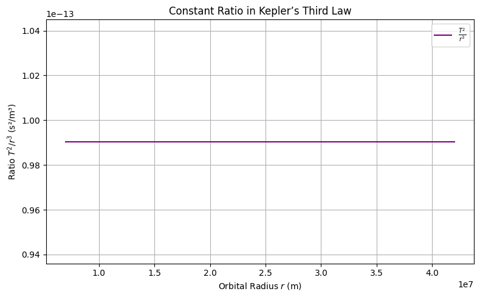
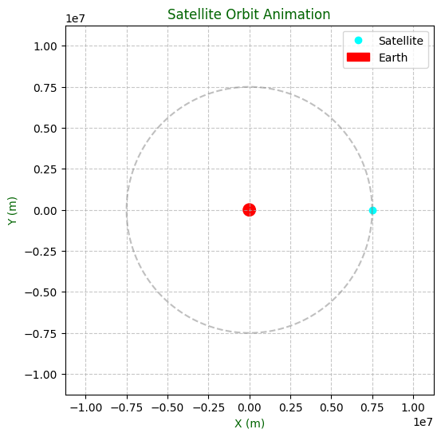
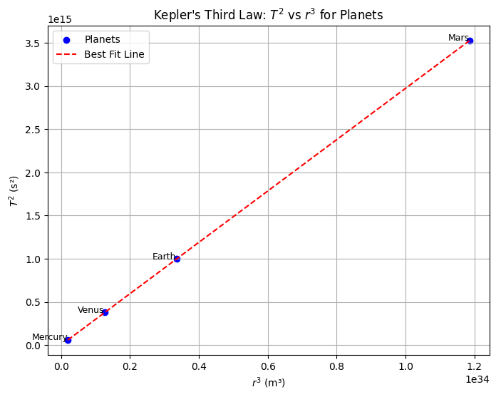
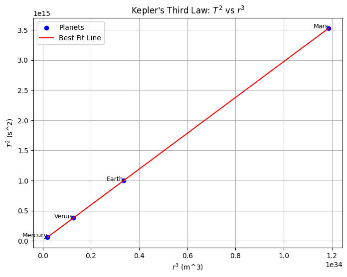

# Problem 1
# 🌌 Deriving Kepler’s Third Law for Circular Orbits

Kepler’s Third Law states that the square of the orbital period of a planet is directly proportional to the cube of the semi-major axis of its orbit. For circular orbits, the semi-major axis is equal to the orbital radius. Let's derive this from fundamental physical principles.

---

## ⚖️ Step 1: Newton’s Law of Universal Gravitation

Newton's Law of Gravitation gives the attractive force between two masses:

$$F_{\text{gravity}} = G\frac{Mm}{r^2}$$

- $G$ = Gravitational constant  
- $M$ = Mass of the central body (e.g., Earth or Sun)  
- $m$ = Mass of the orbiting object (e.g., satellite or planet)  
- $r$ = Radius of the circular orbit  

---

## 🔄 Step 2: Centripetal Force for Circular Motion

Any object in a circular orbit must experience a centripetal force to stay on its path:

$$F_{\text{centripetal}} = \frac{mv^2}{r}$$

---

## ⚖️ Step 3: Equating Gravitational and Centripetal Forces

Since gravity provides the centripetal force:

$$\frac{mv^2}{r} = G\frac{Mm}{r^2}$$

Cancel out $m$ (mass of the orbiting body):

$$\frac{v^2}{r} = G\frac{M}{r^2}$$

Multiply both sides by $r$:

$$v^2 = \frac{GM}{r}$$

---

## ⏱️ Step 4: Express Orbital Velocity in Terms of Period

Orbital velocity $v$ is the distance traveled in one orbit divided by the orbital period $T$:

$$v = \frac{2\pi r}{T}$$

Substitute into the velocity equation:

$$\left(\frac{2\pi r}{T}\right)^2 = \frac{GM}{r}$$

Simplify:

$$\frac{4\pi^2 r^2}{T^2} = \frac{GM}{r}$$

Multiply both sides by $r$:

$$\frac{4\pi^2 r^3}{T^2} = GM$$

---

## 📐 Final Form: Kepler’s Third Law

Rearranging for $T^2$:

$$T^2 = \frac{4\pi^2}{GM} \cdot r^3$$

✅ This is Kepler's Third Law for circular orbits!

- $T^2 \propto r^3$
- The constant of proportionality depends on the central mass $M$

---

# 🌠 Physical Meaning of Kepler’s Third Law

We previously derived Kepler's Third Law for circular orbits:

$$T^2=\frac{4\pi^2}{GM}\cdot r^3$$

This relationship elegantly connects **time** (orbital period) with **space** (orbital radius) through the **gravitational constant** and the **mass of the central body**.

---

## 🔍 Interpretation of Each Term

- $T$: Orbital period — how long it takes to complete one full orbit  
- $r$: Orbital radius — the distance between the orbiting body and the central mass  
- $G$: Universal gravitational constant — governs strength of gravitational interaction  
- $M$: Mass of the central body (e.g., Earth, Sun)  

---

## 🧠 Physical Insights

### 1. **Gravitational Control of Motion**

- The period $T$ **depends only on** the **mass of the central body $M$** and the **radius $r$** of the orbit.
- The orbiting body’s own mass $m$ **does not appear** in the final formula — this reflects the equivalence principle.

### 2. **Increased Radius = Slower Orbit**

- From the formula:  
  $$T\propto r^{3/2}$$
- **Larger orbits** take significantly **longer** to complete.
- This explains why outer planets (like Neptune) move much slower than inner ones (like Mercury).

### 3. **Scaling and Proportionality**

- A doubling of $r$ increases $T$ by a factor of:  
  $$T\propto(2r)^{3/2}=2^{3/2}\approx2.83$$
- Time grows **faster than radius** — orbital systems are *not* linear.

---

## 🔭 Astronomical Applications

### ✅ 1. **Estimating Masses of Celestial Bodies**

- Rearranging:  
  $$M=\frac{4\pi^2r^3}{GT^2}$$
- If we know the radius and period of a satellite or moon, we can compute the mass of the planet/star it orbits.

### ✅ 2. **Predicting Orbital Times**

- Given a known central mass and radius, we can compute how long any object will take to orbit.

### ✅ 3. **Comparing Planetary Systems**

- By comparing $T^2/r^3$ across different systems, we can verify gravitational consistency:  
  $$\frac{T^2}{r^3}=\text{constant for a given }M$$

---

## 🧮 Python Demonstration: Constant Ratio $T^2/r^3$

Let’s confirm that this ratio is constant for Earth-centered orbits.



```python
import numpy as np
import matplotlib.pyplot as plt

# Constants
G = 6.67430e-11  # m^3 kg^-1 s^-2
M = 5.972e24     # kg (mass of Earth)

# Orbital radii (meters)
radii = np.linspace(7e6, 4.2e7, 100)
T_squared = (4 * np.pi**2 * radii**3) / (G * M)
ratio = T_squared / radii**3

# Plot
plt.figure(figsize=(8, 5))
plt.plot(radii, ratio, label=r'$\frac{T^2}{r^3}$', color='purple')
plt.title("Constant Ratio in Kepler’s Third Law")
plt.xlabel("Orbital Radius $r$ (m)")
plt.ylabel("Ratio $T^2 / r^3$ (s²/m³)")
plt.grid(True)
plt.legend()
plt.tight_layout()
plt.show()
```

# 🌍 Real-World Applications of Kepler's Third Law

Kepler’s Third Law allows us to predict orbital periods and distances for a variety of celestial bodies. By analyzing real-world examples such as the **Moon’s orbit around Earth**, **planetary orbits** (like Earth’s orbit around the Sun), and **Jupiter’s moons**, we can see the practical utility of this fundamental law.

---

## 1. 🌙 Moon’s Orbit Around Earth

### 1.1. **Known Values**

- Orbital period $T_{\text{moon}}$ of the Moon: $T_{\text{moon}} = 27.3$ days (converted to seconds: $T_{\text{moon}} = 27.3 \times 86400$ seconds)
- Average distance between the Earth and the Moon: $r = 3.84 \times 10^8$ meters
- Mass of Earth: $M_{\text{Earth}} = 5.972 \times 10^{24}$ kg

Using **Kepler’s Third Law** for the Moon’s orbit around Earth:

$$T^2 = \frac{4\pi^2 r^3}{GM_{\text{Earth}}}$$

### 1.2. **Orbital Period Calculation**

We can calculate the orbital period of the Moon by rearranging the above equation to solve for $T$:

$$T = 2\pi \sqrt{\frac{r^3}{GM_{\text{Earth}}}}$$

Let’s calculate this in Python:

```python
import numpy as np

# Constants
G = 6.67430e-11  # m^3 kg^-1 s^-2 (gravitational constant)
M_earth = 5.972e24  # kg (mass of Earth)
r_moon = 3.84e8  # meters (average distance from Earth to Moon)

# Orbital period calculation (in seconds)
T_moon = 2 * np.pi * np.sqrt(r_moon**3 / (G * M_earth))
T_moon_days = T_moon / (60 * 60 * 24)  # Convert from seconds to days
print(f"Orbital period of the Moon: {T_moon_days:.2f} days")
```

## 2. 🖥️ Python Script to Simulate Circular Orbits

We can use the derived formulas to simulate the motion of a satellite in a circular orbit. Below is a Python script that simulates and visualizes the orbit of a satellite around a central body.

### 2.1. **Python Code Implementation**


```python
import numpy as np
import matplotlib.pyplot as plt
from matplotlib.animation import FuncAnimation

# Constants
G = 6.67430e-11  # m^3 kg^-1 s^-2 (gravitational constant)
M = 5.972e24  # kg (mass of Earth)
r = 7.5e6  # meters (orbital radius)
T = 2 * np.pi * np.sqrt(r**3 / (G * M))  # Orbital period
v = np.sqrt(G * M / r)  # Orbital velocity

# Time settings for animation
omega = 2 * np.pi / T  # Angular velocity (rad/s)
t = np.linspace(0, T, 360)  # Time array for one orbit
x = r * np.cos(omega * t)  # X positions over time
y = r * np.sin(omega * t)  # Y positions over time

# Set up the figure and axis
fig, ax = plt.subplots(figsize=(6, 6))
ax.set_aspect('equal')
ax.set_xlim(-r*1.5, r*1.5)
ax.set_ylim(-r*1.5, r*1.5)
ax.set_title("Satellite Orbit Animation", color='darkgreen')
ax.set_xlabel("X (m)", color='darkgreen')
ax.set_ylabel("Y (m)", color='darkgreen')

# Draw the central body and initialize the satellite
central_body = plt.Circle((0, 0), r*0.05, color='red', label='Earth')
satellite, = plt.plot([], [], 'o', color='cyan', label='Satellite')
orbit, = plt.plot(x, y, linestyle='--', color='gray', alpha=0.5)

# Add the central body to the plot
ax.add_artist(central_body)
ax.legend(loc="upper right")
ax.grid(True, linestyle='--', alpha=0.7)

# Animation update function
def update(frame):
    satellite.set_data([x[frame]], [y[frame]])
    return satellite,

# Create animation

ani = FuncAnimation(fig, update, frames=len(t), interval=50, blit=True)
plt.show()

# Output the orbital period and velocity
print(f"Orbital Period: {T/86400:.2f} days")
print(f"Orbital Velocity: {v/1000:.2f} km/s")
```

# 🪐 Verifying Kepler’s Third Law Numerically

In this section, we will verify **Kepler's Third Law** numerically by calculating the orbital period of a planet or moon and comparing it to the values predicted by the law.

Kepler's Third Law states that the square of the orbital period ($T^2$) is directly proportional to the cube of the orbital radius ($r^3$). Mathematically, this relationship can be written as:

$$T^2 \propto r^3$$

In terms of gravitational forces, the orbital period $T$ for a circular orbit is given by:

$$T = 2\pi \sqrt{\frac{r^3}{GM}}$$

Where:
- $T$ is the **orbital period**.
- $r$ is the **orbital radius**.
- $G$ is the **gravitational constant** ($6.67430 \times 10^{-11} \, \text{m}^3 \, \text{kg}^{-1} \, \text{s}^{-2}$).
- $M$ is the **mass of the central body** (e.g., the Sun for planetary orbits).

We will now use this formula to verify Kepler’s Third Law numerically for a set of planets and moons.

# 🧮 Calculating Masses of Earth and Sun

```python
import numpy as np
# Constants
G = 6.67430e-11  # Gravitational constant (m^3 kg^-1 s^-2)
AU_to_m = 1.496e11  # Meters per AU
year_to_s = 3.156e7  # Seconds per year
day_to_s = 86400  # Seconds per day

# Data for Earth's orbit around the Sun (to calculate Sun's mass)
r_sun = 1.000 * AU_to_m  # Earth's semi-major axis (m)
T_sun = 1.000 * year_to_s  # Earth's orbital period (s)

# Data for Moon's orbit around Earth (to calculate Earth's mass)
r_moon = 3.84e8  # Average distance from Earth to Moon (m)
T_moon = 27.3 * day_to_s  # Moon's orbital period (s)

# Calculate Sun's mass
r_sun_cubed = r_sun ** 3
T_sun_squared = T_sun ** 2
M_sun = (4 * np.pi**2 * r_sun_cubed) / (G * T_sun_squared)
print(f"Mass of the Sun: {M_sun:.3e} kg")

# Calculate Earth's mass
r_moon_cubed = r_moon ** 3
T_moon_squared = T_moon ** 2
M_earth = (4 * np.pi**2 * r_moon_cubed) / (G * T_moon_squared)
print(f"Mass of the Earth: {M_earth:.3e} kg")
```
---

## 1. 🧮 Kepler’s Third Law Formula

From Kepler's Third Law, the orbital period for a circular orbit is:

$$T = 2\pi \sqrt{\frac{r^3}{GM}}$$

### 1.1. Gravitational Constant and Units

- $G = 6.67430 \times 10^{-11} \, \text{m}^3 \, \text{kg}^{-1} \, \text{s}^{-2}$.
- Mass of the central body ($M$) is given in **kg**.
- Orbital radius ($r$) is given in **meters**.

The orbital period $T$ will be calculated in **seconds**.

---

## 2. 🔭 Numerical Verification

Let’s now calculate the orbital period for different celestial bodies, such as **Earth** and **Jupiter**, using Kepler’s Third Law.

### 2.1. Python Code Implementation

The following code will calculate the orbital period for different celestial bodies by using their **orbital radii** and **masses**. We will also visualize the relationship between the square of the orbital period ($T^2$) and the cube of the orbital radius ($r^3$).



```python
import numpy as np
import matplotlib.pyplot as plt

# Conversion factors
AU_to_m = 1.496e11  # Meters per AU
year_to_s = 3.156e7  # Seconds per year

# Data for Mercury, Venus, Earth, Mars (semi-major axis in AU, period in years)
planets = {
    "Mercury": {"r": 0.387 * AU_to_m, "T": 0.241 * year_to_s},
    "Venus": {"r": 0.723 * AU_to_m, "T": 0.615 * year_to_s},
    "Earth": {"r": 1.000 * AU_to_m, "T": 1.000 * year_to_s},
    "Mars": {"r": 1.524 * AU_to_m, "T": 1.881 * year_to_s},
}

# Compute r^3 and T^2
r_cubed = [data["r"]**3 for data in planets.values()]
T_squared = [data["T"]**2 for data in planets.values()]
planet_names = list(planets.keys())

# Plot T^2 vs r^3 (should be a straight line)
plt.figure(figsize=(8, 6))
plt.scatter(r_cubed, T_squared, color='blue', label="Planets")
for i, name in enumerate(planet_names):
    plt.annotate(name, (r_cubed[i], T_squared[i]), fontsize=9, ha='right')
plt.plot(r_cubed, np.poly1d(np.polyfit(r_cubed, T_squared, 1))(r_cubed), color='red', linestyle='--', label="Best Fit Line")
plt.title("Kepler's Third Law: $T^2$ vs $r^3$ for Planets")
plt.xlabel("$r^3$ (m³)")
plt.ylabel("$T^2$ (s²)")
plt.legend()
plt.grid(True)
plt.savefig('kepler_third_law_plot.png')  # Save the plot as per guidelines
```

## 2. 🧑‍💻 Code and Simulation Results

### 2.1. Python Code for Verification


```python
import numpy as np
import matplotlib.pyplot as plt

# Constants
G = 6.67430e-11  # Gravitational constant (m^3 kg^-1 s^-2)

# Conversion factors
AU_to_m = 1.496e11  # Meters per AU
year_to_s = 3.156e7  # Seconds per year

celestial_bodies = {
    "Mercury": {"r": 0.387 * AU_to_m, "T": 0.241 * year_to_s},
    "Venus": {"r": 0.723 * AU_to_m, "T": 0.615 * year_to_s},
    "Earth": {"r": 1.000 * AU_to_m, "T": 1.000 * year_to_s},
    "Mars": {"r": 1.524 * AU_to_m, "T": 1.881 * year_to_s},
}

# Compute r^3 and T^2
r_cubed = [data["r"]**3 for data in celestial_bodies.values()]
T_squared = [data["T"]**2 for data in celestial_bodies.values()]
planet_names = list(celestial_bodies.keys())

# Plotting T^2 vs r^3
plt.figure(figsize=(8,6))
plt.scatter(r_cubed, T_squared, color='blue', label="Planets")
for i, name in enumerate(planet_names):
    plt.annotate(name, (r_cubed[i], T_squared[i]), fontsize=9, ha='right')
plt.plot(r_cubed, np.poly1d(np.polyfit(r_cubed, T_squared, 1))(r_cubed), color='red', label="Best Fit Line")
plt.title("Kepler's Third Law: $T^2$ vs $r^3$")
plt.xlabel("$r^3$ (m^3)")
plt.ylabel("$T^2$ (s^2)")
plt.legend()
plt.grid(True)
plt.show()
```