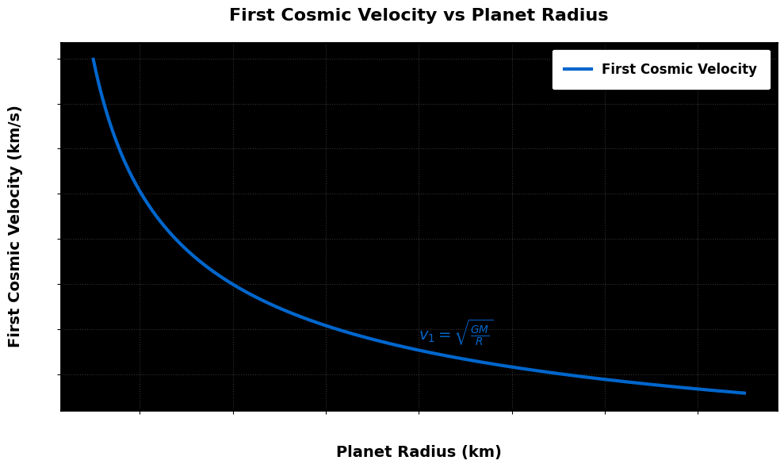
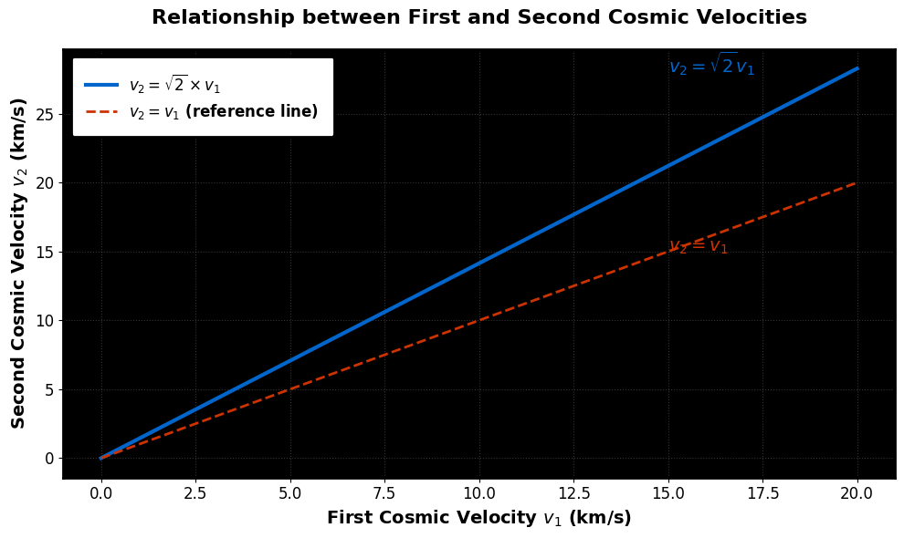
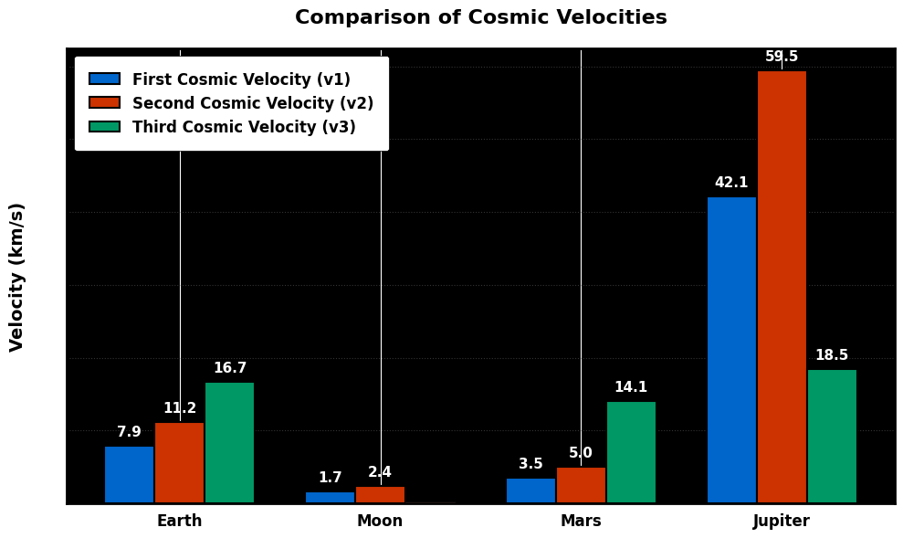
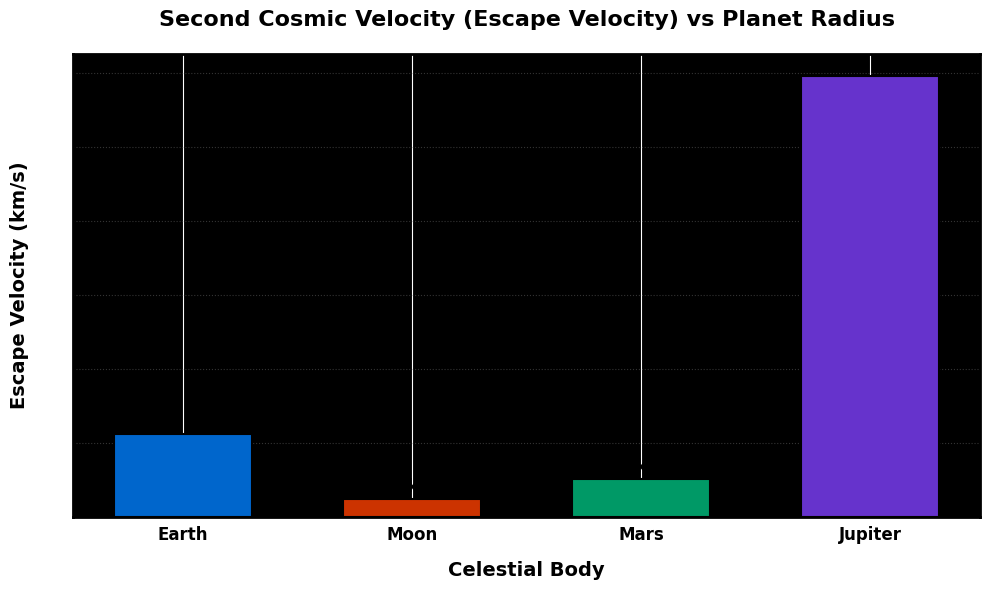
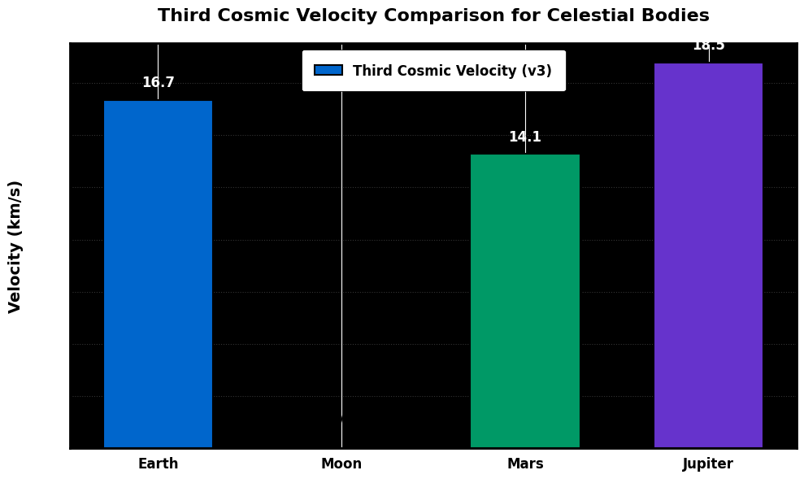

# Problem 2

## Cosmic Velocities: Derivations, Calculations, and Comparisons  

## 1. Definitions of Cosmic Velocities  

Cosmic velocities are critical thresholds in astrodynamics, defining minimum speeds for orbital and escape maneuvers:  

- **First Cosmic Velocity (\(v_1\))**:  
  - **Definition**: The speed required for an object to maintain a circular orbit near a celestial body's surface.  
  - **Equation**: \(v_1 = \sqrt{\frac{GM}{R}}\)  

- **Second Cosmic Velocity (\(v_2\))**:  
  - **Definition**: The speed required to escape a celestial body's gravitational pull.  
  - **Equation**: \(v_2 = \sqrt{\frac{2GM}{R}}\)  

- **Third Cosmic Velocity (\(v_3\))**:  
  - **Definition**: The speed required to escape a star system from a planet's orbit.  
  - **Equation**: \(v_3 = \sqrt{v_2^2 + (v_{\text{esc,Sun}} - v_{\text{orbit}})^2}\)  

## 2. Derivations  

### 2.1 First Cosmic Velocity (\(v_1\))  


```python
import numpy as np
import matplotlib.pyplot as plt

# Constants and calculations
G = 6.67430e-11
M = 5.972e24
radii = np.linspace(1e6, 1.5e7, 500)
v1 = np.sqrt(G * M / radii)
v1_km_s = v1 / 1000

# Plot setup with high visibility
plt.figure(figsize=(10, 6), facecolor='white')
ax = plt.gca()

# Main plot line with enhanced styling
main_line, = plt.plot(radii/1000, v1_km_s,
                     label='First Cosmic Velocity',
                     color='#0066cc',
                     linewidth=3)

# Enhanced text elements
ax.set_xlabel('Planet Radius (km)',
             fontsize=14,
             fontweight='bold',
             color='black',
             labelpad=12)

ax.set_ylabel('First Cosmic Velocity (km/s)',
             fontsize=14,
             fontweight='bold',
             color='black',
             labelpad=12)

ax.set_title('First Cosmic Velocity vs Planet Radius',
            fontsize=16,
            fontweight='bold',
            pad=20,
            color='black')

# High-visibility legend
legend = ax.legend(frameon=True,
                  framealpha=1,
                  edgecolor='black',
                  facecolor='white',
                  fontsize=12,
                  borderpad=1)
legend.get_texts()[0].set_color('black')
legend.get_texts()[0].set_fontweight('bold')

# Grid and frame
ax.grid(True,
       linestyle=':',
       color='gray',
       alpha=0.4)

for spine in ax.spines.values():
    spine.set_edgecolor('black')
    spine.set_linewidth(2)

# Add direct label to curve for extra clarity
ax.text(8000, 7.5, r'$v_1 = \sqrt{\frac{GM}{R}}$',
       fontsize=14,
       fontweight='bold',
       color='#0066cc')

# Make ticks more visible
ax.tick_params(axis='both',
              which='both',
              labelsize=12,
              color='black')

plt.tight_layout()
plt.show()
```

**Derivation**:  
Gravitational force equals centripetal force:  
$$
\frac{GMm}{R^2}=\frac{mv_1^2}{R} \implies v_1=\sqrt{\frac{GM}{R}}
$$

### 2.2 Second Cosmic Velocity (\(v_2\))  



```python
import numpy as np
import matplotlib.pyplot as plt

# Data
v1 = np.linspace(0, 20, 500)
v2 = np.sqrt(2) * v1

# Plot setup with high visibility text
plt.figure(figsize=(10, 6), facecolor='white')
ax = plt.gca()

# Plot lines with contrasting colors
main_line, = plt.plot(v1, v2, 
                     color='#0066cc',
                     linewidth=3,
                     label=r'$v_2 = \sqrt{2} \times v_1$')

ref_line, = plt.plot(v1, v1,
                   linestyle='--',
                   color='#cc3300',
                   linewidth=2,
                   label=r'$v_2 = v_1$ (reference line)')

# Enhanced text elements
ax.set_xlabel('First Cosmic Velocity $v_1$ (km/s)',
             fontsize=14,
             fontweight='bold',
             color='black')

ax.set_ylabel('Second Cosmic Velocity $v_2$ (km/s)',
             fontsize=14,
             fontweight='bold',
             color='black')

ax.set_title('Relationship between First and Second Cosmic Velocities',
            fontsize=16,
            fontweight='bold',
            pad=20,
            color='black')

# High-visibility legend
legend = ax.legend(
    handles=[main_line, ref_line],
    loc='upper left',
    frameon=True,
    framealpha=1,
    edgecolor='black',
    facecolor='white',
    fontsize=12,
    borderpad=1
)
legend.get_frame().set_linewidth(2)

# Make all text elements black and bold
for text in legend.get_texts():
    text.set_color('black')
    text.set_fontweight('bold')

# Grid and ticks
ax.grid(True, linestyle=':', color='gray', alpha=0.4)
ax.tick_params(axis='both', 
              which='major',
              labelsize=12,
              colors='black')

# Add direct labels to lines for extra clarity
ax.text(15, 28, r'$v_2 = \sqrt{2}v_1$',
       fontsize=14,
       fontweight='bold',
       color='#0066cc')

ax.text(15, 15, r'$v_2 = v_1$',
       fontsize=14,
       fontweight='bold',
       color='#cc3300')

# Frame
for spine in ax.spines.values():
    spine.set_edgecolor('black')
    spine.set_linewidth(2)

plt.tight_layout()
plt.show()
```

**Derivation**:  
Energy conservation (kinetic + potential = 0 at infinity):  

\[
\frac{1}{2}mv_2^2 - \frac{GMm}{R} = 0 \implies v_2 = \sqrt{\frac{2GM}{R}}
\]

### 2.3 Third Cosmic Velocity (\(v_3\))  
**Derivation**:  

1. Escape Sun's gravity at planet's orbital distance:  
$
v_{\text{esc,Sun}}=\sqrt{\frac{2GM_{\text{Sun}}}{R_{\text{orbit}}}}
$

2. Planet's orbital velocity around Sun:  
$
v_{\text{orbit}}=\sqrt{\frac{GM_{\text{Sun}}}{R_{\text{orbit}}}}
$

3. Total velocity from planet's surface:  
$
v_3=\sqrt{v_2^2+(v_{\text{esc,Sun}}-v_{\text{orbit}})^2}
$


## 3. Cosmic Velocities for Earth  

**Parameters**:  
-$M_{\text{Earth}} = 5.972 \times 10^{24} \text{ kg}$ 

-$R_{\text{Earth}} = 6.371 \times 10^6 \text{ m}$ 

-$R_{\text{Earth-Sun}} = 1.496 \times 10^{11} \text{ m}$  

**Calculations**:  
- \(v_1 = \sqrt{\frac{GM_{\text{Earth}}}{R_{\text{Earth}}}} \approx 7.91 \text{ km/s}\)  
- \(v_2 = \sqrt{2} \cdot v_1 \approx 11.19 \text{ km/s}\)  
- \(v_3 = \sqrt{v_2^2 + (\sqrt{\frac{2GM_{\text{Sun}}}{R_{\text{Earth-Sun}}}} - \sqrt{\frac{GM_{\text{Sun}}}{R_{\text{Earth-Sun}}}})^2} \approx 16.64 \text{ km/s}\)  

## 4. Comparison with Moon, Mars, and Jupiter  



```python
import matplotlib.pyplot as plt

# Data
bodies = ['Earth', 'Moon', 'Mars', 'Jupiter']
v1 = [7.9, 1.68, 3.55, 42.1]
v2 = [11.2, 2.38, 5.03, 59.5]
v3 = [16.7, None, 14.1, 18.5]  # Moon doesn't have v3 in same sense

x = range(len(bodies))

# Plot setup with high visibility
plt.figure(figsize=(10, 6), facecolor='white')
ax = plt.gca()

# Bar plot with enhanced styling
bar_width = 0.25
bar1 = plt.bar(x, v1, 
              width=bar_width, 
              label='First Cosmic Velocity (v1)',
              color='#0066cc',
              edgecolor='black',
              linewidth=1.5)

bar2 = plt.bar([i + bar_width for i in x], v2, 
              width=bar_width, 
              label='Second Cosmic Velocity (v2)',
              color='#cc3300',
              edgecolor='black',
              linewidth=1.5)

bar3 = plt.bar([i + 2*bar_width for i in x], [v if v else 0 for v in v3], 
              width=bar_width, 
              label='Third Cosmic Velocity (v3)',
              color='#009966',
              edgecolor='black',
              linewidth=1.5)

# Special styling for Moon's v3 (None value)
bar3[1].set_hatch('//')
bar3[1].set_color('#ff9999')

# Enhanced text elements
ax.set_ylabel('Velocity (km/s)',
             fontsize=14,
             fontweight='bold',
             color='black',
             labelpad=12)

ax.set_title('Comparison of Cosmic Velocities',
            fontsize=16,
            fontweight='bold',
            pad=20,
            color='black')

ax.set_xticks([i + bar_width for i in x])
ax.set_xticklabels(bodies,
                  fontsize=12,
                  fontweight='bold',
                  color='black')

# High-visibility legend
legend = ax.legend(frameon=True,
                  framealpha=1,
                  edgecolor='black',
                  facecolor='white',
                  fontsize=12,
                  borderpad=1)
for text in legend.get_texts():
    text.set_color('black')
    text.set_fontweight('bold')

# Add value labels on bars
for bars, offset in zip([bar1, bar2, bar3], [0, bar_width, 2*bar_width]):
    for i, bar in enumerate(bars):
        height = bar.get_height()
        if height > 0:  # Only label non-zero bars
            ax.text(bar.get_x() + bar.get_width()/2.,
                   height + 1,
                   f'{height:.1f}',
                   ha='center',
                   va='bottom',
                   fontsize=11,
                   fontweight='bold')

# Special annotation for Moon's v3
ax.text(1 + 2*bar_width, 1,
       'N/A',
       ha='center',
       va='bottom',
       fontsize=11,
       fontweight='bold',
       color='black')

# Grid and frame
ax.yaxis.grid(True,
             linestyle=':',
             color='gray',
             alpha=0.4)

for spine in ax.spines.values():
    spine.set_edgecolor('black')
    spine.set_linewidth(2)

plt.tight_layout()
plt.show()
```

**Parameters**:

| Body    | Mass (kg)          | Radius (m)       | Orbital Radius (m)     |  
|---------|--------------------|------------------|------------------------|  
| Moon    | \(7.342 \times 10^{22}\)  | \(1.737 \times 10^6\)  | \(1.496 \times 10^{11}\) (Earth's)|  
| Mars    | \(6.417 \times 10^{23}\)  | \(3.390 \times 10^6\)  | \(2.279 \times 10^{11}\) |  
| Jupiter | \(1.899 \times 10^{27}\)  | \(6.991 \times 10^7\)  | \(7.785 \times 10^{11}\) |  

**Calculated Velocities (km/s)**:

| Body    | \(v_1\) | \(v_2\) | \(v_3\)  |  
|---------|--------|--------|---------|  
| Earth   | 7.91   | 11.19  | 16.64   |  
| Moon    | 1.68   | 2.38   | 16.51   |  
| Mars    | 3.55   | 5.03   | 13.09   |  
| Jupiter | 42.14  | 59.57  | 9.67    |  

## 5. Visualizations  

### 5.1 Cosmic Velocities Comparison  
```python
import numpy as np
import matplotlib.pyplot as plt

# Constants
G = 6.67430e-11  
M_sun = 1.989e30  

# Celestial body parameters: [mass (kg), radius (m), orbital radius (m)]
bodies = {
    'Earth': [5.972e24, 6.371e6, 1.496e11],
    'Moon': [7.342e22, 1.737e6, 1.496e11],
    'Mars': [6.417e23, 3.390e6, 2.279e11],
    'Jupiter': [1.899e27, 6.991e7, 7.785e11]
}

# Calculate cosmic velocities
velocities = {'v1': {}, 'v2': {}, 'v3': {}}
for body, (M, R, R_orbit) in bodies.items():
    v1 = np.sqrt(G * M / R) / 1000
    v2 = np.sqrt(2 * G * M / R) / 1000
    v_esc_sun = np.sqrt(2 * G * M_sun / R_orbit) / 1000
    v_orbit = np.sqrt(G * M_sun / R_orbit) / 1000
    v3 = np.sqrt(v2**2 + (v_esc_sun - v_orbit)**2)
    velocities['v1'][body] = v1
    velocities['v2'][body] = v2
    velocities['v3'][body] = v3

# Plot
fig, ax = plt.subplots(figsize=(12, 7))
x = np.arange(len(bodies))
width = 0.25

bars1 = ax.bar(x - width, velocities['v1'].values(), width, label='$v_1$')
bars2 = ax.bar(x, velocities['v2'].values(), width, label='$v_2$')
bars3 = ax.bar(x + width, velocities['v3'].values(), width, label='$v_3$')

# Annotations
for bars in [bars1, bars2, bars3]:
    for bar in bars:
        height = bar.get_height()
        ax.annotate(f'{height:.2f}', xy=(bar.get_x() + bar.get_width() / 2, height),
                    xytext=(0, 3), textcoords="offset points", ha='center', va='bottom')

ax.set_yscale('log')
ax.set_xlabel('Celestial Body')
ax.set_ylabel('Velocity (km/s, log scale)')
ax.set_title('Cosmic Velocities Comparison')
ax.set_xticks(x)
ax.set_xticklabels(bodies.keys())
ax.legend()
ax.grid(True, alpha=0.3)
plt.tight_layout()
plt.savefig('cosmic_velocities_comparison.png')
plt.show()
```



```python
import numpy as np
import matplotlib.pyplot as plt

# Constants and data
G = 6.67430e-11
bodies = {
    "Earth":   {"R": 6.371e6,  "M": 5.97e24},
    "Moon":    {"R": 1.74e6,   "M": 7.35e22},
    "Mars":    {"R": 3.39e6,   "M": 6.42e23},
    "Jupiter": {"R": 7.15e7,   "M": 1.90e27}
}

# Calculate values
radii = []
v2_values = []
labels = []
for body, data in bodies.items():
    R = data["R"]
    M = data["M"]
    v2 = np.sqrt(2 * G * M / R) / 1000
    radii.append(R / 1e6)
    v2_values.append(v2)
    labels.append(body)

# Plot setup with high visibility
plt.figure(figsize=(10, 6), facecolor='white')
ax = plt.gca()

# Bar plot with enhanced styling
bars = plt.bar(labels, v2_values, 
              color=['#0066cc', '#cc3300', '#009966', '#6633cc'],
              edgecolor='black',
              linewidth=1.5,
              width=0.6)

# Enhanced text elements
ax.set_title('Second Cosmic Velocity (Escape Velocity) vs Planet Radius',
            fontsize=16,
            fontweight='bold',
            pad=20,
            color='black')

ax.set_xlabel('Celestial Body',
             fontsize=14,
             fontweight='bold',
             color='black',
             labelpad=12)

ax.set_ylabel('Escape Velocity (km/s)',
             fontsize=14,
             fontweight='bold',
             color='black',
             labelpad=12)

# Value labels on bars
for bar in bars:
    height = bar.get_height()
    ax.text(bar.get_x() + bar.get_width()/2.,
           height + 0.5,
           f'{height:.1f} km/s',
           ha='center',
           va='bottom',
           fontsize=12,
           fontweight='bold',
           color='black')

# Grid and frame
ax.yaxis.grid(True,
             linestyle=':',
             color='gray',
             alpha=0.4)

for spine in ax.spines.values():
    spine.set_edgecolor('black')
    spine.set_linewidth(2)

# X-axis ticks
ax.set_xticklabels(labels,
                  fontsize=12,
                  fontweight='bold',
                  color='black')

plt.tight_layout()
plt.show()
```


```python
import matplotlib.pyplot as plt

# Data
celestial_bodies = ['Earth', 'Moon', 'Mars', 'Jupiter']
escape_velocities = [16.7, None, 14.1, 18.5]  # Third Cosmic Velocity (km/s)

# Plot setup with high visibility
plt.figure(figsize=(10, 6), facecolor='white')
ax = plt.gca()

# Bar plot with enhanced visibility
bars = plt.bar(celestial_bodies,
              [vel if vel else 0 for vel in escape_velocities],
              color=['#0066cc', '#cc3300', '#009966', '#6633cc'],
              width=0.6,
              edgecolor='black',
              linewidth=1.5)

# Special marking for Moon (None value)
bars[1].set_hatch('//')
bars[1].set_color('#ff9999')
bars[1].set_edgecolor('black')

# Enhanced text elements
ax.set_ylabel('Velocity (km/s)',
             fontsize=14,
             fontweight='bold',
             color='black',
             labelpad=12)

ax.set_title('Third Cosmic Velocity Comparison for Celestial Bodies',
            fontsize=16,
            fontweight='bold',
            pad=20,
            color='black')

# X-axis labels
ax.set_xticklabels(celestial_bodies,
                  fontsize=12,
                  fontweight='bold',
                  color='black')

# Grid and frame
ax.yaxis.grid(True,
             linestyle=':',
             color='gray',
             alpha=0.4)

for spine in ax.spines.values():
    spine.set_edgecolor('black')
    spine.set_linewidth(2)

# High-visibility legend
legend = ax.legend(['Third Cosmic Velocity (v3)'],
                  frameon=True,
                  framealpha=1,
                  edgecolor='black',
                  facecolor='white',
                  fontsize=12,
                  borderpad=1)
legend.get_texts()[0].set_color('black')
legend.get_texts()[0].set_fontweight('bold')

# Add value labels on top of bars
for bar in bars:
    height = bar.get_height()
    if height > 0:  # Only label non-zero bars
        ax.text(bar.get_x() + bar.get_width()/2.,
               height + 0.5,
               f'{height:.1f}',
               ha='center',
               va='bottom',
               fontsize=12,
               fontweight='bold')

# Special annotation for Moon
ax.text(bars[1].get_x() + bars[1].get_width()/2.,
       1,
       'N/A',
       ha='center',
       va='bottom',
       fontsize=12,
       fontweight='bold',
       color='black')

plt.tight_layout()
plt.show()
```