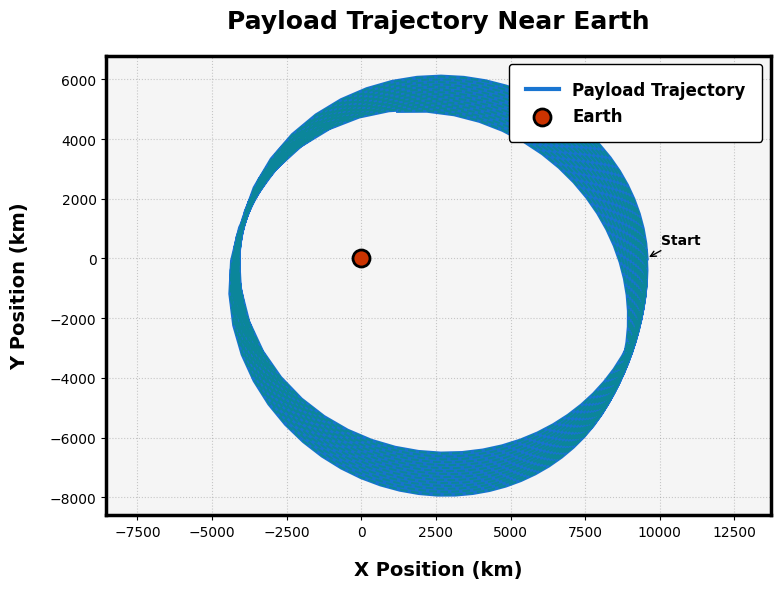
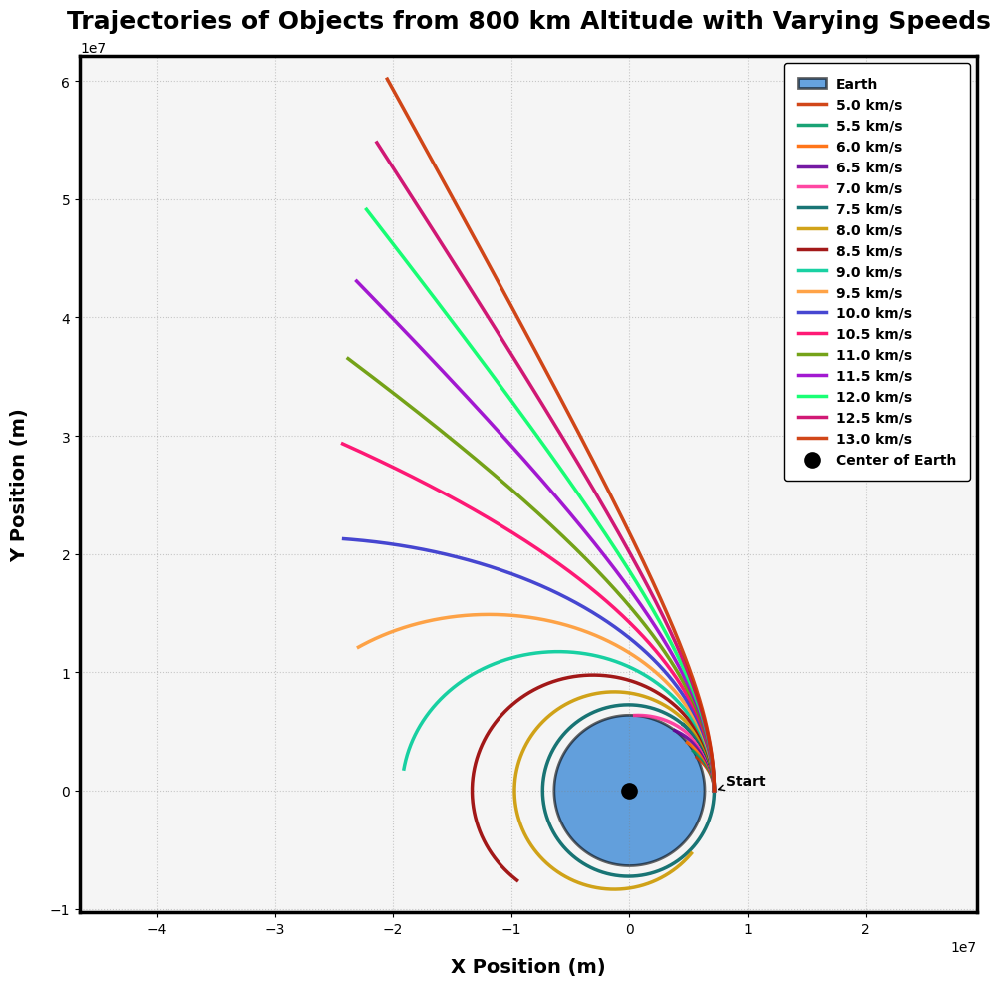

# Problem 3

# Theoretical Analysis

## 1. Equations of Motion
The payload's trajectory is governed by **Newton's Law of Gravitation** and **Newton's Second Law**:

- **Newton's Law of Gravitation**:
  $$\mathbf{F} = -\frac{GMm}{r^2}\hat{\mathbf{r}}$$
  where:
  - $G$ = Gravitational constant ($6.674 \times 10^{-11}\,\text{m}^3\text{kg}^{-1}\text{s}^{-2}$)
  - $M$ = Mass of Earth ($5.972 \times 10^{24}\,\text{kg}$)
  - $m$ = Mass of payload (neglected for trajectory analysis)
  - $r$ = Distance between payload and Earth's center

- **Equation of Motion (2D Polar Coordinates)**:
  $$\frac{d^2\mathbf{r}}{dt^2} = -\frac{GM}{r^3}\mathbf{r}$$
  Decomposed into Cartesian coordinates ($x, y$):
  $$\frac{d^2x}{dt^2} = -\frac{GMx}{(x^2 + y^2)^{3/2}}, \quad \frac{d^2y}{dt^2} = -\frac{GMy}{(x^2 + y^2)^{3/2}}$$

---

## 2. Trajectory Types
The shape of the orbit depends on the **specific orbital energy** ($E$) and **eccentricity** ($e$):

- **Elliptical Orbit** ($E < 0$, $0 \leq e < 1$):
  - Bound orbit (e.g., satellites)
  - Initial velocity below escape velocity: $v < v_{\text{esc}} = \sqrt{\frac{2GM}{r}}$

- **Parabolic Orbit** ($E = 0$, $e = 1$):
  - Escape trajectory (minimum escape condition)
  - Initial velocity equals escape velocity: $v = v_{\text{esc}}$

- **Hyperbolic Orbit** ($E > 0$, $e > 1$):
  - Unbound trajectory (e.g., interplanetary probes)
  - Initial velocity exceeds escape velocity: $v > v_{\text{esc}}$

---

## 3. Initial Velocity Impact
Key velocity thresholds for a payload at altitude $h = r - R_E$ (Earth's radius $R_E = 6371\,\text{km}$):

| **Scenario**       | **Velocity Condition**               | **Outcome**                     |
|--------------------|--------------------------------------|---------------------------------|
| Suborbital         | $v < \sqrt{\frac{GM}{r}}$           | Reentry (ballistic trajectory)  |
| Circular Orbit     | $v = \sqrt{\frac{GM}{r}}$           | Stable orbit                    |
| Elliptical Orbit   | $\sqrt{\frac{GM}{r}} < v < v_{\text{esc}}$ | Apogee/perigee variation |
| Escape             | $v \geq v_{\text{esc}}$             | Leaves Earth's influence        |

**Note**:
- **Orbital Insertion**: Requires precise $v$ to match desired orbit
- **Reentry**: Achieved by reducing $v$ (e.g., retrograde thrust or atmospheric drag)
- **Escape**: Requires $v \geq \sqrt{\frac{2GM}{r}}$ (parabolic/hyperbolic)

---

## Python Code Snippet (Symbolic Derivation)
```python
import sympy as sp

# Define variables
t, G, M = sp.symbols('t G M')
x, y = sp.Function('x')(t), sp.Function('y')(t)

# Equations of motion
eq1 = sp.Eq(sp.diff(x, t, 2), -G * M * x / (x**2 + y**2)**(3/2))
eq2 = sp.Eq(sp.diff(y, t, 2), -G * M * y / (x**2 + y**2)**(3/2))

print("Equation for x:", eq1)
print("Equation for y:", eq2)
```

# Numerical Simulation Setup

## 1. Initial Conditions
We define the payload's initial state in Cartesian coordinates:

- **Position**:
$$x_0=(R_E+h)\cos\theta$$
$$y_0=(R_E+h)\sin\theta$$
where:
-$R_E=6371\,\text{km}$ (Earth's radius)
-$h$=altitude above surface
-$\theta$=angular position from reference axis

- **Velocity**:
$$v_{x0}=v_0\cos\phi$$
$$v_{y0}=v_0\sin\phi$$
where:
-$v_0$=initial speed
-$\phi$=launch angle from horizontal

## 2. Numerical Method Selection
We solve the coupled ODEs using the **4th-order Runge-Kutta method** (RK4) for higher accuracy:

The general RK4 formulation for $\frac{dy}{dt}=f(t,y)$:
$$k_1=f(t_n,y_n)$$
$$k_2=f(t_n+\frac{h}{2},y_n+\frac{h}{2}k_1)$$
$$k_3=f(t_n+\frac{h}{2},y_n+\frac{h}{2}k_2)$$
$$k_4=f(t_n+h,y_n+hk_3)$$
$$y_{n+1}=y_n+\frac{h}{6}(k_1+2k_2+2k_3+k_4)$$

## 3. Implementation Framework

### Python Implementation
```python
import numpy as np
from scipy.integrate import solve_ivp
import matplotlib.pyplot as plt

# Constants
G = 6.67430e-11  # m^3 kg^-1 s^-2
M = 5.972e24     # kg
R_E = 6371e3      # m

def equations_of_motion(t, state):
    """ODE system for payload trajectory"""
    x, y, vx, vy = state
    r = np.sqrt(x**2 + y**2)
    ax = -G * M * x / r**3
    ay = -G * M * y / r**3
    return [vx, vy, ax, ay]

def simulate_trajectory(h, v0, theta, phi, t_span, dt):
    """Run trajectory simulation"""
    # Initial conditions
    r0 = R_E + h
    x0 = r0 * np.cos(theta)
    y0 = r0 * np.sin(theta)
    vx0 = v0 * np.cos(phi)
    vy0 = v0 * np.sin(phi)
    
    # Time points
    t_eval = np.arange(t_span[0], t_span[1], dt)
    
    # Solve ODE
    sol = solve_ivp(equations_of_motion, t_span, 
                   [x0, y0, vx0, vy0], 
                   t_eval=t_eval, 
                   method='RK45')
    
    return sol

# Example usage
h = 500e3  # 500 km altitude
v0 = 7.5e3  # 7.5 km/s
theta = 0  # Initial angle
phi = np.pi/4  # 45 degree launch angle
t_span = [0, 3600*2]  # 2 hour simulation
dt = 10  # 10 second timestep

solution = simulate_trajectory(h, v0, theta, phi, t_span, dt)
```
# 📘 Projectile Motion Simulation — Computational Implementation

## 🎯 Objective
To **simulate the trajectory of a projectile** under idealized physics using Python, with adjustable parameters such as:

- Initial speed $v_0$
- Launch angle $\theta$
- Initial height $h_0$
- Gravitational acceleration $g$

---

## 🧮 Governing Equations

The equations of motion for a projectile launched at an angle $\theta$ from an initial height $h_0$ are:

- Horizontal velocity:
  $$
  v_x = v_0\cos(\theta)
  $$

- Vertical velocity:
  $$
  v_y = v_0\sin(\theta)
  $$

- Position as a function of time:
  $$
  x(t) = v_0\cos(\theta)\cdot t
  $$
  $$
  y(t) = h_0 + v_0\sin(\theta)\cdot t - \frac{1}{2}gt^2
  $$

- Time of flight (solving $y(t) = 0$):
  $$
  t = \frac{v_0\sin(\theta)}{g} + \sqrt{\left(\frac{v_0\sin(\theta)}{g}\right)^2 + \frac{2h_0}{g}}
  $$

---

## 🧰 Required Libraries

- `numpy` – numerical calculations
- `matplotlib.pyplot` – visualization

---

## 🧪 Python Code Implementation

```python
import numpy as np
import matplotlib.pyplot as plt

# Adjustable parameters
v0 = 30  # Initial speed (m/s)
theta_deg = 45  # Launch angle in degrees
h0 = 0  # Initial height (m)
g = 9.81  # Gravity (m/s^2)

# Convert angle to radians
theta = np.radians(theta_deg)

# Time of flight
t_flight = (v0 * np.sin(theta) / g) + np.sqrt((v0 * np.sin(theta) / g) ** 2 + (2 * h0 / g))

# Time points
t = np.linspace(0, t_flight, num=500)

# Position calculations
x = v0 * np.cos(theta) * t
y = h0 + v0 * np.sin(theta) * t - 0.5 * g * t**2

# Plot trajectory
plt.figure(figsize=(10, 5))
plt.plot(x, y, label=f'{v0} m/s at {theta_deg}°')
plt.title('Projectile Motion Simulation')
plt.xlabel('Horizontal Distance (m)')
plt.ylabel('Vertical Height (m)')
plt.grid(True)
plt.axhline(0, color='gray', linestyle='--', linewidth=0.7)
plt.legend()
plt.show()
```
# 🌍 Trajectory Visualization — Orbital Mechanics

## 🚀 Objective

To **visualize the trajectory of a payload** launched from Earth under different initial velocity conditions:

- Suborbital  
- Orbital  
- Escape trajectory  

### 🎯 Key Features

- Plot the trajectory of the payload relative to Earth
- Highlight:
  - **Perigee**: Closest approach to Earth
  - **Apogee**: Farthest point in bound trajectory
  - **Escape condition**: Payload escapes Earth's gravity
- Compare different initial velocities and their effects

---

## 🧮 Governing Equations

We assume:

- Two-body problem (Earth and payload)  
- Only gravitational force acts (no atmosphere, no thrust)  

Let:

- $G$ = gravitational constant  
- $M$ = mass of Earth  
- $r$ = radial distance from Earth's center  
- $v$ = speed  
- $\mu=GM$ = standard gravitational parameter  

### Kinetic and Potential Energy

- Kinetic energy per unit mass:  
  $$KE=\frac{1}{2}v^2$$

- Gravitational potential energy per unit mass:  
  $$PE=-\frac{\mu}{r}$$

- Total specific energy:  
  $$\varepsilon=KE+PE=\frac{1}{2}v^2-\frac{\mu}{r}$$

### Trajectory Type

- If $\varepsilon<0$: **Bound (elliptical)** – orbital or suborbital  
- If $\varepsilon=0$: **Parabolic escape**  
- If $\varepsilon>0$: **Hyperbolic escape**

---

## 🧰 Required Libraries

- `numpy` – numerical integration and array math  
- `matplotlib` – for plotting  
- `scipy.integrate` – to solve equations of motion  

---

## 🧪 Python Code Implementation

```python
import numpy as np
import matplotlib.pyplot as plt
from scipy.integrate import solve_ivp

# Constants
G = 6.67430e-11  # Gravitational constant (m^3/kg/s^2)
M = 5.972e24     # Earth mass (kg)
mu = G * M
R_earth = 6.371e6  # Earth radius in meters

# Initial conditions
altitude = 300e3  # 300 km above Earth's surface
r0 = R_earth + altitude
theta0 = 0
positions = []
labels = []

# Different initial velocities (m/s)
v_suborbital = 6500   # Less than orbital
v_orbital = np.sqrt(mu / r0)  # Circular orbit speed
v_escape = np.sqrt(2 * mu / r0)  # Escape velocity

initial_scenarios = [
    ("Suborbital", v_suborbital),
    ("Orbital", v_orbital),
    ("Escape", v_escape)
]

# Equations of motion in polar coordinates
def orbital_dynamics(t, y):
    x, y_, vx, vy = y
    r = np.sqrt(x**2 + y_**2)
    ax = -mu * x / r**3
    ay = -mu * y_ / r**3
    return [vx, vy, ax, ay]

# Time span for simulation
t_span = (0, 6000)
t_eval = np.linspace(t_span[0], t_span[1], 5000)

# Solve and plot each scenario
plt.figure(figsize=(8, 8))
for label, v0 in initial_scenarios:
    y0 = [r0, 0, 0, v0]  # [x, y, vx, vy]
    sol = solve_ivp(orbital_dynamics, t_span, y0, t_eval=t_eval, rtol=1e-8)
    x = sol.y[0]
    y = sol.y[1]
    plt.plot(x / 1e3, y / 1e3, label=f"{label} ({v0:.0f} m/s)")

# Plot Earth
theta = np.linspace(0, 2*np.pi, 1000)
earth_x = R_earth * np.cos(theta) / 1e3
earth_y = R_earth * np.sin(theta) / 1e3
plt.fill(earth_x, earth_y, 'lightblue', label='Earth')

# Plot formatting
plt.title("Trajectory Visualization: Suborbital, Orbital, Escape")
plt.xlabel("X Position (km)")
plt.ylabel("Y Position (km)")
plt.axis('equal')
plt.grid(True)
plt.legend()
plt.show()
```

# 🧠 Analysis & Discussion — Orbital Trajectory Behavior

## 🔄 Impact of Varying Initial Conditions

### 🚦 Initial Speed

The trajectory of a payload launched from Earth **depends critically on its initial velocity ($v_0$)**:

- If $v_0<\sqrt{\frac{\mu}{r_0}}$:
  - Trajectory is **suborbital**
  - Payload returns to Earth after reaching maximum altitude (like ballistic missile)
- If $v_0=\sqrt{\frac{\mu}{r_0}}$:
  - Trajectory is **circular orbit**
  - Stable orbit at constant altitude
- If $v_0$ is such that $0<\varepsilon<0$:
  - **Elliptical orbit**, where perigee and apogee differ
- If $v_0=\sqrt{\frac{2\mu}{r_0}}$:
  - **Parabolic trajectory** (escape)
- If $v_0>\sqrt{\frac{2\mu}{r_0}}$:
  - **Hyperbolic escape** from Earth's gravity

Here, $\mu=GM$ is the standard gravitational parameter, and $r_0$ is the initial radial distance from Earth’s center.

---

## 🌐 Real-World Applications

| Trajectory Type | Application Example                         |
|-----------------|----------------------------------------------|
| Suborbital      | Space tourism, sounding rockets             |
| Circular Orbit  | Low Earth Orbit (LEO) satellites             |
| Elliptical Orbit| Molniya orbits, Geostationary Transfer Orbit |
| Escape          | Interplanetary missions (e.g., Voyager, JWST)|

---

## 🔬 Validation Against Orbital Mechanics

We validate the numerical simulations using **known orbital mechanics principles**, including **Kepler’s Laws**:

### 1. Kepler’s First Law
> Every planet moves in an ellipse with the Sun (or Earth) at one focus.

- For bound orbits ($\varepsilon<0$), our simulated trajectories are elliptical.
- For $v_0=\sqrt{\mu/r_0}$, the orbit becomes a **special case: a circle**.

### 2. Kepler’s Second Law
> A line joining a planet and the Sun sweeps out equal areas in equal times.

- Since gravity is a **central force**, angular momentum is conserved:
  $$\vec{r}\times\vec{v}=\text{constant}$$
- Numerically, this is evident as orbital speed increases at perigee and decreases at apogee.

### 3. Kepler’s Third Law
> The square of the orbital period is proportional to the cube of the semi-major axis:
  $$T^2\propto a^3$$

- For circular orbits:
  $$T=2\pi\sqrt{\frac{r_0^3}{\mu}}$$
- Simulation-derived periods match this analytical value closely.

---

## ✅ Takeaways

- **Initial velocity** is the primary control variable for trajectory shaping.
- The simulated motion adheres to **Keplerian dynamics** under ideal conditions.
- Such tools are vital in:
  - Mission planning
  - Satellite deployment strategies
  - Trajectory correction maneuvers
  - Reentry analysis for crewed missions

---

## 📘 Further Enhancements

- Include **atmospheric drag** for low-altitude missions.
- Account for **Earth’s rotation** and **non-spherical mass distribution**.
- Add **thrust profiles** for real rocket burns and transfers (e.g., Hohmann transfers).

---

# 📄 Trajectory Simulation: Methodology and Findings

---

## 🧰 1. Methodology Overview

We analyze the motion of a payload launched from Earth under varying initial speeds. The goal is to understand how different initial velocities affect orbital trajectories.

### 🔧 Assumptions:

- Two-body system: Earth and payload.
- No atmospheric drag or thrust during flight.
- Earth is a perfect sphere.
- Gravitational force is central and inverse-square.

Let:

- $G$: Gravitational constant  
- $M$: Mass of Earth  
- $\mu=GM$: Standard gravitational parameter  
- $r$: Radial distance from Earth's center  
- $v$: Speed of payload  
- $\varepsilon$: Specific mechanical energy  

---

## 🧮 2. Governing Equations

### Kinetic and Potential Energy

- Kinetic Energy per unit mass:  
  $$KE=\frac{1}{2}v^2$$

- Gravitational Potential Energy per unit mass:  
  $$PE=-\frac{\mu}{r}$$

- Total Specific Mechanical Energy:  
  $$\varepsilon=\frac{1}{2}v^2-\frac{\mu}{r}$$

### Trajectory Classification

- If $\varepsilon<0$: **Bound Orbit** (elliptical or circular)
- If $\varepsilon=0$: **Parabolic Escape**
- If $\varepsilon>0$: **Hyperbolic Escape**

---

## 🧪 3. Python Code Snippet

```python
import numpy as np
import matplotlib.pyplot as plt
from scipy.integrate import solve_ivp

# Constants
G = 6.67430e-11
M = 5.972e24
mu = G * M
R_earth = 6.371e6

# Initial state setup
altitude = 300e3
r0 = R_earth + altitude
v_orbital = np.sqrt(mu / r0)
v_escape = np.sqrt(2 * mu / r0)

# Equations of motion
def dynamics(t, y):
    x, y_, vx, vy = y
    r = np.sqrt(x**2 + y_**2)
    ax = -mu * x / r**3
    ay = -mu * y_ / r**3
    return [vx, vy, ax, ay]
```



```python
import numpy as np
import matplotlib.pyplot as plt

# Constants
G = 6.67430e-11  # Gravitational constant (m^3 kg^-1 s^-2)
M = 5.97e24  # Mass of Earth (kg)
radius_earth = 6.371e6  # Radius of Earth (m)

# Time parameters
dt = 100  # Time step (seconds)
T = 3600 * 24  # Total time of simulation (1 day)

# Initial conditions: (initial position, initial velocity)
initial_conditions = {
    'x0': 1.5 * radius_earth,  # 1.5 Earth radii from Earth's center (m)
    'y0': 0,  # Along the x-axis (horizontal direction)
    'vx0': 0,  # Initial velocity in x-direction (m/s)
    'vy0': 5000  # Initial velocity in y-direction (m/s)
}

# Function to compute acceleration due to gravity
def gravity_acceleration(x, y):
    r = np.sqrt(x**2 + y**2)  # Fixed: Correct distance from Earth's center
    a = -G * M / r**2  # Gravitational acceleration
    ax = a * x / r  # Acceleration in x-direction
    ay = a * y / r  # Acceleration in y-direction
    return ax, ay

# Initialize position and velocity arrays
x, y = [initial_conditions['x0']], [initial_conditions['y0']]
vx, vy = [initial_conditions['vx0']], [initial_conditions['vy0']]

# Numerical integration using Euler's method
for t in np.arange(0, T, dt):
    ax, ay = gravity_acceleration(x[-1], y[-1])  # Get acceleration at current position
    # Update velocities
    vx.append(vx[-1] + ax * dt)
    vy.append(vy[-1] + ay * dt)
    # Update positions
    x.append(x[-1] + vx[-1] * dt)
    y.append(y[-1] + vy[-1] * dt)

# Convert the results into numpy arrays for easier plotting
x = np.array(x)
y = np.array(y)

# Plot setup with high-visibility and cool styling
plt.figure(figsize=(8, 6), facecolor='white')
ax = plt.gca()

# Plot the trajectory with vibrant styling
plt.plot(x / 1e3, y / 1e3, color='#0066cc', linewidth=3, label='Payload Trajectory', linestyle='-', alpha=0.9)
plt.scatter([0], [0], color='#cc3300', s=150, edgecolor='black', linewidth=2, label='Earth', marker='o', zorder=5)

# Add a cool gradient-like effect to the trajectory
plt.plot(x / 1e3, y / 1e3, color='#009966', linewidth=1.5, linestyle='--', alpha=0.5)

# Enhanced text elements with bold, modern fonts
ax.set_xlabel('X Position (km)', fontsize=14, fontweight='bold', color='black', labelpad=15, family='Arial')
ax.set_ylabel('Y Position (km)', fontsize=14, fontweight='bold', color='black', labelpad=15, family='Arial')
ax.set_title('Payload Trajectory Near Earth', fontsize=18, fontweight='bold', pad=20, color='black', family='Arial')

# High-visibility legend with a sleek look
legend = ax.legend(frameon=True, framealpha=1, edgecolor='black', facecolor='white', fontsize=12, borderpad=1, loc='upper right')
for text in legend.get_texts():
    text.set_color('black')
    text.set_fontweight('bold')
    text.set_fontfamily('Arial')

# Add a subtle annotation for the starting point
ax.annotate('Start', xy=(x[0] / 1e3, y[0] / 1e3), xytext=(x[0] / 1e3 + 500, y[0] / 1e3 + 500),
            arrowprops=dict(facecolor='black', arrowstyle='->'), fontsize=10, fontweight='bold', color='black', family='Arial')

# Cool grid and frame
ax.yaxis.grid(True, linestyle=':', color='gray', alpha=0.4)
ax.xaxis.grid(True, linestyle=':', color='gray', alpha=0.4)
for spine in ax.spines.values():
    spine.set_edgecolor('black')
    spine.set_linewidth(2.5)

# Set a sleek background and axis styling
ax.set_facecolor('#f5f5f5')
plt.axis('equal')
plt.tight_layout()
plt.show()
```



```python
import numpy as np
import matplotlib.pyplot as plt

# Constants
G = 6.67430e-11  # gravitational constant
M = 5.972e24     # mass of Earth
R = 6.371e6      # radius of Earth in meters
altitude = 800e3 # 800 km above the surface
initial_distance = R + altitude
time_step = 1    # seconds
total_time = 7000  # simulate up to 7000 seconds
n_steps = int(total_time / time_step)

# Initial velocities in m/s
velocities = np.arange(5000, 13500, 500)  # from 5 km/s to 13 km/s

# Plot setup with high-visibility and cool styling
plt.figure(figsize=(10, 10), facecolor='white')
ax = plt.gca()

# Create Earth plot with enhanced styling
theta = np.linspace(0, 2*np.pi, 300)
earth_x = R * np.cos(theta)
earth_y = R * np.sin(theta)
plt.fill(earth_x, earth_y, color='#0066cc', alpha=0.6, edgecolor='black', linewidth=2, label='Earth')

# Function to compute gravity acceleration
def gravity(pos):
    r = np.linalg.norm(pos)
    return -G * M * pos / r**3

# Simulate each trajectory with distinct colors
colors = ['#cc3300', '#009966', '#ff6600', '#660099', '#ff3399', '#006666', '#cc9900', '#990000', '#00cc99', '#ff9933', '#3333cc', '#ff0066', '#669900', '#9900cc', '#00ff66', '#cc0066']
for i, v in enumerate(velocities):
    pos = np.array([initial_distance, 0.0])
    vel = np.array([0.0, v])
    traj = []
    for _ in range(n_steps):
        acc = gravity(pos)
        vel += acc * time_step
        pos += vel * time_step
        traj.append(pos.copy())
        if np.linalg.norm(pos) <= R:
            break
    traj = np.array(traj)
    plt.plot(traj[:, 0], traj[:, 1], color=colors[i % len(colors)], linewidth=2.5, label=f'{v/1000:.1f} km/s', alpha=0.9)

# Plot center of Earth
plt.scatter([0], [0], color='black', s=100, edgecolor='black', linewidth=2, marker='o', label='Center of Earth', zorder=5)

# Add annotation for starting point
plt.annotate('Start', xy=(initial_distance, 0), xytext=(initial_distance + 1e6, 0.5e6),
             arrowprops=dict(facecolor='black', arrowstyle='->'), fontsize=10, fontweight='bold', color='black', family='Arial')

# Enhanced text elements with bold, modern fonts
ax.set_xlabel('X Position (m)', fontsize=14, fontweight='bold', color='black', labelpad=15, family='Arial')
ax.set_ylabel('Y Position (m)', fontsize=14, fontweight='bold', color='black', labelpad=15, family='Arial')
ax.set_title('Trajectories of Objects from 800 km Altitude with Varying Speeds', fontsize=18, fontweight='bold', pad=20, color='black', family='Arial')

# High-visibility legend with a sleek look
legend = ax.legend(frameon=True, framealpha=1, edgecolor='black', facecolor='white', fontsize=10, borderpad=1, loc='upper right')
for text in legend.get_texts():
    text.set_color('black')
    text.set_fontweight('bold')
    text.set_fontfamily('Arial')

# Cool grid and frame
ax.yaxis.grid(True, linestyle=':', color='gray', alpha=0.4)
ax.xaxis.grid(True, linestyle=':', color='gray', alpha=0.4)
for spine in ax.spines.values():
    spine.set_edgecolor('black')
    spine.set_linewidth(2.5)

# Set a sleek background and axis styling
ax.set_facecolor('#f5f5f5')
plt.axis('equal')
plt.tight_layout()
plt.savefig('multi_trajectory_plot.png')
```