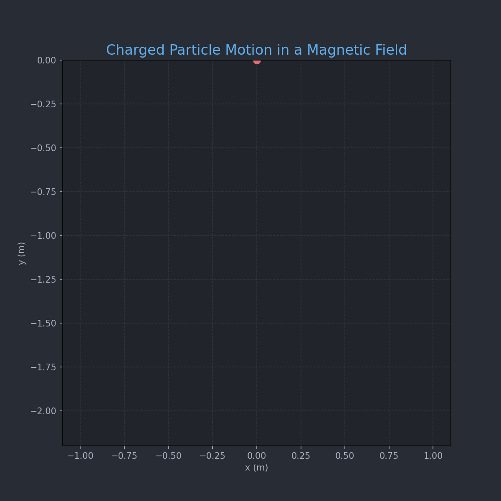

# Problem 1

# Simulating the Effects of the Lorentz Force

## 1. Introduction and Motivation

The Lorentz force governs the motion of charged particles in electromagnetic fields and is essential in understanding systems like:  
- Particle accelerators – guiding and accelerating beams.  
- Mass spectrometers – separating particles based on mass-to-charge ratio.  
- Plasma confinement devices (e.g., tokamaks) – controlling plasma using magnetic fields.  

Understanding the Lorentz force enables the design and analysis of such systems.

---

## 2. Lorentz Force Equation

The Lorentz force $\vec{F}$ acting on a charged particle is given by:

$$
\vec{F} = q (\vec{E} + \vec{v} \times \vec{B})
$$

Where:  
- $q$: Charge of the particle  
- $\vec{E}$: Electric field  
- $\vec{B}$: Magnetic field  
- $\vec{v}$: Particle velocity  
Using Newton’s Second Law:

$$
\vec{F} = m \frac{d\vec{v}}{dt}
$$

We obtain the equation of motion:

$$
m \frac{d\vec{v}}{dt} = q (\vec{E} + \vec{v} \times \vec{B})
$$

This equation is generally solved numerically due to the complexity of $\vec{v} \times \vec{B}$.

---

## 3. Simulation Overview

We simulate particle trajectories using the 4th-order Runge-Kutta method for accuracy.
**Scenarios Simulated:**  
1. Uniform magnetic field only: Circular motion.  
2. Parallel $\vec{E}$ and $\vec{B}$: Helical motion.  
3. Crossed fields: Drift motion.  

**Parameters that can be varied:**  
- Electric field strength $\vec{E}$  
- Magnetic field strength $\vec{B}$  
- Initial velocity $\vec{v}_0$  
- Charge $q$ and mass $m$
---



```python
import numpy as np
import matplotlib.pyplot as plt
from matplotlib.animation import FuncAnimation, PillowWriter
from scipy.integrate import solve_ivp
from IPython.display import Image, display

# --- Constants ---
q = 1.0                                # Charge (C)
m = 1.0                                # Mass (kg)
E = np.array([0.0, 0.0, 0.0])          # Electric field (V/m)
B = np.array([0.0, 0.0, 1.0])          # Magnetic field (T)

# --- Initial Conditions ---
v0 = np.array([1.0, 0.0, 0.0])         # Velocity (m/s)
r0 = np.array([0.0, 0.0, 0.0])         # Position (m)
y0 = np.concatenate((r0, v0))          # Combine initial state

# --- Lorentz Force Function ---
def lorentz(t, y):
    r = y[:3]
    v = y[3:]
    dvdt = (q / m) * (E + np.cross(v, B))
    return np.concatenate((v, dvdt))

# --- Time Settings ---
t_span = (0, 10)
t_eval = np.linspace(t_span[0], t_span[1], 500)
sol = solve_ivp(lorentz, t_span, y0, t_eval=t_eval)

x, y = sol.y[0], sol.y[1]      # only x and y components for 2D plot
z = sol.y[2]                   # z component (flat in circular motion)

# --- Set Up Plot ---
fig, ax = plt.subplots(figsize=(8, 8)) # Slightly larger figure
fig.patch.set_facecolor('#282C34')     # Dark background for the figure
ax.set_facecolor('#21252B')            # Dark background for the plot area

ax.set_xlim(np.min(x)*1.1, np.max(x)*1.1)
ax.set_ylim(np.min(y)*1.1, np.max(y)*1.1)
ax.set_xlabel("x (m)", color='#ABB2BF') # Light gray labels
ax.set_ylabel("y (m)", color='#ABB2BF')
ax.set_title("Charged Particle Motion in a Magnetic Field", color='#61AFEF', fontsize=16) # Blue title
ax.grid(True, linestyle='--', alpha=0.5, color='#3E4452') # Subtler grid

ax.tick_params(axis='x', colors='#ABB2BF') # Light gray ticks
ax.tick_params(axis='y', colors='#ABB2BF')

line, = ax.plot([], [], lw=2, color='#98C379', alpha=0.9) # Green-ish path
point, = ax.plot([], [], 'o', color='#E06C75', markersize=8, markeredgecolor='#E06C75') # Red point

# --- Init Function ---
def init():
    line.set_data([], [])
    point.set_data([], [])
    return line, point

# --- Update Function ---
def update(i):
    if i < len(x):
        line.set_data(x[:i+1], y[:i+1])
        point.set_data([x[i]], [y[i]])
    return line, point

# --- Create Animation ---
ani = FuncAnimation(fig, update, frames=len(x), init_func=init, blit=False, interval=20)

# --- Save to GIF ---
gif_path = "charged_particle_motion_styled.gif" # New GIF name
writer = PillowWriter(fps=30)
ani.save(gif_path, writer=writer, dpi=150) # Higher DPI for better quality
plt.close()

# --- Display in Notebook (if using Jupyter/Colab) ---
display(Image(filename=gif_path))
```