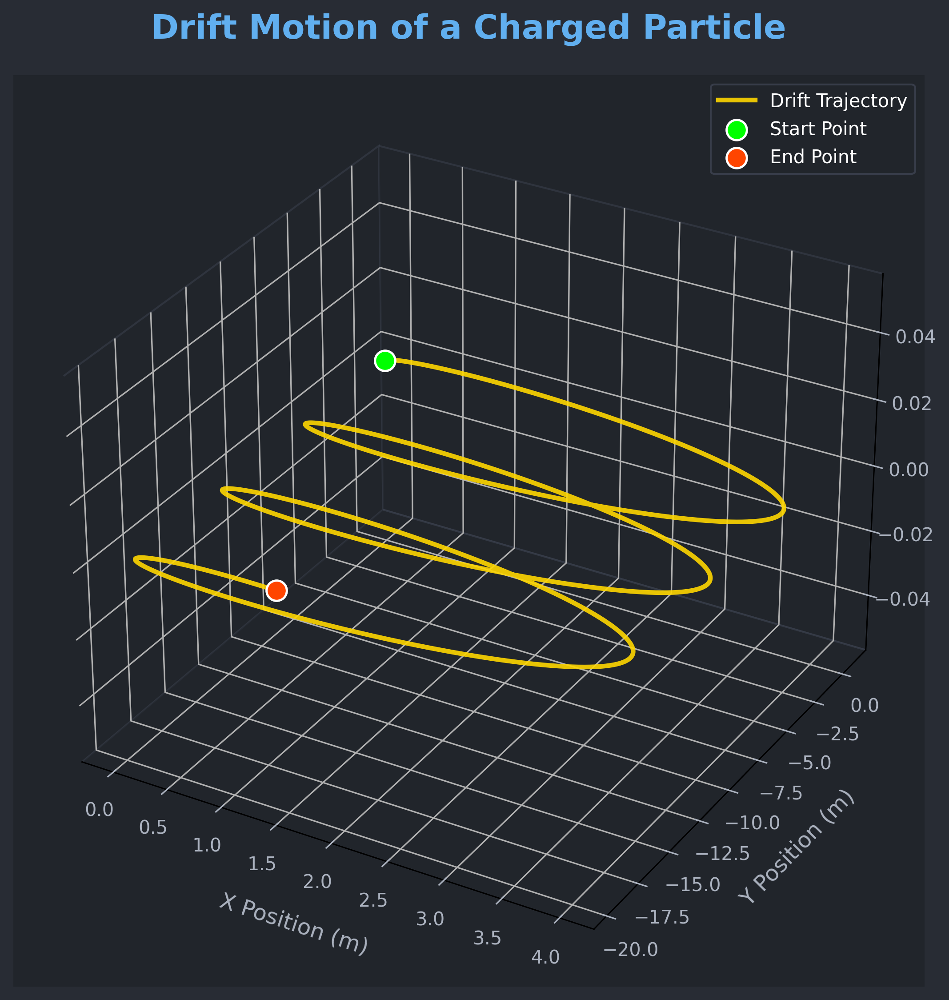

# Problem 1

# Simulating the Effects of the Lorentz Force

## 1. Introduction and Motivation

The Lorentz force governs the motion of charged particles in electromagnetic fields and is essential in understanding systems like:  
- Particle accelerators – guiding and accelerating beams.  
- Mass spectrometers – separating particles based on mass-to-charge ratio.  
- Plasma confinement devices (e.g., tokamaks) – controlling plasma using magnetic fields.  

Understanding the Lorentz force enables the design and analysis of such systems.

---

## 2. Lorentz Force Equation

The Lorentz force $\vec{F}$ acting on a charged particle is given by:

$$
\vec{F} = q (\vec{E} + \vec{v} \times \vec{B})
$$

Where:  
- $q$: Charge of the particle  
- $\vec{E}$: Electric field  
- $\vec{B}$: Magnetic field  
- $\vec{v}$: Particle velocity  
Using Newton’s Second Law:

$$
\vec{F} = m \frac{d\vec{v}}{dt}
$$

We obtain the equation of motion:

$$
m \frac{d\vec{v}}{dt} = q (\vec{E} + \vec{v} \times \vec{B})
$$

This equation is generally solved numerically due to the complexity of $\vec{v} \times \vec{B}$.

---

## 3. Simulation Overview

We simulate particle trajectories using the 4th-order Runge-Kutta method for accuracy.
**Scenarios Simulated:**  
1. Uniform magnetic field only: Circular motion.  
2. Parallel $\vec{E}$ and $\vec{B}$: Helical motion.  
3. Crossed fields: Drift motion.  

**Parameters that can be varied:**  
- Electric field strength $\vec{E}$  
- Magnetic field strength $\vec{B}$  
- Initial velocity $\vec{v}_0$  
- Charge $q$ and mass $m$
---

## 4. Code Implementation


```python
import numpy as np
import matplotlib.pyplot as plt
from scipy.integrate import solve_ivp
from matplotlib.collections import LineCollection
import os # Required for operating system functions (like creating directories)
from IPython.display import Image, display # For displaying in Colab

# --- Constants ---
q = 1.0                                # Charge (C)
m = 1.0                                # Mass (kg)
E = np.array([0.0, 0.0, 0.0])          # Electric field (V/m)
B = np.array([0.0, 0.0, 1.0])          # Magnetic field (T)

# --- Initial conditions ---
r0 = np.array([1.0, 0.0, 0.0])         # Initial position (m)
v0 = np.array([0.0, 1.0, 0.0])         # Initial velocity perpendicular to B (m/s)
y0 = np.concatenate((r0, v0))          # Combine position and velocity

# --- Lorentz force differential equation ---
def lorentz(t, y):
    r = y[:3]
    v = y[3:]
    dvdt = (q / m) * (E + np.cross(v, B))
    return np.concatenate((v, dvdt))

# --- Time setup ---
t_span = (0, 10)
t_eval = np.linspace(*t_span, 500)
sol = solve_ivp(lorentz, t_span, y0, t_eval=t_eval)
x, y = sol.y[0], sol.y[1]

# --- Color gradient path ---
points = np.array([x, y]).T.reshape(-1, 1, 2)
segments = np.concatenate([points[:-1], points[1:]], axis=1)
norm = plt.Normalize(t_eval.min(), t_eval.max())
# Using 'magma' or 'viridis' for a cooler gradient
lc = LineCollection(segments, cmap='viridis', norm=norm)
lc.set_array(t_eval)
lc.set_linewidth(3.0) # Slightly thicker line for better visibility

# --- Plot ---
fig, ax = plt.subplots(figsize=(9, 7)) # Slightly larger figure
fig.patch.set_facecolor('#282C34')     # Dark background for the figure
ax.set_facecolor('#21252B')            # Dark background for the plot area

ax.add_collection(lc) # Add the colored line collection to the plot

# Particle start and end points with distinct markers and colors
ax.scatter(x[0], y[0], color='#00FF00', s=100, label='Start Point', zorder=5, edgecolors='white', linewidth=0.8) # Bright green, larger
ax.scatter(x[-1], y[-1], color='#FF4500', s=100, label='End Point', zorder=5, edgecolors='white', linewidth=0.8) # Orange-red, larger

# Labels and Title
ax.set_xlabel('X Position (m)', color='#ABB2BF', fontsize=12)
ax.set_ylabel('Y Position (m)', color='#ABB2BF', fontsize=12)
ax.set_title('Charged Particle Trajectory in a Uniform Magnetic Field', color='#61AFEF', fontsize=18, weight='bold') # Blue, larger, bold title

# Grid and Ticks
ax.grid(True, linestyle='--', alpha=0.4, color='#3E4452') # Subtler grid
ax.tick_params(axis='x', colors='#ABB2BF', labelsize=10)
ax.tick_params(axis='y', colors='#ABB2BF', labelsize=10)

# Aspect Ratio
ax.axis('equal') # Ensures circular motion appears circular

# Color bar for time
cbar = fig.colorbar(lc, ax=ax, label='Time (s)', shrink=0.75, pad=0.03) # Shrink and position
cbar.set_label('Time (s)', color='#ABB2BF', fontsize=12)
cbar.ax.tick_params(colors='#ABB2BF') # Colorbar tick labels

# Legend
ax.legend(facecolor='#21252B', edgecolor='#3E4452', labelcolor='white', fontsize=10) # Styled legend

plt.tight_layout() # Adjust plot to prevent labels from overlapping

# --- Save to PNG (or JPG if preferred, for static images) ---
# For GitHub Pages, saving as PNG is often good for static plots.
# The image will be saved in the "4 Electromagnetism" folder.
output_dir = "4 Electromagnetism" # Your target directory name
os.makedirs(output_dir, exist_ok=True) # Create the directory if it doesn't exist
# Using a descriptive filename for the static plot
image_path = os.path.join(output_dir, "charged_particle_trajectory.png")

plt.savefig(image_path, dpi=300, bbox_inches='tight', facecolor=fig.get_facecolor()) # Save the plot with high DPI
plt.close(fig) # Close the plot to free memory

# --- Display in Notebook (if using Jupyter/Colab) ---
display(Image(filename=image_path))
```


```python
import numpy as np
import matplotlib.pyplot as plt
from matplotlib.animation import FuncAnimation, PillowWriter
from scipy.integrate import solve_ivp
from IPython.display import Image, display
import os # İşletim sistemi fonksiyonları için gerekli

# --- Constants ---
q = 1.0                                # Charge (C)
m = 1.0                                # Mass (kg)
E = np.array([0.0, 0.0, 0.0])          # Electric field (V/m)
B = np.array([0.0, 0.0, 1.0])          # Magnetic field (T)

# --- Initial Conditions ---
v0 = np.array([1.0, 0.0, 0.0])         # Velocity (m/s)
r0 = np.array([0.0, 0.0, 0.0])         # Position (m)
y0 = np.concatenate((r0, v0))          # Combine initial state (position and velocity)

# --- Lorentz Force Function ---
def lorentz(t, y):
    r = y[:3]  # Extract position components (x, y, z)
    v = y[3:]  # Extract velocity components (vx, vy, vz)
    dvdt = (q / m) * (E + np.cross(v, B)) # Calculate acceleration based on Lorentz force
    return np.concatenate((v, dvdt)) # Return concatenated velocity and acceleration

# --- Time Settings ---
t_span = (0, 10) # Time interval for simulation (start, end)
t_eval = np.linspace(t_span[0], t_span[1], 500) # Points at which to evaluate the solution
sol = solve_ivp(lorentz, t_span, y0, t_eval=t_eval) # Solve the differential equation

x, y = sol.y[0], sol.y[1] # Extract x and y components for 2D plotting
z = sol.y[2] # Extract z component (will be flat in circular motion if B is along z)

# --- Set Up Plot ---
fig, ax = plt.subplots(figsize=(8, 8)) # Create a figure and a set of subplots
fig.patch.set_facecolor('#282C34')     # Set the background color of the figure
ax.set_facecolor('#21252B')            # Set the background color of the plot area

ax.set_xlim(np.min(x)*1.1, np.max(x)*1.1) # Set x-axis limits with a small buffer
ax.set_ylim(np.min(y)*1.1, np.max(y)*1.1) # Set y-axis limits with a small buffer
ax.set_xlabel("x (m)", color='#ABB2BF') # X-axis label
ax.set_ylabel("y (m)", color='#ABB2BF') # Y-axis label
ax.set_title("Charged Particle Motion in a Magnetic Field", color='#61AFEF', fontsize=16) # Plot title
ax.grid(True, linestyle='--', alpha=0.5, color='#3E4452') # Add a subtle grid

ax.tick_params(axis='x', colors='#ABB2BF') # Set x-axis tick label color
ax.tick_params(axis='y', colors='#ABB2BF') # Set y-axis tick label color

line, = ax.plot([], [], lw=2, color='#98C379', alpha=0.9) # Initialize the line for the particle's path
point, = ax.plot([], [], 'o', color='#E06C75', markersize=8, markeredgecolor='#E06C75') # Initialize the point for the current position

# --- Init Function for Animation ---
def init():
    line.set_data([], []) # Clear line data
    point.set_data([], []) # Clear point data
    return line, point # Return the plot objects to be updated

# --- Update Function for Animation ---
def update(i):
    if i < len(x): # Ensure index is within bounds
        line.set_data(x[:i+1], y[:i+1]) # Update the path up to the current frame
        point.set_data([x[i]], [y[i]]) # Update the current particle position
    return line, point # Return the updated plot objects

# --- Create Animation ---
# FuncAnimation creates the animation by repeatedly calling the update function
ani = FuncAnimation(fig, update, frames=len(x), init_func=init, blit=False, interval=20)

# --- Save to GIF ---
# GIF'i "4 Electromagnetism" klasörünün içine kaydedecek şekilde güncellendi.
# Bu klasör yoksa oluşturulur.
output_dir = "4 Electromagnetism" # Hedef klasör adınız
os.makedirs(output_dir, exist_ok=True) # Klasörü oluştur (zaten varsa hata vermez)
gif_path = os.path.join(output_dir, "charged_particle_motion_animated.gif") # Klasör içinde kaydet

writer = PillowWriter(fps=30) # Initialize GIF writer with 30 frames per second
ani.save(gif_path, writer=writer, dpi=150) # Save the animation to a GIF file with higher DPI for better quality
plt.close() # Close the plot window to free up resources, important for Colab and non-interactive environments

# --- Display in Notebook (if using Jupyter/Colab) ---
# This line displays the saved GIF directly within the Colab or Jupyter notebook output.
display(Image(filename=gif_path))
```


```python
import numpy as np
import matplotlib.pyplot as plt
from scipy.integrate import solve_ivp
from mpl_toolkits.mplot3d import Axes3D # Explicitly import Axes3D
from matplotlib import cm # For colormaps
import os # Required for operating system functions (like creating directories)
from IPython.display import Image, display # For displaying images in Colab

# --- Constants ---
q = 1.0                                # Charge (C)
m = 1.0                                # Mass (kg)
E = np.array([0.0, 0.0, 1.0])          # Electric field (V/m) - now along z-axis
B = np.array([0.0, 0.0, 1.0])          # Magnetic field (T) - now along z-axis

# --- Initial conditions ---
v0 = np.array([1.0, 0.0, 0.0])         # Initial velocity (m/s)
r0 = np.array([0.0, 0.0, 0.0])         # Initial position (m)
y0 = np.concatenate((v0, r0))          # Combine initial state: velocity then position

# --- Lorentz force differential equation ---
def lorentz(t, y):
    v = y[:3]  # Extract velocity components (vx, vy, vz)
    r = y[3:]  # Extract position components (x, y, z)
    dvdt = (q / m) * (E + np.cross(v, B)) # Calculate acceleration based on Lorentz force
    return np.concatenate((dvdt, v)) # Return concatenated acceleration (dv/dt) and velocity (dr/dt)

# --- Time setup ---
t_span = (0, 10) # Time interval for simulation (start, end)
t_eval = np.linspace(*t_span, 1000) # Points at which to evaluate the solution (1000 points)
sol = solve_ivp(lorentz, t_span, y0, t_eval=t_eval) # Solve the differential equation

# Extract position components from the solution
x, y, z = sol.y[3], sol.y[4], sol.y[5]

# --- 3D Plot ---
fig = plt.figure(figsize=(14, 10)) # Larger figure for 3D plot
fig.patch.set_facecolor('#282C34') # Dark background for the figure

ax = fig.add_subplot(111, projection='3d') # Add a 3D subplot
ax.set_facecolor('#21252B') # Dark background for the plot area (3D specific)

# Plot the full trajectory (lighter, semi-transparent for context)
ax.plot(x, y, z, lw=1.5, c='#ABB2BF', alpha=0.4) # Lighter gray, slightly thicker line

# Scatter points colored by time (for better visual appeal)
scatter = ax.scatter(x, y, z, c=sol.t, cmap='viridis', s=8, alpha=0.9, edgecolor='none') # Larger, more visible points

# Mark start and end points
ax.scatter(x[0], y[0], z[0], color='#00FF00', label='Start Point', s=150, zorder=5, edgecolors='white', linewidth=1.5) # Bright green, larger marker
ax.scatter(x[-1], y[-1], z[-1], color='#FF4500', label='End Point', s=150, zorder=5, edgecolors='white', linewidth=1.5) # Orange-red, larger marker

# Set labels with dark theme colors
ax.set_xlabel('X Position (m)', color='#ABB2BF', fontsize=12)
ax.set_ylabel('Y Position (m)', color='#ABB2BF', fontsize=12)
ax.set_zlabel('Z Position (m)', color='#ABB2BF', fontsize=12)

# Set title with dark theme colors
ax.set_title('3D Trajectory of a Charged Particle in\nElectric & Magnetic Fields',
             color='#61AFEF', weight='bold', fontsize=18, pad=20) # Blue, larger, bold title, higher padding

# Customize grid, tick labels, and axes for dark theme
ax.tick_params(axis='x', colors='#ABB2BF', labelsize=10)
ax.tick_params(axis='y', colors='#ABB2BF', labelsize=10)
ax.tick_params(axis='z', colors='#ABB2BF', labelsize=10)

# Set grid line colors
ax.xaxis.pane.set_edgecolor('#3E4452')
ax.yaxis.pane.set_edgecolor('#3E4452')
ax.zaxis.pane.set_edgecolor('#3E4452')
ax.xaxis.pane.set_facecolor('#21252B') # Make panes match ax background
ax.yaxis.pane.set_facecolor('#21252B')
ax.zaxis.pane.set_facecolor('#21252B')
ax.grid(True, linestyle='--', alpha=0.4, color='#3E4452') # Subtler grid lines

# Color bar for time
cbar = fig.colorbar(scatter, ax=ax, label='Time (s)', shrink=0.7, pad=0.08) # Adjusted shrink and pad for 3D
cbar.set_label('Time (s)', color='#ABB2BF', fontsize=12)
cbar.ax.tick_params(colors='#ABB2BF') # Colorbar tick labels

# Legend
ax.legend(facecolor='#21252B', edgecolor='#3E4452', labelcolor='white', fontsize=10) # Styled legend

plt.tight_layout(rect=[0, 0, 1, 0.95]) # Adjust layout to prevent title overlap

# --- Save to PNG ---
# The image will be saved in the "4 Electromagnetism" folder, as requested.
# It will create the directory if it doesn't exist.
output_dir = "4 Electromagnetism" # Your target directory name
os.makedirs(output_dir, exist_ok=True) # Create the directory if it doesn't exist
# Using a descriptive filename for the static 3D plot
image_path = os.path.join(output_dir, "3d_charged_particle_trajectory.png")

plt.savefig(image_path, dpi=300, bbox_inches='tight', facecolor=fig.get_facecolor()) # Save with high DPI
plt.close(fig) # Close the plot to free memory

# --- Display in Notebook (if using Jupyter/Colab) ---
display(Image(filename=image_path))
```


```python
import numpy as np
import matplotlib.pyplot as plt
from scipy.integrate import solve_ivp
from mpl_toolkits.mplot3d import Axes3D # Explicitly import Axes3D
import os # Required for operating system functions (like creating directories)
from IPython.display import Image, display # For displaying images in Colab

# --- Constants ---
q = 1.0                                # Charge (C)
m = 1.0                                # Mass (kg)
E = np.array([1.0, 0.0, 0.0])          # Electric field (V/m) - along x-axis for drift
B = np.array([0.0, 0.0, 1.0])          # Magnetic field (T) - along z-axis

# --- Initial conditions ---
v0 = np.array([0.0, 1.0, 0.0])         # Initial velocity (m/s)
r0 = np.array([0.0, 0.0, 0.0])         # Initial position (m)
y0 = np.concatenate((v0, r0))          # Combine initial state: velocity then position

# --- Lorentz force differential equation ---
def lorentz(t, y):
    v = y[:3]  # Extract velocity components (vx, vy, vz)
    r = y[3:]  # Extract position components (x, y, z)
    dvdt = (q / m) * (E + np.cross(v, B)) # Calculate acceleration based on Lorentz force
    return np.concatenate((dvdt, v)) # Return concatenated acceleration (dv/dt) and velocity (dr/dt)

# --- Time settings ---
t_span = (0, 20) # Time interval for simulation (start, end)
t_eval = np.linspace(*t_span, 2000) # Points at which to evaluate the solution (2000 points for smoothness)

# --- Solve the ODE ---
sol = solve_ivp(lorentz, t_span, y0, t_eval=t_eval)
# Extract position components from the solution
x, y, z = sol.y[3], sol.y[4], sol.y[5]

# --- 3D Plotting ---
fig = plt.figure(figsize=(12, 8)) # Slightly larger figure for better detail
fig.patch.set_facecolor('#282C34') # Dark background for the figure

ax = fig.add_subplot(111, projection='3d') # Add a 3D subplot
ax.set_facecolor('#21252B') # Dark background for the plot area

# Plot the trajectory with enhanced styling
ax.plot(x, y, z, color='#FFD700', lw=2.5, label='Drift Trajectory', alpha=0.9) # Gold color, slightly thicker, opaque

# Add start and end points for clarity
ax.scatter(x[0], y[0], z[0], color='#00FF00', s=120, label='Start Point', zorder=5, edgecolors='white', linewidth=1.2) # Bright green
ax.scatter(x[-1], y[-1], z[-1], color='#FF4500', s=120, label='End Point', zorder=5, edgecolors='white', linewidth=1.2) # Orange-red

# Labels and style for dark theme
ax.set_xlabel('X Position (m)', color='#ABB2BF', fontsize=12, labelpad=10) # Label padding
ax.set_ylabel('Y Position (m)', color='#ABB2BF', fontsize=12, labelpad=10)
ax.set_zlabel('Z Position (m)', color='#ABB2BF', fontsize=12, labelpad=10)

ax.tick_params(colors='#ABB2BF', labelsize=10) # Tick label colors

# Adjust grid and background panes for 3D plot
ax.xaxis.pane.set_edgecolor('#3E4452') # Grid line colors for the panes
ax.yaxis.pane.set_edgecolor('#3E4452')
ax.zaxis.pane.set_edgecolor('#3E4452')
ax.xaxis.pane.set_facecolor('#21252B') # Pane face colors
ax.yaxis.pane.set_facecolor('#21252B')
ax.zaxis.pane.set_facecolor('#21252B')

ax.grid(True, color='#3E4452', linestyle='--', alpha=0.5) # Subtler grid lines

# Title
plt.title("Drift Motion of a Charged Particle", color='#61AFEF', fontsize=18, weight='bold', pad=20) # Blue, larger, bold title, padding

# Legend
ax.legend(loc='upper right', facecolor='#21252B', edgecolor='#3E4452', labelcolor='white', fontsize=10) # Styled legend

plt.tight_layout(rect=[0, 0, 1, 0.95]) # Adjust layout to prevent title overlap

# --- Save to PNG ---
# The image will be saved in the "4 Electromagnetism" folder.
output_dir = "4 Electromagnetism" # Your target directory name
os.makedirs(output_dir, exist_ok=True) # Create the directory if it doesn't exist
# Using a descriptive filename for the static 3D plot
image_path = os.path.join(output_dir, "drift_motion_trajectory.png")

plt.savefig(image_path, dpi=300, bbox_inches='tight', facecolor=fig.get_facecolor()) # Save with high DPI
plt.close(fig) # Close the plot to free memory

# --- Display in Notebook (if using Jupyter/Colab) ---
display(Image(filename=image_path))
```