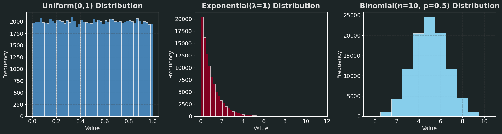
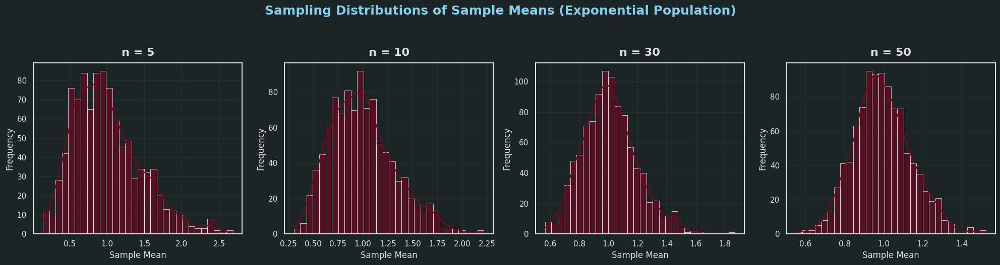
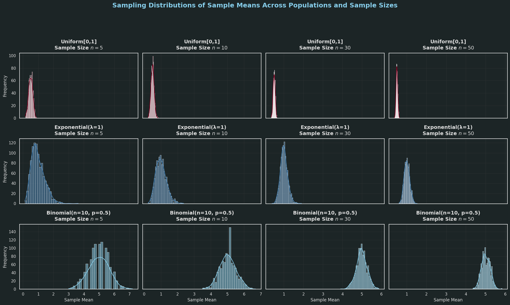

# Problem 1

# 📊 Simulating Sampling Distributions


### 🎯 Objective
To demonstrate the Central Limit Theorem (CLT), we begin by generating large populations from various distributions:

- Uniform Distribution
- Exponential Distribution
- Binomial Distribution

Each dataset will represent a "population", from which we will later draw repeated random samples to study the behavior of their means.

---

## 🔢 Step 1: Generate Populations

Let:
- $N = 100000$ be the size of each simulated population.

We will define each population as follows:

- **Uniform Distribution**:  

$$X \sim \text{Uniform}(a=0, b=1)$$

- **Exponential Distribution**:  

$$X \sim \text{Exponential}(\lambda=1)$$

- **Binomial Distribution**:  

$$X \sim \text{Binomial}(n=10, p=0.5)$$

---



```python
import numpy as np
import matplotlib.pyplot as plt

# Set seed for reproducibility
np.random.seed(42)

# Population size
N = 100_000

# --- Generate Populations ---
# 1. Uniform Distribution: U(0, 1)
population_uniform = np.random.uniform(low=0, high=1, size=N)

# 2. Exponential Distribution: Exp(λ=1)
population_exponential = np.random.exponential(scale=1.0, size=N)

# 3. Binomial Distribution: Binomial(n=10, p=0.5)
population_binomial = np.random.binomial(n=10, p=0.5, size=N)

# --- Set Styling for a Cooler Look ---
plt.style.use('dark_background')
plt.rcParams.update({
    'font.family': 'sans-serif',
    'font.size': 14,
    'axes.titlesize': 18,
    'axes.labelsize': 14,
    'axes.labelcolor': '#E0E0E0',
    'axes.facecolor': '#1C2526',
    'grid.color': '#444444',
    'grid.alpha': 0.3,
    'grid.linestyle': '--',
    'text.color': '#E0E0E0'
})

# --- Plot Histograms ---
fig, axs = plt.subplots(1, 3, figsize=(18, 5), facecolor='#1C2526')

# Uniform
axs[0].hist(population_uniform, bins=50, color='#4682B4', edgecolor='#FFFFFF', linewidth=0.5)
axs[0].set_title("Uniform(0,1) Distribution", pad=10, fontweight='bold')
axs[0].set_xlabel("Value")
axs[0].set_ylabel("Frequency")
axs[0].grid(True)

# Exponential
axs[1].hist(population_exponential, bins=50, color='#800020', edgecolor='#FFFFFF', linewidth=0.5)
axs[1].set_title("Exponential(λ=1) Distribution", pad=10, fontweight='bold')
axs[1].set_xlabel("Value")
axs[1].set_ylabel("Frequency")
axs[1].grid(True)

# Binomial
axs[2].hist(population_binomial, bins=range(0,12), color='#87CEEB', edgecolor='#FFFFFF', linewidth=0.5, align='left')
axs[2].set_title("Binomial(n=10, p=0.5) Distribution", pad=10, fontweight='bold')
axs[2].set_xlabel("Value")
axs[2].set_ylabel("Frequency")
axs[2].grid(True)

# Add a subtle glow effect with alpha for cooler visuals
for ax in axs:
    ax.patch.set_alpha(0.9)

plt.tight_layout()
plt.show()
```

# 🧪 Step 2: Modeling Sampling Distributions

## 🎯 Goal

To investigate the **Central Limit Theorem (CLT)** by modeling how sample means behave when taken from various population distributions.

---

## 📚 Central Limit Theorem (CLT)

The **Central Limit Theorem** asserts:

> For a population with mean $\mu$ and variance $\sigma^2$, the distribution of the sample mean $\bar{X}$ approximates a normal distribution as the sample size $n$ grows — irrespective of the original population's form.

In mathematical terms, if $X_1, X_2, ..., X_n$ are independent and identically distributed (i.i.d.) random variables with mean $\mu$ and variance $\sigma^2$, then the standardized sample mean:

$$
Z = \frac{\bar{X} - \mu}{\sigma/\sqrt{n}}
$$

approaches the standard normal distribution $N(0, 1)$ in distribution as $n$ becomes very large.

---

## 🛠️ Simulation Strategy

We will:

- Select a variety of **sample sizes**: $n = 5, 10, 30, 50$
- For each $n$:
  - Extract a large number of samples (e.g., 1000)
  - Calculate the sample mean for each sample
  - Gather all sample means to create the **sampling distribution**
- Visualize histograms of these sampling distributions and monitor the trend toward normality

---

## 🐍 Python Code



```python
import numpy as np
import matplotlib.pyplot as plt
import seaborn as sns

# Set a custom dark theme with seaborn
sns.set(style="darkgrid", rc={"axes.facecolor": "#1C2526", "figure.facecolor": "#1C2526", "grid.color": "#444444", "grid.alpha": 0.3})

# Define population
N = 100_000
np.random.seed(42)
population = np.random.exponential(scale=1.0, size=N)

# Sample sizes to test
sample_sizes = [5, 10, 30, 50]
num_samples = 1000  # Number of samples per size

# Custom color palette inspired by burgundy (#800020) and lighter blue (#4682B4)
colors = ['#800020', '#4682B4', '#87CEEB', '#400010']  # Burgundy, Light Blue, Light Blue Accent, Dark Burgundy
sns.set_palette(sns.color_palette(colors))

# Plotting
fig, axs = plt.subplots(1, len(sample_sizes), figsize=(20, 5), facecolor='#1C2526')

for i, n in enumerate(sample_sizes):
    sample_means = []

    for _ in range(num_samples):
        sample = np.random.choice(population, size=n, replace=False)
        sample_means.append(np.mean(sample))

    sns.histplot(sample_means, bins=30, kde=True, ax=axs[i], edgecolor='#FFFFFF', linewidth=0.5)
    axs[i].set_title(f'n = {n}', fontsize=16, fontweight='bold', pad=10, color='#E0E0E0')
    axs[i].set_xlabel('Sample Mean', fontsize=12, color='#E0E0E0')
    axs[i].set_ylabel('Frequency', fontsize=12, color='#E0E0E0')
    axs[i].tick_params(colors='#E0E0E0')  # Match tick colors to text

    # Add a subtle glow effect with alpha
    axs[i].patch.set_alpha(0.9)

plt.suptitle('Sampling Distributions of Sample Means (Exponential Population)', fontsize=18, fontweight='bold', color='#87CEEB', y=1.05)
plt.tight_layout()
plt.show()
```
# 📈 Step 3: Displaying Sampling Distribution Outcomes

## 🎯 Aim

- Create histograms of the **sample averages** for each population distribution across different sample sizes.
- Analyze the **speed of convergence** of these sampling distributions toward a normal shape.
- Evaluate how the form of the **initial population distribution** influences convergence.

---

## 🔎 Conceptual Foundation

Consider the **Central Limit Theorem (CLT)**:

> For independent, identically distributed random variables $X_1, X_2, \ldots, X_n$ with mean $\mu$ and variance $\sigma^2$, the standardized sample mean

$$
Z = \frac{\bar{X} - \mu}{\sigma/\sqrt{n}}
$$

tends toward a standard normal distribution $N(0,1)$ as the sample size $n$ grows infinitely large.

---

## 📌 Key Aspects to Note

- Sampling distributions for **small $n$** mirror the population's shape.
- With increasing $n$, the sampling distributions turn **more symmetric and bell-like**.
- The **rate of convergence** is influenced by the population distribution's:
  - **Skewness**
  - **Kurtosis**
  - **Variance**

---

## 🐍 Python Code for Visualization



```python
import numpy as np
import matplotlib.pyplot as plt
import seaborn as sns

# Set a custom dark theme with seaborn
sns.set(style="darkgrid", rc={"axes.facecolor": "#1C2526", "figure.facecolor": "#1C2526", "grid.color": "#444444", "grid.alpha": 0.3})

# Set random seed for reproducibility
np.random.seed(42)

# Population size
N = 100_000

# Generate populations
populations = {
    "Uniform[0,1]": np.random.uniform(0, 1, N),
    "Exponential(λ=1)": np.random.exponential(1, N),
    "Binomial(n=10, p=0.5)": np.random.binomial(n=10, p=0.5, size=N),
}

sample_sizes = [5, 10, 30, 50]
num_samples = 1000

# Custom color palette inspired by burgundy (#800020) and lighter blue (#4682B4)
colors = ['#800020', '#4682B4', '#87CEEB']  # Burgundy, Light Blue, Light Blue Accent
sns.set_palette(sns.color_palette(colors))

# Plotting
fig, axes = plt.subplots(len(populations), len(sample_sizes), figsize=(20, 12), sharex='col', sharey='row', facecolor='#1C2526')

for row_idx, (dist_name, population) in enumerate(populations.items()):
    for col_idx, n in enumerate(sample_sizes):
        sample_means = []
        for _ in range(num_samples):
            sample = np.random.choice(population, size=n, replace=False)
            sample_means.append(np.mean(sample))

        ax = axes[row_idx, col_idx]
        sns.histplot(sample_means, bins=30, kde=True, color=colors[row_idx % len(colors)], ax=ax, edgecolor='#FFFFFF', linewidth=0.5)
        ax.set_title(f"{dist_name}\nSample Size $n={n}$", fontsize=14, fontweight='bold', pad=10, color='#E0E0E0')
        if col_idx == 0:
            ax.set_ylabel('Frequency', fontsize=12, color='#E0E0E0')
        if row_idx == len(populations)-1:
            ax.set_xlabel('Sample Mean', fontsize=12, color='#E0E0E0')
        ax.tick_params(colors='#E0E0E0')  # Match tick colors to text
        ax.grid(True)

        # Add a subtle glow effect with alpha
        ax.patch.set_alpha(0.9)

plt.suptitle("Sampling Distributions of Sample Means Across Populations and Sample Sizes", fontsize=18, fontweight='bold', color='#87CEEB', y=1.02)
plt.tight_layout(rect=[0, 0.03, 1, 0.95])
plt.show()
```

# 🔎 Step 4: Investigating Factors Shaping the Central Limit Theorem

## 🎯 Goals

- Explore how the **form of the initial population distribution** impacts the speed of convergence to a normal shape.
- Assess the effect of **sample size $n$** on the approximation to a normal distribution.
- Study the influence of **population variance $\sigma^2$** on the dispersion of the sampling distribution of the mean.

---

## 1. Role of Population Distribution Form

- The CLT ensures a move toward normality, but the **pace of convergence hinges on the form** of the population distribution.
- Distributions with **significant skewness** or **heavy tails** (e.g., Exponential, Cauchy) need larger sample sizes for the sample mean to near normality.
- For balanced and light-tailed distributions (e.g., Uniform, Binomial), the convergence tends to be quicker.

---

## 2. Effect of Sample Size $n$

- The sampling distribution of the mean $\bar{X}$ for sample size $n$ exhibits:

  $$
  \text{Mean}(\bar{X}) = \mu
  $$

  $$
  \text{Variance}(\bar{X}) = \frac{\sigma^2}{n}
  $$

- As $n$ grows:

  - The variance of $\bar{X}$ shrinks, making the sampling distribution more **tightly clustered** around $\mu$.
  - Per the CLT, the distribution of $\bar{X}$ nears the normal distribution:

  $$
  \bar{X} \xrightarrow{d} N\left(\mu, \frac{\sigma^2}{n}\right)
  $$

- Visualizing various $n$ values aids in **tracking this clustering and shape evolution**.

---

## 3. Influence of Population Variance $\sigma^2$

- The **spread** of the sampling distribution is tied to the population variance $\sigma^2$.
- A larger $\sigma^2$ results in greater **variation in sample means**.
- This underscores the importance of knowing or estimating $\sigma^2$ in statistical inference.

---

## 📊 Overview of Connections

- The interplay of population form, sample size, and variance dictates how swiftly and closely the sampling distribution of the mean approaches normality.
  
- Core equation encapsulating the CLT:

  $$
  Z = \frac{\bar{X} - \mu}{\sigma/\sqrt{n}} \xrightarrow{d} N(0,1)
  $$

---

## 🐍 Next: Python Code to Test These Factors

- Model sampling distributions with varying:

  - Population forms (e.g., Uniform, Exponential, Binomial)
  - Sample sizes ($n = 5, 10, 30, 50$)
  - Variances (e.g., by adjusting distribution scales)

- Illustrate the outcomes to enhance comprehension of the CLT in practice.

---