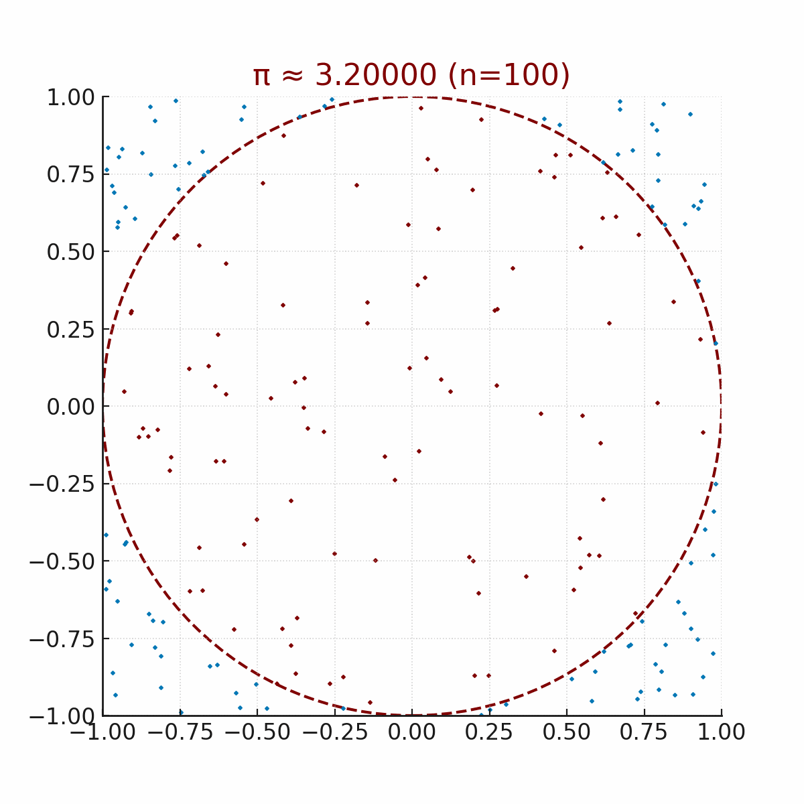
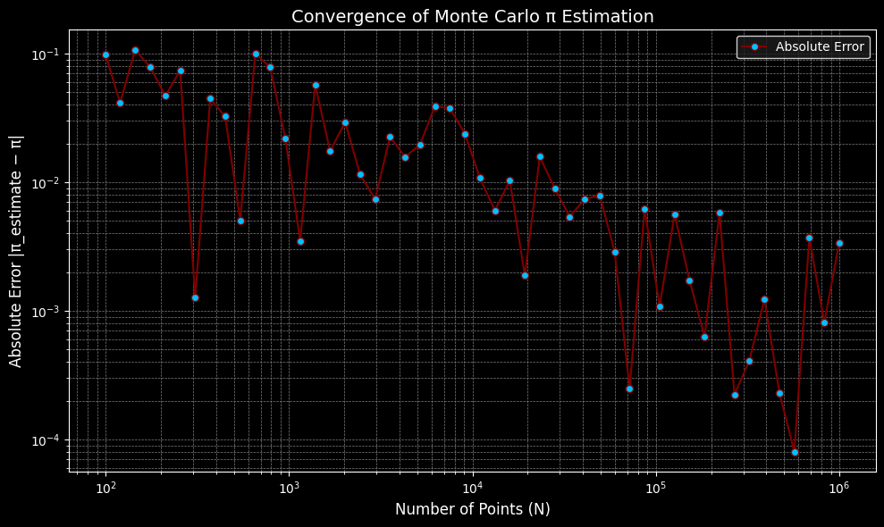
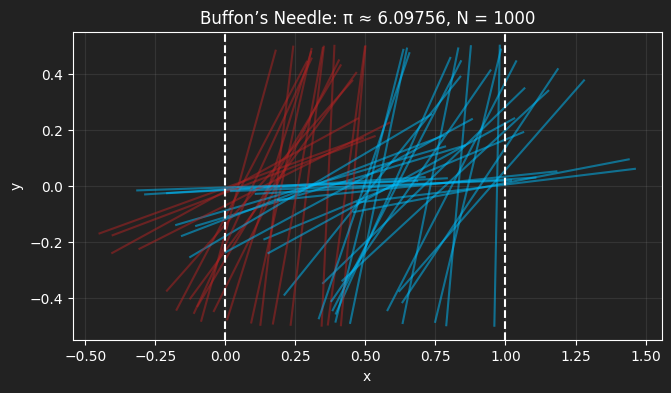
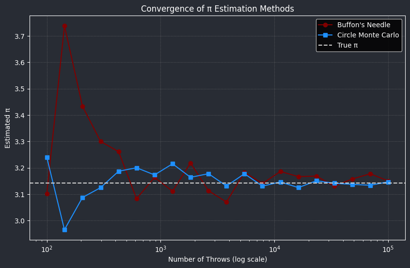
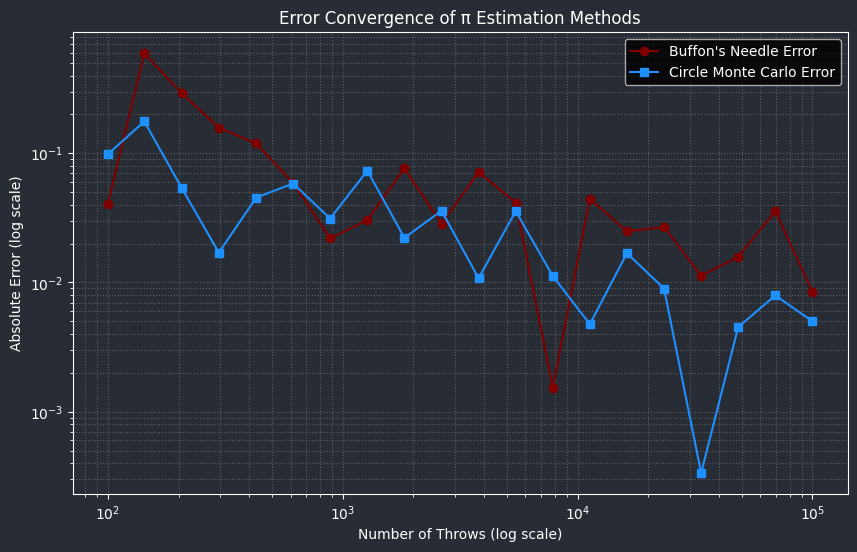

# Problem 2

# 📘 Section 1: Approximating π Using a Circle

## 1. Theoretical Background

### 🧠 Conceptual Insight

Monte Carlo techniques apply randomness to tackle problems that are fundamentally deterministic. To approximate π, we leverage the geometric connection between a circle and the square that encloses it:

- Imagine a **unit circle** (radius = 1) centered at the origin (0, 0).
- This circle fits perfectly within a **square** with a side length of 2, spanning coordinates from (-1, -1) to (1, 1).
- The **area** of the unit circle is:

  $$
  A_{circle} = \pi r^2 = \pi \cdot 1^2 = \pi
  $$

- The **area** of the surrounding square is:

  $$
  A_{square} = (2r)^2 = (2 \cdot 1)^2 = 4
  $$

- The ratio between these areas becomes:

  $$
  \frac{A_{circle}}{A_{square}} = \frac{\pi}{4}
  $$

So, when we uniformly sample points at random within the square, the **likelihood** that a point lands inside the circle is:

  $$
  P(\text{point inside circle}) = \frac{\pi}{4}
  $$

### 🔢 Estimating π via Monte Carlo

To derive π using this probabilistic approach:

1. **Generate** many random coordinate pairs $(x, y)$ in the square $[-1, 1] \times [-1, 1]$.
2. **Determine** whether each point lies within the unit circle using:

   $$
   x^2 + y^2 \leq 1
   $$

3. **Record** the number of points that fall inside the circle: $N_{circle}$
4. **Note** the total number of sampled points: $N_{total}$
5. Estimate π using the expression:

   $$
   \hat{\pi} = 4 \cdot \frac{N_{circle}}{N_{total}}
   $$

### ✅ Key Takeaways

- Monte Carlo estimation of π depends on simulating random events and comparing relative counts.
- The more points you sample ($N_{total}$), the closer the estimate gets to the true value of π.
- This strategy intuitively combines **geometry, probability, and numerical simulation**.


```python
import matplotlib.pyplot as plt
import numpy as np

# Set a fixed seed for reproducibility
np.random.seed(42)

# Total number of random points
N_total = 10000

# Generate random (x, y) pairs between -1 and 1
x = np.random.uniform(-1, 1, N_total)
y = np.random.uniform(-1, 1, N_total)

# Compute whether each point falls inside the unit circle
inside_circle = x**2 + y**2 <= 1

# Estimate pi
N_circle = np.sum(inside_circle)
pi_estimate = 4 * N_circle / N_total

# Create the plot
fig, ax = plt.subplots(figsize=(6, 6))
ax.set_aspect("equal")

# Plot inside-circle points in maroon (bordo), outside in blue (mavi)
ax.scatter(x[inside_circle], y[inside_circle], color="#800000", s=1, label='Inside Circle')
ax.scatter(x[~inside_circle], y[~inside_circle], color="#0077B6", s=1, label='Outside Circle')

# Draw the unit circle for reference
circle = plt.Circle((0, 0), 1, edgecolor="#800000", facecolor='none', linewidth=1.5, linestyle='--')
ax.add_patch(circle)

# Aesthetic settings
ax.set_title(f"Monte Carlo π Estimation\nEstimated π ≈ {pi_estimate:.5f}", fontsize=12, color="#800000")
ax.set_xlabel("x-axis", fontsize=10)
ax.set_ylabel("y-axis", fontsize=10)
ax.legend(loc="upper right", fontsize=9)
ax.set_xlim([-1, 1])
ax.set_ylim([-1, 1])
ax.grid(True, linestyle=':', alpha=0.6)

plt.tight_layout()
plt.show()
```

---

### 🖥 2. Running the Simulation

In this part, we carry out a Monte Carlo simulation to approximate the value of π by randomly placing points within a square and evaluating how many land inside a circle inscribed within it.

### 🧪 Simulation Procedure

- We define a **unit circle** with radius 1, centered at the origin $(0,0)$.
- This circle is perfectly enclosed in a **square** with side length 2, spanning the coordinate range:

  $$
  [-1, 1] \times [-1, 1]
  $$

- The core idea is to generate $N$ random coordinate pairs $(x, y)$ uniformly across the square and determine how many fall within the bounds of the circle.

### ➕ Condition for Being Inside the Circle

- A point $(x, y)$ is considered **within the circle** if it satisfies the inequality:

  $$
  x^2 + y^2 \leq 1
  $$

- Let $N_{\text{circle}}$ represent the number of such valid points.
- Let $N_{\text{total}}$ be the full count of generated points.

### 🔢 Formula for Estimating π

- The theoretical chance that a point falls inside the circle is approximately:

  $$
  P = \frac{\pi}{4}
  $$

- Hence, the Monte Carlo estimate for π becomes:

  $$
  \hat{\pi} = 4 \cdot \frac{N_{\text{circle}}}{N_{\text{total}}}
  $$

### 📝 Observations

- Increasing $N_{\text{total}}$ typically leads to a more precise approximation of π.
- Since the simulation is based on random sampling, results may vary slightly with each run.
- This method is conceptually straightforward and provides a visual, hands-on way to explore mathematical estimation.

> ✅ This simulation highlights how random sampling and geometry can work together to approximate a fundamental constant like π.
---

### 3. Visualization

The Python script below produces a scatter plot, differentiating between points that land inside versus outside the circle.



```python
import numpy as np
import matplotlib.pyplot as plt

# Set random seed for reproducibility
np.random.seed(42)

def estimate_pi_circle(N):
    # Generate N random points in [-1, 1] x [-1, 1]
    x = np.random.uniform(-1, 1, N)
    y = np.random.uniform(-1, 1, N)
    
    # Check which points lie inside the unit circle
    inside_circle = x**2 + y**2 <= 1
    M = np.sum(inside_circle)
    
    # Estimate pi
    pi_estimate = 4 * M / N
    
    return x, y, inside_circle, pi_estimate

# Run simulation with N = 10000
N = 10000
x, y, inside_circle, pi_estimate = estimate_pi_circle(N)

# Plot
plt.figure(figsize=(8, 8))
plt.scatter(x[inside_circle], y[inside_circle], c='blue', s=1, label='Inside Circle')
plt.scatter(x[~inside_circle], y[~inside_circle], c='red', s=1, label='Outside Circle')
circle = plt.Circle((0, 0), 1, edgecolor='black', facecolor='none')
plt.gca().add_patch(circle)
plt.gca().set_aspect('equal')
plt.xlim(-1, 1)
plt.ylim(-1, 1)
plt.title(f'Circle Method: π ≈ {pi_estimate:.5f}, N = {N}')
plt.xlabel('x')
plt.ylabel('y')
plt.legend()
plt.grid(True)
plt.show()

print(f"Estimated π: {pi_estimate}")
```

### 4 Analysis



```python
import numpy as np
import matplotlib.pyplot as plt

# Dark theme setup
plt.style.use('dark_background')

# Monte Carlo π estimation function
def estimate_pi_circle(N):
    np.random.seed(0)
    x = np.random.rand(N)
    y = np.random.rand(N)
    inside_circle = (x**2 + y**2) <= 1
    count_inside = np.sum(inside_circle)
    pi_estimate = 4 * count_inside / N
    return x, y, inside_circle, pi_estimate

# Sample sizes (logarithmic scale)
Ns = np.logspace(2, 6, num=50, dtype=int)
errors = []
pi_true = np.pi

for N in Ns:
    _, _, _, pi_estimate = estimate_pi_circle(N)
    errors.append(abs(pi_estimate - pi_true))

# Plotting
plt.figure(figsize=(10, 6))
plt.loglog(
    Ns, errors,
    marker='o',
    linestyle='-',
    color='#800000',               # Bordo line
    markerfacecolor='#00BFFF',     # Mavi markers
    markeredgecolor='#800000',
    label='Absolute Error'
)

plt.title('Convergence of Monte Carlo π Estimation', fontsize=14, color='white')
plt.xlabel('Number of Points (N)', fontsize=12, color='white')
plt.ylabel('Absolute Error |π_estimate − π|', fontsize=12, color='white')
plt.grid(True, which='both', linestyle='--', linewidth=0.5, color='gray')
plt.legend(facecolor='#1e1e1e', edgecolor='white')
plt.tight_layout()
plt.show()
```
# ✅ SECTION 2: Approximating π Using Buffon’s Experiment

## 📘 1. Conceptual Framework

### 🧠 Introduction to Buffon’s Needle Puzzle

Buffon’s Needle is a classic probability puzzle that offers a technique to approximate π through random trials involving dropping a needle onto a surface marked with parallel lines. The puzzle investigates the likelihood that a needle of length $L$ dropped randomly onto a floor with parallel lines spaced $d$ units apart will intersect one of these lines.

---

### 🔍 Puzzle Configuration and Presumptions

- The surface features **parallel lines** separated by a distance $d$.
- A needle of length $L$ is randomly cast onto the surface.
- The needle’s placement is defined by:
  - The separation $x$ from the needle’s midpoint to the closest line (where $0 \leq x \leq \frac{d}{2}$).
  - The angle $\theta$ between the needle and the parallel lines, with $\theta$ being uniformly distributed within $[0, \frac{\pi}{2}]$ due to symmetry.

---

### 📐 Requirement for Needle Intersecting a Line

The needle intersects a line if the separation from its midpoint to the nearest line is less than or equal to half of the needle’s projected length on the axis perpendicular to the lines:

$$
x \leq \frac{L}{2} \sin \theta
$$

---

### 📊 Likelihood of Intersection

The probability $P$ that a needle intersects a line is derived by integrating across all possible positions and orientations, resulting in:

$$
P = \frac{2L}{\pi d}
$$

*This formula assumes $L \leq d$.*

---

### 🔢 Derivation of the π Approximation Formula

Let:

- $L$ = length of the needle
- $d$ = spacing between the parallel lines
- $N$ = total count of needle drops
- $C$ = count of instances the needle intersects a line

From the observed empirical probability,

$$
P \approx \frac{C}{N}
$$

and equating to the theoretical probability,

$$
\frac{C}{N} \approx \frac{2L}{\pi d}
$$

Solving for π, we obtain the estimate:

$$
\boxed{
\pi \approx \frac{2 L N}{d C}
}
$$

---

### ✅ Conclusion

- Buffon’s Needle puzzle links geometry and probability to estimate π.
- It presents an elegant, physical experiment-based approach to numerical approximation.
- Precision enhances as $N$ (number of needle drops) rises.
- The puzzle serves as a fundamental instance in geometric probability and Monte Carlo techniques.

## 2. Emulation

We now proceed to implement the emulation of Buffon’s Needle experiment to approximate π.

### Emulation Procedure

- **Step 1:** Emulate $N$ random needle drops on a surface with parallel lines spaced by distance $d$.
- **Step 2:** For each needle drop:
  - Sample the needle's midpoint position $x$ uniformly from $[0, d/2]$.
  - Sample the needle's orientation angle $\theta$ uniformly from $[0, \pi/2]$.
- **Step 3:** Ascertain whether the needle intersects a line by verifying the condition:

$$
x \leq \frac{L}{2} \sin \theta
$$

- **Step 4:** Tally the number of intersections $C$.
- **Step 5:** Approximate π using the formula:

$$
\hat{\pi} = \frac{2 L N}{d C}
$$

### 3 Visual Representation



```python
import numpy as np
import matplotlib.pyplot as plt

# Set random seed
np.random.seed(42)

def estimate_pi_buffon(N, l=1, d=1):
    # Random midpoint x (y is irrelevant for horizontal lines), and angle theta
    x_mid = np.random.uniform(0, d, N)  # Midpoint x between 0 and d
    theta = np.random.uniform(0, np.pi/2, N)  # Angle between 0 and π/2
    
    # Distance from midpoint to nearest line
    crossings = np.abs(l/2 * np.sin(theta)) >= (x_mid % d)
    M = np.sum(crossings)
    
    # Estimate pi
    pi_estimate = 2 * N / M if M > 0 else np.inf
    
    return x_mid, theta, crossings, pi_estimate

# Run simulation with N = 1000
N = 1000
x_mid, theta, crossings, pi_estimate = estimate_pi_buffon(N)

# Plot
plt.figure(figsize=(10, 4), facecolor='#222222')  # Dark background
ax = plt.gca()
ax.set_facecolor('#222222')
ax.tick_params(axis='x', colors='white')
ax.tick_params(axis='y', colors='white')
ax.spines['bottom'].set_color('white')
ax.spines['top'].set_color('white')
ax.spines['left'].set_color('white')
ax.spines['right'].set_color('white')

for i in range(min(N, 50)):  # Plot up to 50 needles
    x_c = x_mid[i]
    t = theta[i]
    x1 = x_c - 0.5 * np.cos(t)
    x2 = x_c + 0.5 * np.cos(t)
    y1 = -0.5 * np.sin(t)
    y2 = 0.5 * np.sin(t)
    color = '#B22222' if crossings[i] else '#00BFFF'  # bordo and mavi
    plt.plot([x1, x2], [y1, y2], color, alpha=0.5)
    
# Plot lines
for x in [0, 1]:
    plt.axvline(x, color='white', linestyle='--')
    
plt.title(f'Buffon’s Needle: π ≈ {pi_estimate:.5f}, N = {N}', color='white')
plt.xlabel('x', color='white')
plt.ylabel('y', color='white')
plt.gca().set_aspect('equal')
plt.grid(True, color='gray', alpha=0.2)
plt.show()

print(f"Estimated π: {pi_estimate}")
```

## 4. Evaluation

We examine the convergence behavior of the Buffon’s Needle simulation and contrast it with the circle-based Monte Carlo technique for approximating π.

---

### 🔍 Aims

- Execute the Buffon’s Needle simulation for increasing counts of throws $N$.
- Observe how the approximation of π enhances (converges) as $N$ increases.
- Chart the convergence of π approximations against the number of throws.
- Assess the convergence speed and precision against the circle-based Monte Carlo method.

---

### 📈 Approach

- Define a sequence of sample sizes: $N_1 < N_2 < \dots < N_k$.
- For each $N_i$:
  - Execute the Buffon’s Needle simulation and document the approximated π value, $\hat{\pi}_{needle}(N_i)$.
  - Execute the circle-based Monte Carlo simulation and document the approximated π value, $\hat{\pi}_{circle}(N_i)$.
- Plot $\hat{\pi}$ vs. $N$ for both methods on a shared graph.
- Evaluate the error:

$$
\text{Error}(N) = \left|\pi - \hat{\pi}(N)\right|
$$

---

### 🔧 Python Implementation for Evaluation





```python
import numpy as np
import matplotlib.pyplot as plt

# Buffon's Needle simulation function
def buffon_needle_pi_estimate(L, d, N):
    x_centers = np.random.uniform(0, d/2, N)
    angles = np.random.uniform(0, np.pi/2, N)
    crossings = x_centers <= (L/2)*np.sin(angles)
    C = np.sum(crossings)
    if C == 0:
        return np.nan
    return (2 * L * N) / (d * C)

# Circle-based Monte Carlo π estimation
def monte_carlo_circle_pi(N):
    points = np.random.uniform(-1, 1, (N, 2))
    inside_circle = np.sum(points[:,0]**2 + points[:,1]**2 <= 1)
    return 4 * inside_circle / N

# Parameters
L = 1.0
d = 1.5
sample_sizes = np.logspace(2, 5, num=20, dtype=int)  # From 100 to 100,000 throws

needle_estimates = []
circle_estimates = []

for N in sample_sizes:
    pi_needle = buffon_needle_pi_estimate(L, d, N)
    pi_circle = monte_carlo_circle_pi(N)
    needle_estimates.append(pi_needle)
    circle_estimates.append(pi_circle)

# Define custom colors
bordo = '#800000'  # A shade of red for 'bordo'
mavi = '#1E90FF'   # A shade of blue for 'mavi'
dark_background = '#282C34' # A dark gray background

# Plotting convergence
plt.figure(figsize=(10, 6), facecolor=dark_background)
ax1 = plt.gca()
ax1.set_facecolor(dark_background)

plt.plot(sample_sizes, needle_estimates, 'o-', label="Buffon's Needle", color=bordo, markersize=6, linewidth=1.5)
plt.plot(sample_sizes, circle_estimates, 's-', label="Circle Monte Carlo", color=mavi, markersize=6, linewidth=1.5)
plt.axhline(np.pi, color='lightgray', linestyle='--', label="True π", linewidth=1.5) # True pi line
plt.xscale('log')

# Set text and tick colors to white for better contrast on dark background
ax1.set_xlabel("Number of Throws (log scale)", color='white')
ax1.set_ylabel("Estimated π", color='white')
ax1.set_title("Convergence of π Estimation Methods", color='white')
ax1.tick_params(axis='x', colors='white')
ax1.tick_params(axis='y', colors='white')
ax1.spines['bottom'].set_color('white')
ax1.spines['top'].set_color('white')
ax1.spines['left'].set_color('white')
ax1.spines['right'].set_color('white')
plt.legend(labelcolor='white')
plt.grid(True, linestyle=':', alpha=0.6, color='gray')
plt.show()

# Plot absolute errors
plt.figure(figsize=(10, 6), facecolor=dark_background)
ax2 = plt.gca()
ax2.set_facecolor(dark_background)

plt.plot(sample_sizes, np.abs(np.pi - np.array(needle_estimates)), 'o-', label="Buffon's Needle Error", color=bordo, markersize=6, linewidth=1.5)
plt.plot(sample_sizes, np.abs(np.pi - np.array(circle_estimates)), 's-', label="Circle Monte Carlo Error", color=mavi, markersize=6, linewidth=1.5)
plt.xscale('log')
plt.yscale('log')

# Set text and tick colors to white for better contrast on dark background
ax2.set_xlabel("Number of Throws (log scale)", color='white')
ax2.set_ylabel("Absolute Error (log scale)", color='white')
ax2.set_title("Error Convergence of π Estimation Methods", color='white')
ax2.tick_params(axis='x', colors='white')
ax2.tick_params(axis='y', colors='white')
ax2.spines['bottom'].set_color('white')
ax2.spines['top'].set_color('white')
ax2.spines['left'].set_color('white')
ax2.spines['right'].set_color('white')
plt.legend(labelcolor='white')
plt.grid(True, which="both", linestyle=':', alpha=0.6, color='gray')
plt.show()
```
---

## Observations

Both techniques demonstrate a tendency to converge towards the actual value of π as the count of trials rises. The **circle-based Monte Carlo approach** generally exhibits quicker convergence and reduced variability for an equivalent number of samples. Conversely, the **Buffon's Needle technique**, despite its historical charm and elegance, might necessitate a greater number of samples to attain a comparable level of precision. The plots presented on a **logarithmic scale** effectively underscore the rate at which the error diminishes with an increasing number of samples.