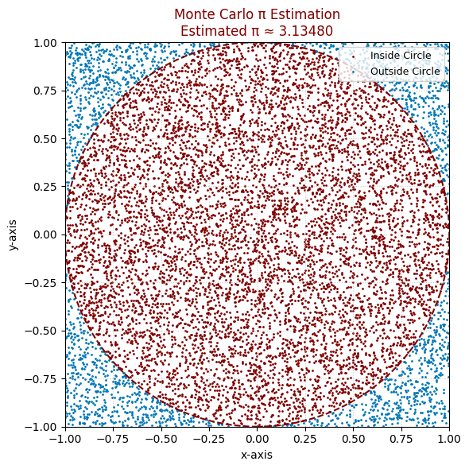

# Problem 2

# 📘 Part 1: Approximating π Using a Circle

## 1. Theoretical Background

### 🧠 Conceptual Insight

Monte Carlo techniques apply randomness to tackle problems that are fundamentally deterministic. To approximate π, we leverage the geometric connection between a circle and the square that encloses it:

- Imagine a **unit circle** (radius = 1) centered at the origin (0, 0).
- This circle fits perfectly within a **square** with a side length of 2, spanning coordinates from (-1, -1) to (1, 1).
- The **area** of the unit circle is:

  $$
  A_{circle} = \pi r^2 = \pi \cdot 1^2 = \pi
  $$

- The **area** of the surrounding square is:

  $$
  A_{square} = (2r)^2 = (2 \cdot 1)^2 = 4
  $$

- The ratio between these areas becomes:

  $$
  \frac{A_{circle}}{A_{square}} = \frac{\pi}{4}
  $$

So, when we uniformly sample points at random within the square, the **likelihood** that a point lands inside the circle is:

  $$
  P(\text{point inside circle}) = \frac{\pi}{4}
  $$

### 🔢 Estimating π via Monte Carlo

To derive π using this probabilistic approach:

1. **Generate** many random coordinate pairs $(x, y)$ in the square $[-1, 1] \times [-1, 1]$.
2. **Determine** whether each point lies within the unit circle using:

   $$
   x^2 + y^2 \leq 1
   $$

3. **Record** the number of points that fall inside the circle: $N_{circle}$
4. **Note** the total number of sampled points: $N_{total}$
5. Estimate π using the expression:

   $$
   \hat{\pi} = 4 \cdot \frac{N_{circle}}{N_{total}}
   $$

### ✅ Key Takeaways

- Monte Carlo estimation of π depends on simulating random events and comparing relative counts.
- The more points you sample ($N_{total}$), the closer the estimate gets to the true value of π.
- This strategy intuitively combines **geometry, probability, and numerical simulation**.



```python
import matplotlib.pyplot as plt
import numpy as np

# Set a fixed seed for reproducibility
np.random.seed(42)

# Total number of random points
N_total = 10000

# Generate random (x, y) pairs between -1 and 1
x = np.random.uniform(-1, 1, N_total)
y = np.random.uniform(-1, 1, N_total)

# Compute whether each point falls inside the unit circle
inside_circle = x**2 + y**2 <= 1

# Estimate pi
N_circle = np.sum(inside_circle)
pi_estimate = 4 * N_circle / N_total

# Create the plot
fig, ax = plt.subplots(figsize=(6, 6))
ax.set_aspect("equal")

# Plot inside-circle points in maroon (bordo), outside in blue (mavi)
ax.scatter(x[inside_circle], y[inside_circle], color="#800000", s=1, label='Inside Circle')
ax.scatter(x[~inside_circle], y[~inside_circle], color="#0077B6", s=1, label='Outside Circle')

# Draw the unit circle for reference
circle = plt.Circle((0, 0), 1, edgecolor="#800000", facecolor='none', linewidth=1.5, linestyle='--')
ax.add_patch(circle)

# Aesthetic settings
ax.set_title(f"Monte Carlo π Estimation\nEstimated π ≈ {pi_estimate:.5f}", fontsize=12, color="#800000")
ax.set_xlabel("x-axis", fontsize=10)
ax.set_ylabel("y-axis", fontsize=10)
ax.legend(loc="upper right", fontsize=9)
ax.set_xlim([-1, 1])
ax.set_ylim([-1, 1])
ax.grid(True, linestyle=':', alpha=0.6)

plt.tight_layout()
plt.show()
```


